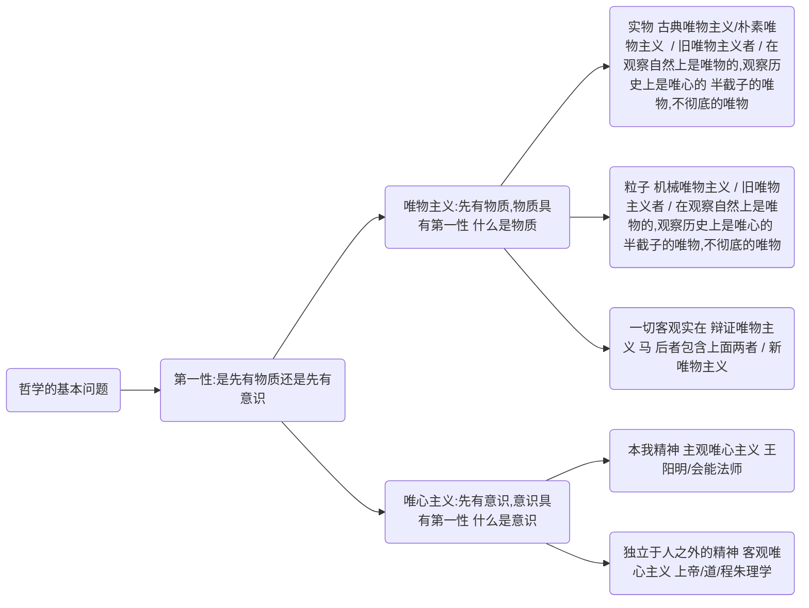
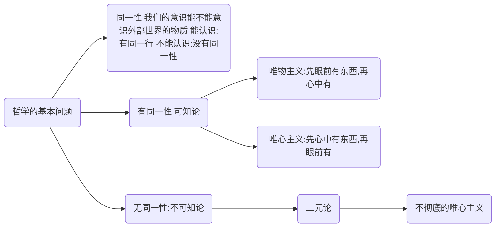
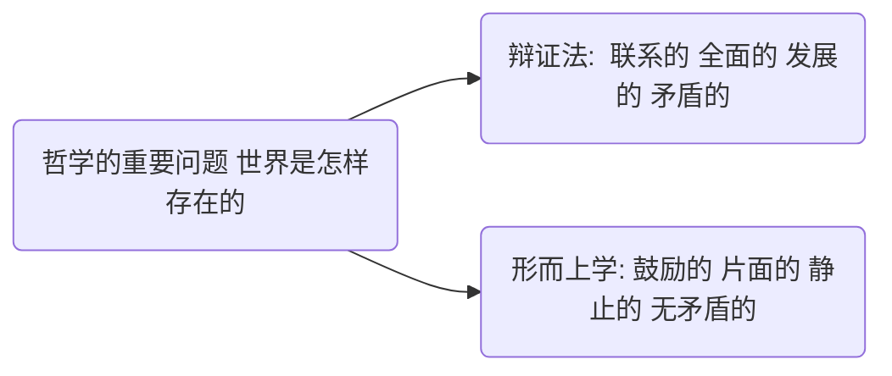

# 带🔺的选择题重点

如果它是一个非重点我一定不会忘

如果它是一个重点分析题考点我一定不会忘

讲过的但是忘了做标识的一律按重点选择题考点

## 导论

## 马克思主义的构成🔺

## 马克思主义的基本立场、基本观点和基本方法🔺

## 马克思主义的创立 🔺

社会根源、阶级基础和思想渊源

## 马克思主义的发展🔺

## 马恩列经典著作总结 🔺

## 马克思主义的鲜明特征🔺

马克思主义的人民性，实践性，和发展性集中表现为革命性

## 错题

# 辩证唯物论

## 哲学的基本问题和不同的哲学流派🔺

世界的本原是什么？

### 哲学的基本问题-第一性

马克思，辩证唯物主义

第一次把人类历史当作物质来看 （唯物史观）

马克思在哲学历史上的两大历史贡献

1. 创立了唯物史观
2. 形成了辩证唯物主义

### 哲学的基本问题-同一性

一切的唯物论者和彻底的唯心论者  都是可知论者

### 哲学的重要问题

形而上学的唯物主义

形而上学的唯心主义

辩证的唯心主义

马克思之前只有这三种，马克思形成了辩证唯物主义

## 马克思的理论渊源

黑格尔-辩证的唯心

费尔巴哈-形而上学的唯物

马克思把黑格尔的辩证法，把费尔巴哈的唯物论，形成了辩证唯物主义
