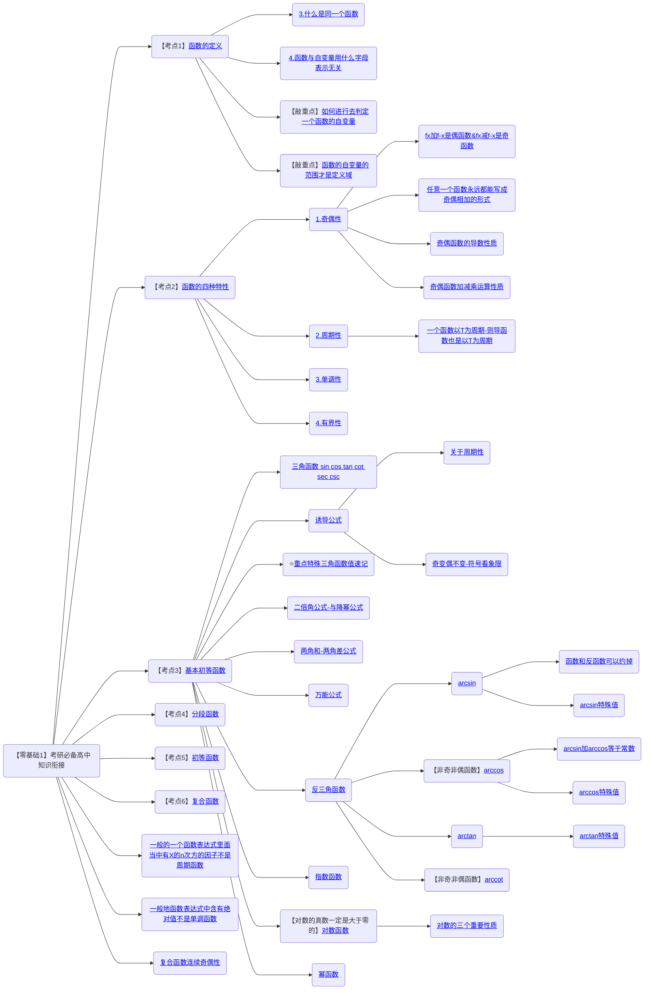
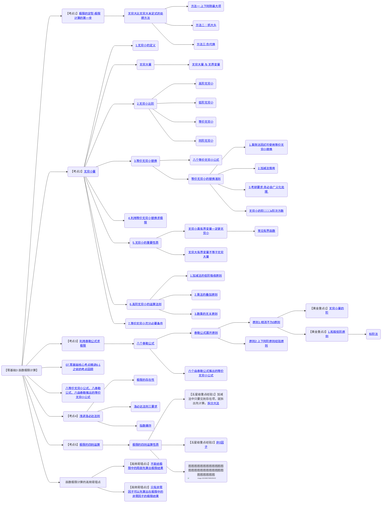
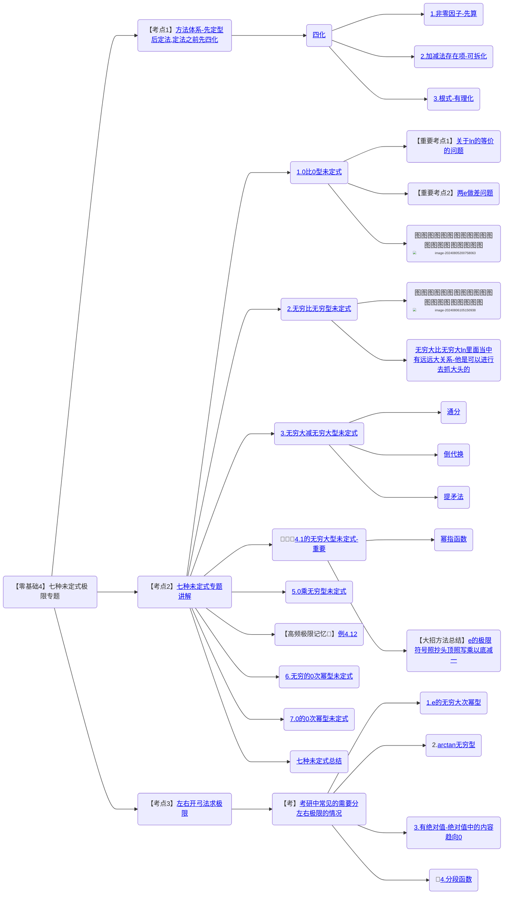
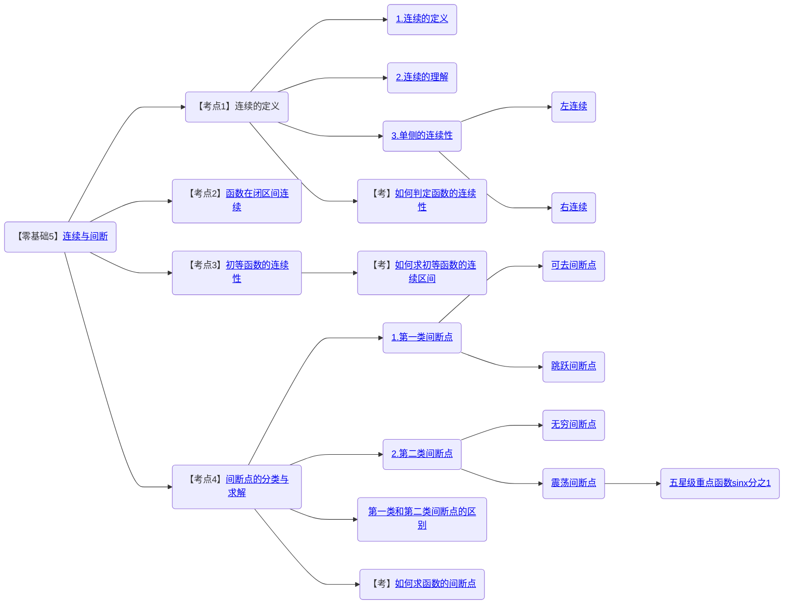
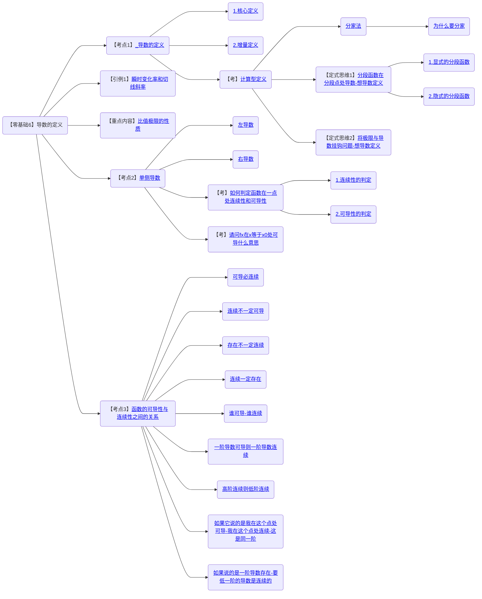
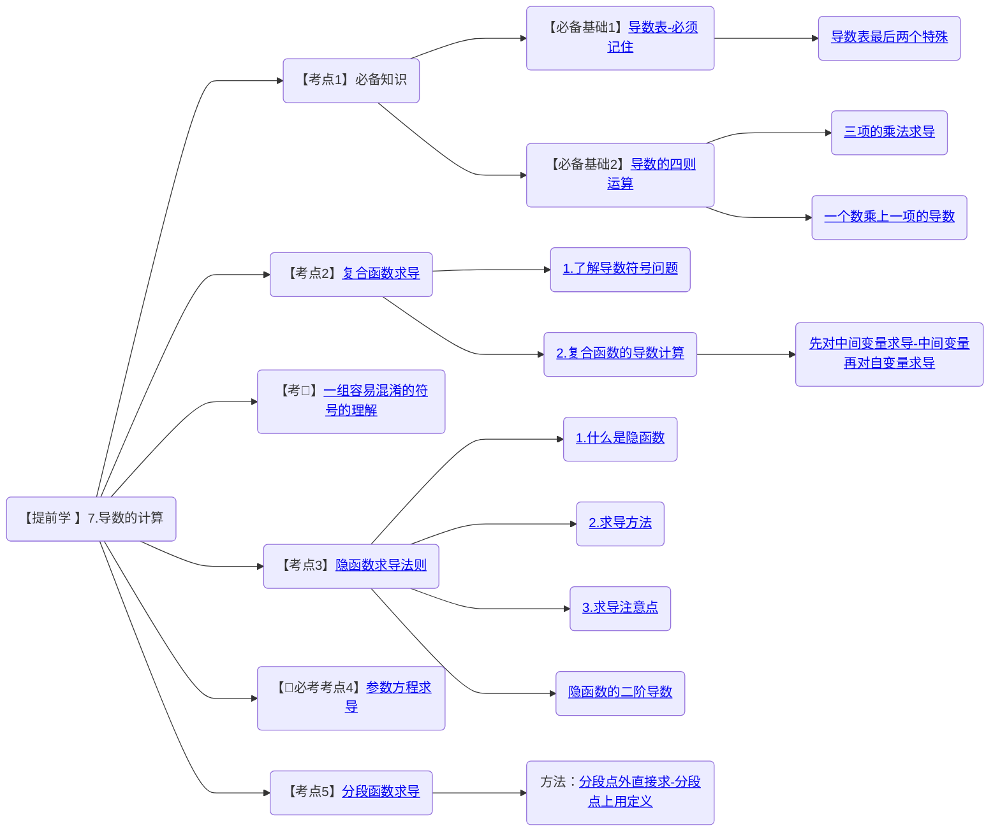
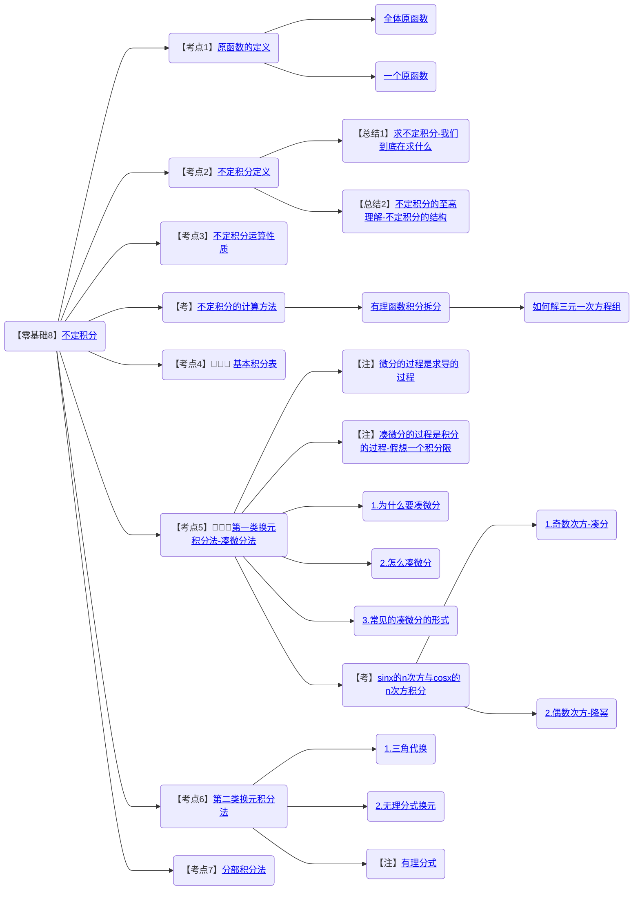
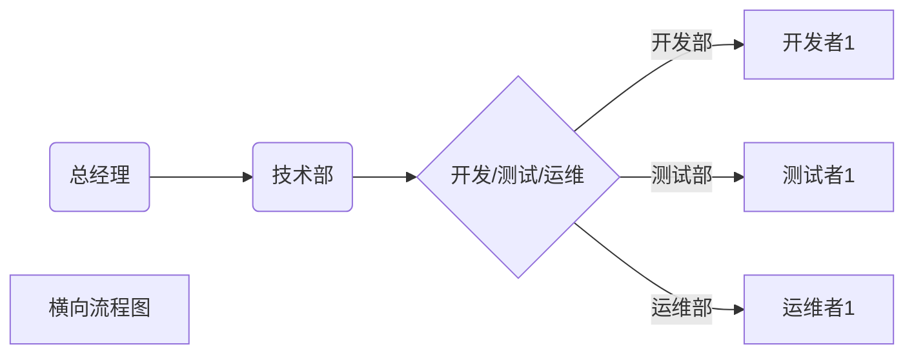

# 范澈老师

```mermaid
graph LR
范澈老师
范澈老师--->导数公式(<a href="/Users/yuebinghui/Documents/program/github/note/笔记/数学/范澈老师/课程内容/1.4第四次课.md#导数公式">导数公式</>)
```

# 【零基础1】考研必备高中知识衔接

```mermaid
graph LR
考研必备高中知识衔接(【零基础1】考研必备高中知识衔接)

考研必备高中知识衔接--->函数的定义(【考点1】<a href="/Users/yuebinghui/Documents/program/github/note/笔记/数学/周洋鑫/02.零基础核心考点精讲1-1～2-1.md#函数的定义">函数的定义</>)
函数的定义--->3.什么是同一个函数(<a href="/Users/yuebinghui/Documents/program/github/note/笔记/数学/周洋鑫/02.零基础核心考点精讲1-1～2-1.md#3.什么是同一个函数">3.什么是同一个函数</>)
函数的定义--->4.函数与自变量用什么字母表示无关(<a href="/Users/yuebinghui/Documents/program/github/note/笔记/数学/周洋鑫/02.零基础核心考点精讲1-1～2-1.md#4.函数与自变量用什么字母表示无关">4.函数与自变量用什么字母表示无关</>)
函数的定义--->如何进行去判定一个函数的自变量(【敲重点】<a href="/Users/yuebinghui/Documents/program/github/note/笔记/数学/周洋鑫/02.零基础核心考点精讲1-1～2-1.md#如何进行去判定一个函数的自变量">如何进行去判定一个函数的自变量</>)
函数的定义--->函数的自变量的范围才是定义域(【敲重点】<a href="/Users/yuebinghui/Documents/program/github/note/笔记/数学/周洋鑫/02.零基础核心考点精讲1-1～2-1.md#函数的自变量的范围才是定义域">函数的自变量的范围才是定义域</>)

考研必备高中知识衔接--->函数的四种特性(【考点2】<a href="/Users/yuebinghui/Documents/program/github/note/笔记/数学/周洋鑫/02.零基础核心考点精讲1-1～2-1.md#函数的四种特性">函数的四种特性</>)
函数的四种特性--->1.奇偶性(<a href="/Users/yuebinghui/Documents/program/github/note/笔记/数学/周洋鑫/02.零基础核心考点精讲1-1～2-1.md#1.奇偶性">1.奇偶性</>)
1.奇偶性--->fx加f-x是偶函数&fx减f-x是奇函数(<a href="/Users/yuebinghui/Documents/program/github/note/笔记/数学/周洋鑫/02.零基础核心考点精讲1-1～2-1.md#fx加f-x是偶函数&fx减f-x是奇函数">fx加f-x是偶函数&fx减f-x是奇函数</>)
1.奇偶性--->任意一个函数永远都能写成奇偶相加的形式(<a href="/Users/yuebinghui/Documents/program/github/note/笔记/数学/周洋鑫/02.零基础核心考点精讲1-1～2-1.md#任意一个函数永远都能写成奇偶相加的形式">任意一个函数永远都能写成奇偶相加的形式</>)
1.奇偶性--->奇偶函数的导数性质(<a href="/Users/yuebinghui/Documents/program/github/note/笔记/数学/周洋鑫/02.零基础核心考点精讲1-1～2-1.md#奇偶函数的导数性质">奇偶函数的导数性质</>)
1.奇偶性--->奇偶函数加减乘运算性质(<a href="/Users/yuebinghui/Documents/program/github/note/笔记/数学/周洋鑫/02.零基础核心考点精讲1-1～2-1.md#奇偶函数加减乘运算性质">奇偶函数加减乘运算性质</>)
函数的四种特性--->2.周期性(<a href="/Users/yuebinghui/Documents/program/github/note/笔记/数学/周洋鑫/02.零基础核心考点精讲1-1～2-1.md#2.周期性 ">2.周期性 </>)
2.周期性--->一个函数以T为周期-则导函数也是以T为周期(<a href="/Users/yuebinghui/Documents/program/github/note/笔记/数学/周洋鑫/02.零基础核心考点精讲1-1～2-1.md#一个函数以T为周期-则导函数也是以T为周期">一个函数以T为周期-则导函数也是以T为周期</>)
函数的四种特性--->3.单调性(<a href="/Users/yuebinghui/Documents/program/github/note/笔记/数学/周洋鑫/02.零基础核心考点精讲1-1～2-1.md#3.单调性">3.单调性</>)
函数的四种特性--->4.有界性(<a href="/Users/yuebinghui/Documents/program/github/note/笔记/数学/周洋鑫/02.零基础核心考点精讲1-1～2-1.md#4.有界性">4.有界性</>)


考研必备高中知识衔接--->基本初等函数(【考点3】<a href="/Users/yuebinghui/Documents/program/github/note/笔记/数学/周洋鑫/02.零基础核心考点精讲1-1～2-1.md#基本初等函数">基本初等函数</>)
基本初等函数--->三角函数(<a href="/Users/yuebinghui/Documents/program/github/note/笔记/数学/周洋鑫/02.零基础核心考点精讲1-1～2-1.md#三角函数">三角函数 sin cos tan cot sec csc</>)
基本初等函数--->诱导公式(<a href="/Users/yuebinghui/Documents/program/github/note/笔记/数学/周洋鑫/02.零基础核心考点精讲1-1～2-1.md#诱导公式">诱导公式</>)
诱导公式--->关于周期性(<a href="/Users/yuebinghui/Documents/program/github/note/笔记/数学/周洋鑫/02.零基础核心考点精讲1-1～2-1.md#关于周期性">关于周期性</>)
诱导公式--->奇变偶不变-符号看象限(<a href="/Users/yuebinghui/Documents/program/github/note/笔记/数学/周洋鑫/02.零基础核心考点精讲1-1～2-1.md#奇变偶不变-符号看象限">奇变偶不变-符号看象限</>)
基本初等函数--->重点特殊三角函数值速记(⭐️<a href="/Users/yuebinghui/Documents/program/github/note/笔记/数学/周洋鑫/02.零基础核心考点精讲1-1～2-1.md#重点特殊三角函数值速记">重点特殊三角函数值速记</>)
基本初等函数--->二倍角公式-与降幂公式(<a href="/Users/yuebinghui/Documents/program/github/note/笔记/数学/周洋鑫/02.零基础核心考点精讲1-1～2-1.md#二倍角公式-与降幂公式">二倍角公式-与降幂公式</>)
基本初等函数--->两角和-两角差公式(<a href="/Users/yuebinghui/Documents/program/github/note/笔记/数学/周洋鑫/02.零基础核心考点精讲1-1～2-1.md#两角和-两角差公式">两角和-两角差公式</>)
基本初等函数--->万能公式(<a href="/Users/yuebinghui/Documents/program/github/note/笔记/数学/周洋鑫/02.零基础核心考点精讲1-1～2-1.md#万能公式">万能公式</>)
基本初等函数--->反三角函数(<a href="/Users/yuebinghui/Documents/program/github/note/笔记/数学/周洋鑫/02.零基础核心考点精讲1-1～2-1.md#反三角函数">反三角函数</>)
反三角函数--->arcsin(<a href="/Users/yuebinghui/Documents/program/github/note/笔记/数学/周洋鑫/02.零基础核心考点精讲1-1～2-1.md#arcsin">arcsin</>)
arcsin--->函数和反函数可以约掉(<a href="/Users/yuebinghui/Documents/program/github/note/笔记/数学/周洋鑫/02.零基础核心考点精讲1-1～2-1.md#函数和反函数可以约掉">函数和反函数可以约掉</>)
arcsin--->arcsin特殊值(<a href="/Users/yuebinghui/Documents/program/github/note/笔记/数学/周洋鑫/02.零基础核心考点精讲1-1～2-1.md#arcsin特殊值">arcsin特殊值</>)
反三角函数--->arccos(【非奇非偶函数】<a href="/Users/yuebinghui/Documents/program/github/note/笔记/数学/周洋鑫/02.零基础核心考点精讲1-1～2-1.md#arccos">arccos</>)
arccos--->arcsin加arccos等于常数(<a href="/Users/yuebinghui/Documents/program/github/note/笔记/数学/周洋鑫/02.零基础核心考点精讲1-1～2-1.md#arcsin加arccos等于常数">arcsin加arccos等于常数</>)
arccos--->arccos特殊值(<a href="/Users/yuebinghui/Documents/program/github/note/笔记/数学/周洋鑫/02.零基础核心考点精讲1-1～2-1.md#arccos特殊值">arccos特殊值</>)
反三角函数--->arctan(<a href="/Users/yuebinghui/Documents/program/github/note/笔记/数学/周洋鑫/02.零基础核心考点精讲1-1～2-1.md#arctan">arctan</>)
arctan--->arctan特殊值(<a href="/Users/yuebinghui/Documents/program/github/note/笔记/数学/周洋鑫/02.零基础核心考点精讲1-1～2-1.md#arctan特殊值">arctan特殊值</>)
反三角函数--->arccot(【非奇非偶函数】<a href="/Users/yuebinghui/Documents/program/github/note/笔记/数学/周洋鑫/02.零基础核心考点精讲1-1～2-1.md#arccot">arccot</>)

基本初等函数--->指数函数(<a href="/Users/yuebinghui/Documents/program/github/note/笔记/数学/周洋鑫/02.零基础核心考点精讲1-1～2-1.md#指数函数">指数函数</>)

基本初等函数--->对数函数(【对数的真数一定是大于零的】<a href="/Users/yuebinghui/Documents/program/github/note/笔记/数学/周洋鑫/02.零基础核心考点精讲1-1～2-1.md#对数函数">对数函数</>)
对数函数--->对数的三个重要性质(<a href="/Users/yuebinghui/Documents/program/github/note/笔记/数学/周洋鑫/02.零基础核心考点精讲1-1～2-1.md#对数的三个重要性质">对数的三个重要性质</>)

基本初等函数--->幂函数(<a href="/Users/yuebinghui/Documents/program/github/note/笔记/数学/周洋鑫/02.零基础核心考点精讲1-1～2-1.md#幂函数">幂函数</>)


考研必备高中知识衔接--->分段函数(【考点4】<a href="/Users/yuebinghui/Documents/program/github/note/笔记/数学/周洋鑫/03.零基础核心考点精讲2-2～3-1.md#分段函数">分段函数</>)


考研必备高中知识衔接--->初等函数(【考点5】<a href="/Users/yuebinghui/Documents/program/github/note/笔记/数学/周洋鑫/03.零基础核心考点精讲2-2～3-1.md#初等函数">初等函数</>)


考研必备高中知识衔接--->复合函数(【考点6】<a href="/Users/yuebinghui/Documents/program/github/note/笔记/数学/周洋鑫/02.零基础核心考点精讲1-1～2-1.md#复合函数">复合函数</>)


考研必备高中知识衔接--->一般的一个函数表达式里面当中有X的n次方的因子不是周期函数(<a href="/Users/yuebinghui/Documents/program/github/note/笔记/数学/周洋鑫/04.零基础核心考点精讲3-2.md#一般的一个函数表达式里面当中有X的n次方的因子不是周期函数">一般的一个函数表达式里面当中有X的n次方的因子不是周期函数</>)
考研必备高中知识衔接--->一般地函数表达式中含有绝对值不是单调函数(<a href="/Users/yuebinghui/Documents/program/github/note/笔记/数学/周洋鑫/04.零基础核心考点精讲3-2.md#一般地函数表达式中含有绝对值不是单调函数">一般地函数表达式中含有绝对值不是单调函数</>)
考研必备高中知识衔接--->复合函数连续奇偶性(<a href="/Users/yuebinghui/Documents/program/github/note/笔记/数学/周洋鑫/05.1.零基础核心考点精讲4-2.md#复合函数连续奇偶性">复合函数连续奇偶性</>)


```

# 【零基础2】函数极限的定义

```mermaid
graph LR
函数极限的定义(【零基础2】函数极限的定义)
函数极限的定义 ---> 定义(【考点1】<a href="/Users/yuebinghui/Documents/program/github/note/笔记/数学/周洋鑫/03.零基础核心考点精讲2-2～3-1.md#函数极限的定义">函数极限的定义</>)
```

# 【零基础3 函数极限计算】

```mermaid
graph LR
函数极限计算(【零基础3 函数极限计算】)
函数极限计算--->极限的定型-极限计算的第一步(【考点1】<a href="/Users/yuebinghui/Documents/program/github/note/笔记/数学/周洋鑫/03.零基础核心考点精讲2-2～3-1.md#极限的定型-极限计算的第一步">极限的定型-极限计算的第一步</>)
极限的定型-极限计算的第一步--->无穷大比无穷大未定式的处理方法(<a href="/Users/yuebinghui/Documents/program/github/note/笔记/数学/周洋鑫/03.零基础核心考点精讲2-2～3-1.md#无穷大比无穷大未定式的处理方法">无穷大比无穷大未定式的处理方法</>)
无穷大比无穷大未定式的处理方法--->方法一:上下同除最大项(<a href="/Users/yuebinghui/Documents/program/github/note/笔记/数学/周洋鑫/03.零基础核心考点精讲2-2～3-1.md#方法一:上下同除最大项">方法一:上下同除最大项</>)
无穷大比无穷大未定式的处理方法--->方法二:抓大头(<a href="/Users/yuebinghui/Documents/program/github/note/笔记/数学/周洋鑫/03.零基础核心考点精讲2-2～3-1.md#方法二：抓大头">方法二：抓大头</>)
无穷大比无穷大未定式的处理方法--->方法三:负代换(<a href="/Users/yuebinghui/Documents/program/github/note/笔记/数学/周洋鑫/03.零基础核心考点精讲2-2～3-1.md#方法三:负代换">方法三:负代换</>)


函数极限计算--->无穷小量(【考点2】<a href="/Users/yuebinghui/Documents/program/github/note/笔记/数学/周洋鑫/04.零基础核心考点精讲3-2.md#无穷小量">无穷小量</>)
无穷小量--->1.无穷小的定义(<a href="/Users/yuebinghui/Documents/program/github/note/笔记/数学/周洋鑫/04.零基础核心考点精讲3-2.md#1.无穷小的定义">1.无穷小的定义</>)
无穷小量--->无穷大量(<a href="/Users/yuebinghui/Documents/program/github/note/笔记/数学/周洋鑫/04.零基础核心考点精讲3-2.md#无穷大量的定义">无穷大量</>)
无穷大量--->无穷大量与无界变量(<a href="/Users/yuebinghui/Documents/program/github/note/笔记/数学/周洋鑫/04.零基础核心考点精讲3-2.md#无穷大量 与 无界变量">无穷大量 与 无界变量</>)
无穷小量--->2.无穷小比阶(<a href="/Users/yuebinghui/Documents/program/github/note/笔记/数学/周洋鑫/04.零基础核心考点精讲3-2.md#2.无穷小比阶">2.无穷小比阶</>)
2.无穷小比阶--->高阶无穷小(<a href="/Users/yuebinghui/Documents/program/github/note/笔记/数学/周洋鑫/04.零基础核心考点精讲3-2.md#高阶无穷小">高阶无穷小</>)
2.无穷小比阶--->低阶无穷小(<a href="/Users/yuebinghui/Documents/program/github/note/笔记/数学/周洋鑫/04.零基础核心考点精讲3-2.md#低阶无穷小">低阶无穷小</>)
2.无穷小比阶--->等价无穷小(<a href="/Users/yuebinghui/Documents/program/github/note/笔记/数学/周洋鑫/04.零基础核心考点精讲3-2.md#等价无穷小">等价无穷小</>)
2.无穷小比阶--->同阶无穷小(<a href="/Users/yuebinghui/Documents/program/github/note/笔记/数学/周洋鑫/04.零基础核心考点精讲3-2.md#同阶无穷小">同阶无穷小</>)
无穷小量--->3.等价无穷小替换(<a href="/Users/yuebinghui/Documents/program/github/note/笔记/数学/周洋鑫/05.零基础核心考点精讲4-1.md#3.等价无穷小替换">3.等价无穷小替换</>)
3.等价无穷小替换--->八个等价无穷小公式(<a href="/Users/yuebinghui/Documents/program/github/note/笔记/数学/周洋鑫/05.零基础核心考点精讲4-1.md#八个等价无穷小公式">八个等价无穷小公式</>)
3.等价无穷小替换--->等价无穷小的替换准则(<a href="/Users/yuebinghui/Documents/program/github/note/笔记/数学/周洋鑫/05.零基础核心考点精讲4-1.md#等价无穷小的替换准则">等价无穷小的替换准则</>)
等价无穷小的替换准则--->1.乘除法因式可使用等价无穷小替换(<a href="/Users/yuebinghui/Documents/program/github/note/笔记/数学/周洋鑫/05.零基础核心考点精讲4-1.md#1.乘除法因式可使用等价无穷小替换">1.乘除法因式可使用等价无穷小替换</>)
等价无穷小的替换准则--->2.加减法慎用(<a href="/Users/yuebinghui/Documents/program/github/note/笔记/数学/周洋鑫/05.零基础核心考点精讲4-1.md#2.加减法慎用">2.加减法慎用</>)
等价无穷小的替换准则--->3.考研要求:务必会广义化处理.(<a href="/Users/yuebinghui/Documents/program/github/note/笔记/数学/周洋鑫/05.零基础核心考点精讲4-1.md#3.考研要求:务必会广义化处理.">3.考研要求:务必会广义化处理.</>)
等价无穷小的替换准则--->无穷小的阶(<a href="/Users/yuebinghui/Documents/program/github/note/笔记/数学/周洋鑫/05.零基础核心考点精讲4-1.md#无穷小的阶">无穷小的阶🌟🌟🌟k阶次方数</>)
无穷小量--->4.利用等价无穷小替换求极限(<a href="/Users/yuebinghui/Documents/program/github/note/笔记/数学/周洋鑫/05.1.零基础核心考点精讲4-2.md#4.利用等价无穷小替换求极限">4.利用等价无穷小替换求极限</>)
无穷小量--->5.无穷小的重要性质(<a href="/Users/yuebinghui/Documents/program/github/note/笔记/数学/周洋鑫/05.1.零基础核心考点精讲4-2.md#5.无穷小的重要性质">5.无穷小的重要性质</>)
5.无穷小的重要性质--->无穷小乘有界变量一定是无穷小(<a href="/Users/yuebinghui/Documents/program/github/note/笔记/数学/周洋鑫/05.1.零基础核心考点精讲4-2.md#无穷小乘有界变量一定是无穷小">无穷小乘有界变量一定是无穷小</>)
无穷小乘有界变量一定是无穷小--->常见有界函数(<a href="/Users/yuebinghui/Documents/program/github/note/笔记/数学/周洋鑫/05.1.零基础核心考点精讲4-2.md#常见有界函数">常见有界函数</>)
5.无穷小的重要性质--->无穷大有界变量不等于无穷大量(<a href="/Users/yuebinghui/Documents/program/github/note/笔记/数学/周洋鑫/05.1.零基础核心考点精讲4-2.md#无穷大有界变量不等于无穷大量">无穷大有界变量不等于无穷大量</>)
无穷小量--->6.高阶无穷小的运算法则(<a href="/Users/yuebinghui/Documents/program/github/note/笔记/数学/周洋鑫/06.零基础核心考点精讲5-1.md#6.高阶无穷小的运算法则">6.高阶无穷小的运算法则</>)
6.高阶无穷小的运算法则--->1.加减法的低阶吸收原则(<a href="/Users/yuebinghui/Documents/program/github/note/笔记/数学/周洋鑫/06.零基础核心考点精讲5-1.md#1.加减法的低阶吸收原则">1.加减法的低阶吸收原则</>)
6.高阶无穷小的运算法则--->2.乘法的叠加原则(<a href="/Users/yuebinghui/Documents/program/github/note/笔记/数学/周洋鑫/06.零基础核心考点精讲5-1.md#2.乘法的叠加原则">2.乘法的叠加原则</>)
6.高阶无穷小的运算法则--->3.数乘的无关原则(<a href="/Users/yuebinghui/Documents/program/github/note/笔记/数学/周洋鑫/06.零基础核心考点精讲5-1.md#3.数乘的无关原则">3.数乘的无关原则</>)
无穷小量--->7.等价无穷小充分必要条件(<a href="/Users/yuebinghui/Documents/program/github/note/笔记/数学/周洋鑫/06.零基础核心考点精讲5-1.md#7.等价无穷小充分必要条件">7.等价无穷小充分必要条件</>)


函数极限计算--->利用泰勒公式求极限(【考点3】<a href="/Users/yuebinghui/Documents/program/github/note/笔记/数学/周洋鑫/06.零基础核心考点精讲5-1.md#利用泰勒公式求极限">利用泰勒公式求极限</>)
利用泰勒公式求极限--->八个泰勒公式(<a href="/Users/yuebinghui/Documents/program/github/note/笔记/数学/周洋鑫/06.零基础核心考点精讲5-1.md#八个泰勒公式">八个泰勒公式</>)
八个泰勒公式--->泰勒公式展开原则(<a href="/Users/yuebinghui/Documents/program/github/note/笔记/数学/周洋鑫/06.零基础核心考点精讲5-1.md#泰勒公式展开原则">泰勒公式展开原则</>)
泰勒公式展开原则--->原则1:相消不为0原则(<a href="/Users/yuebinghui/Documents/program/github/note/笔记/数学/周洋鑫/06.零基础核心考点精讲5-1.md#原则1:相消不为0原则">原则1:相消不为0原则</>)
八个泰勒公式--->六个由泰勒公式推出的等价无穷小公式(<a href="/Users/yuebinghui/Documents/program/github/note/笔记/数学/周洋鑫/06.1零基础核心考点精讲5-2.md#六个由泰勒公式推出的等价无穷小公式">六个由泰勒公式推出的等价无穷小公式</>)
原则1:相消不为0原则--->无穷小量的阶(【黄金重点1】<a href="/Users/yuebinghui/Documents/program/github/note/笔记/数学/周洋鑫/06.1零基础核心考点精讲5-2.md#无穷小量的阶">无穷小量的阶</>)
原则1:相消不为0原则--->和取低阶原则(【黄金重点2】<a href="/Users/yuebinghui/Documents/program/github/note/笔记/数学/周洋鑫/06.1零基础核心考点精讲5-2.md#和取低阶原则">1.和取低阶原则</>) 
和取低阶原则--->标阶法(<a href="/Users/yuebinghui/Documents/program/github/note/笔记/数学/周洋鑫/06.1零基础核心考点精讲5-2.md#标阶法">标阶法</>)
泰勒公式展开原则--->原则2:上下同阶原则经验原则(<a href="/Users/yuebinghui/Documents/program/github/note/笔记/数学/周洋鑫/06.1零基础核心考点精讲5-2.md#上下同阶原则经验原则">原则2:上下同阶原则经验原则</>)


函数极限计算 ---> 零基础核心考点精讲6-1之前的考点回顾(<a href="/Users/yuebinghui/Documents/program/github/note/笔记/数学/周洋鑫/07.零基础核心考点精讲6-1.md#07.零基础核心考点精讲6-1之前的考点回顾">07.零基础核心考点精讲6-1之前的考点回顾</>)
函数极限计算 --->八等价无穷小公式八泰勒公式六由泰勒推出的等价无穷小公式(<a href="/Users/yuebinghui/Documents/program/github/note/笔记/数学/周洋鑫/06.1零基础核心考点精讲5-2.md#八等价无穷小公式八泰勒公式六由泰勒推出的等价无穷小公式">八等价无穷小公式、八泰勒公式、六由泰勒推出的等价无穷小公式</>)


函数极限计算 ---> 浅讲洛必达法则
浅讲洛必达法则(【考点4】<a href="/Users/yuebinghui/Documents/program/github/note/笔记/数学/周洋鑫/07.零基础核心考点精讲6-1.md#浅讲洛必达法则">浅讲洛必达法则</>)--->极限的存在性(<a href="/Users/yuebinghui/Documents/program/github/note/笔记/数学/周洋鑫/07.零基础核心考点精讲6-1.md#极限的存在性">极限的存在性</>)
浅讲洛必达法则--->洛必达法则三要求(<a href="/Users/yuebinghui/Documents/program/github/note/笔记/数学/周洋鑫/07.零基础核心考点精讲6-1.md#洛必达法则三要求">洛必达法则三要求</>)
浅讲洛必达法则--->指数爆炸(<a href="/Users/yuebinghui/Documents/program/github/note/笔记/数学/周洋鑫/07.零基础核心考点精讲6-1.md#指数爆炸">指数爆炸</>)


函数极限计算 ---> 极限的四则运算
极限的四则运算(【考点5】<a href="/Users/yuebinghui/Documents/program/github/note/笔记/数学/周洋鑫/07.零基础核心考点精讲6-1.md#极限的四则运算">极限的四则运算</>)
极限的四则运算 ---> 极限的四则运算性质(<a href="/Users/yuebinghui/Documents/program/github/note/笔记/数学/周洋鑫/07.1.零基础核心考点精讲6-2.md#极限的四则运算性质">极限的四则运算性质</>)
极限的四则运算性质 ---> 拆分大法(【五星级重点经验1】加减法中只要见到存在项，就拆出先计算。<a href="/Users/yuebinghui/Documents/program/github/note/笔记/数学/周洋鑫/07.1.零基础核心考点精讲6-2.md#拆分大法">拆分大法</>)
极限的四则运算性质 ---> 非0因子(【五星级重点经验2】<a href="/Users/yuebinghui/Documents/program/github/note/笔记/数学/周洋鑫/07.1.零基础核心考点精讲6-2.md#非0因子">非0因子</>)
极限的四则运算性质 ---> 极限的四则运算性质图片(图图图图图图图图图图图图图图图图图图图图图图图图图图图图图图<img src="/Users/yuebinghui/Documents/program/github/note/images/image-20240807085005422.png" alt="image-20240807085005422" style="zoom:50%;" />)

函数极限计算 ---> 函数极限计算的高频易错点
函数极限计算的高频易错点 --->  不能给极限中的局部先算出极限结果(【高频易错点1】<a href="/Users/yuebinghui/Documents/program/github/note/笔记/数学/周洋鑫/07.1.零基础核心考点精讲6-2.md#不能给极限中的局部先算出极限结果">不能给极限中的局部先算出极限结果</>)
函数极限计算的高频易错点 ---> 只有非零因子可以先算出在极限中的非零因子的极限结果(【高频易错点2】<a href="/Users/yuebinghui/Documents/program/github/note/笔记/数学/周洋鑫/07.1.零基础核心考点精讲6-2.md#只有非零因子可以先算出在极限中的非零因子的极限结果">只有非零因子可以先算出在极限中的非零因子的极限结果</>)


```

# 【零基础4】七种未定式极限专题 

```mermaid
graph LR
七种未定式极限专题(【零基础4】七种未定式极限专题)

七种未定式极限专题 ---> 方法体系-先定型后定法,定法之前先四化(【考点1】<a href="/Users/yuebinghui/Documents/program/github/note/笔记/数学/周洋鑫/08.零基础核心考点精讲7-1.md#方法体系-先定型后定法,定法之前先四化">方法体系-先定型后定法,定法之前先四化</>)
方法体系-先定型后定法,定法之前先四化--->四化(<a href="/Users/yuebinghui/Documents/program/github/note/笔记/数学/周洋鑫/08.零基础核心考点精讲7-1.md#四化">四化</>)
四化--->1.非零因子-先算(<a href="/Users/yuebinghui/Documents/program/github/note/笔记/数学/周洋鑫/08.零基础核心考点精讲7-1.md#1.非零因子-先算">1.非零因子-先算</>)
四化--->2.加减法存在项-可拆化(<a href="/Users/yuebinghui/Documents/program/github/note/笔记/数学/周洋鑫/08.零基础核心考点精讲7-1.md#2.加减法存在项可拆化">2.加减法存在项-可拆化</>)
四化--->3.根式-有理化(<a href="/Users/yuebinghui/Documents/program/github/note/笔记/数学/周洋鑫/08.零基础核心考点精讲7-1.md#3.根式-有理化">3.根式-有理化</>)

七种未定式极限专题--->七种未定式专题讲解(【考点2】<a href="/Users/yuebinghui/Documents/program/github/note/笔记/数学/周洋鑫/08.零基础核心考点精讲7-1.md#七种未定式专题讲解">七种未定式专题讲解</>)
七种未定式专题讲解--->1.0比0型未定式(<a href="/Users/yuebinghui/Documents/program/github/note/笔记/数学/周洋鑫/08.零基础核心考点精讲7-1.md#1.0比0型未定式">1.0比0型未定式</>)
1.0比0型未定式--->关于ln的等价的问题(【重要考点1】<a href="/Users/yuebinghui/Documents/program/github/note/笔记/数学/周洋鑫/08.零基础核心考点精讲7-1.md#关于ln的等价的问题">关于ln的等价的问题</>)
1.0比0型未定式--->两e做差问题(【重要考点2】<a href="/Users/yuebinghui/Documents/program/github/note/笔记/数学/周洋鑫/08.零基础核心考点精讲7-1.md#两e做差问题">两e做差问题</>)
1.0比0型未定式--->0比0型未定式图片(图图图图图图图图图图图图图图图图图图图图图<img src="/Users/yuebinghui/Documents/program/github/note/images/image-20240805200758063.png" alt="image-20240805200758063" style="zoom:50%;" />)

七种未定式专题讲解--->2.无穷比无穷型未定式(<a href="/Users/yuebinghui/Documents/program/github/note/笔记/数学/周洋鑫/08.零基础核心考点精讲7-1.md#2.无穷比无穷型未定式">2.无穷比无穷型未定式</>)
2.无穷比无穷型未定式--->无穷比无穷型未定式图(图图图图图图图图图图图图图图图图图图图图图<img src="/Users/yuebinghui/Documents/program/github/note/images/image-20240806105150938.png" alt="image-20240806105150938" style="zoom:50%;" />)
2.无穷比无穷型未定式--->无穷大比无穷大ln里面当中有远远大关系-他是可以进行去抓大头的(<a href="/Users/yuebinghui/Documents/program/github/note/笔记/数学/周洋鑫/08.零基础核心考点精讲7-1.md#无穷大比无穷大ln里面当中有远远大关系-他是可以进行去抓大头的">无穷大比无穷大ln里面当中有远远大关系-他是可以进行去抓大头的</>)

七种未定式专题讲解--->3.无穷大减无穷大型未定式(<a href="/Users/yuebinghui/Documents/program/github/note/笔记/数学/周洋鑫/08.零基础核心考点精讲7-1.md#3.无穷大减无穷大型未定式">3.无穷大减无穷大型未定式</>)
3.无穷大减无穷大型未定式--->通分(<a href="/Users/yuebinghui/Documents/program/github/note/笔记/数学/周洋鑫/08.零基础核心考点精讲7-1.md#通分">通分</>)
3.无穷大减无穷大型未定式--->倒代换(<a href="/Users/yuebinghui/Documents/program/github/note/笔记/数学/周洋鑫/08.零基础核心考点精讲7-1.md#倒代换">倒代换</>)
3.无穷大减无穷大型未定式--->提矛法(<a href="/Users/yuebinghui/Documents/program/github/note/笔记/数学/周洋鑫/08.零基础核心考点精讲7-1.md#提矛法">提矛法</>)

七种未定式专题讲解--->4.1的无穷大型未定式-重要(🌟🌟🌟<a href="/Users/yuebinghui/Documents/program/github/note/笔记/数学/周洋鑫/08.零基础核心考点精讲7-1.md#4.1的无穷大型未定式-重要">4.1的无穷大型未定式-重要</>)
4.1的无穷大型未定式-重要--->幂指函数(<a href="/Users/yuebinghui/Documents/program/github/note/笔记/数学/周洋鑫/08.零基础核心考点精讲7-1.md#幂指函数">幂指函数</>)
4.1的无穷大型未定式-重要--->e的极限符号照抄头顶照写乘以底减一(【大招方法总结】<a href="/Users/yuebinghui/Documents/program/github/note/笔记/数学/周洋鑫/08.零基础核心考点精讲7-1.md#e的极限符号照抄头顶照写乘以底减一">e的极限符号照抄头顶照写乘以底减一</>)

七种未定式专题讲解--->5.0乘无穷型未定式(<a href="/Users/yuebinghui/Documents/program/github/note/笔记/数学/周洋鑫/08.零基础核心考点精讲7-1.md#5.0乘无穷型未定式">5.0乘无穷型未定式</>)
七种未定式专题讲解--->例4.12(【高频极限记忆🌟】<a href="/Users/yuebinghui/Documents/program/github/note/笔记/数学/周洋鑫/08.零基础核心考点精讲7-1.md#例4.12">例4.12</>)

七种未定式专题讲解--->6.无穷的0次幂型未定式(<a href="/Users/yuebinghui/Documents/program/github/note/笔记/数学/周洋鑫/08.零基础核心考点精讲7-1.md#6.无穷的0次幂型未定式">6.无穷的0次幂型未定式</>)

七种未定式专题讲解--->7.0的0次幂型未定式(<a href="/Users/yuebinghui/Documents/program/github/note/笔记/数学/周洋鑫/08.零基础核心考点精讲7-1.md#7.0的0次幂型未定式">7.0的0次幂型未定式</>)

七种未定式专题讲解--->七种未定式总结(<a href="/Users/yuebinghui/Documents/program/github/note/笔记/数学/周洋鑫/08.零基础核心考点精讲7-1.md#七种未定式总结">七种未定式总结</>)

七种未定式极限专题--->左右开弓法求极限(【考点3】<a href="/Users/yuebinghui/Documents/program/github/note/笔记/数学/周洋鑫/09.零基础核心考点精讲8-1.md#左右开弓法求极限">左右开弓法求极限</>)
左右开弓法求极限--->考研中常见的需要分左右极限的情况(【考】<a href="/Users/yuebinghui/Documents/program/github/note/笔记/数学/周洋鑫/09.零基础核心考点精讲8-1.md#考研中常见的需要分左右极限的情况">考研中常见的需要分左右极限的情况</>)
考研中常见的需要分左右极限的情况--->1.e的无穷大次幂型(<a href="/Users/yuebinghui/Documents/program/github/note/笔记/数学/周洋鑫/09.零基础核心考点精讲8-1.md#1.e的无穷大次幂型">1.e的无穷大次幂型</>)
考研中常见的需要分左右极限的情况--->arctan无穷型(2.<a href="/Users/yuebinghui/Documents/program/github/note/笔记/数学/周洋鑫/09.零基础核心考点精讲8-1.md#arctan无穷型">arctan无穷型</>)
考研中常见的需要分左右极限的情况--->3.有绝对值-绝对值中的内容趋向0(<a href="/Users/yuebinghui/Documents/program/github/note/笔记/数学/周洋鑫/09.零基础核心考点精讲8-1.md#3.有绝对值-绝对值中的内容趋向0">3.有绝对值-绝对值中的内容趋向0</>)
考研中常见的需要分左右极限的情况--->4.分段函数(🌟<a href="/Users/yuebinghui/Documents/program/github/note/笔记/数学/周洋鑫/09.零基础核心考点精讲8-1.md#4.分段函数">4.分段函数</>)

```

# 【零基础5】连续与间断

```mermaid
graph LR
连续与间断(【零基础5】<a href="/Users/yuebinghui/Documents/program/github/note/笔记/数学/周洋鑫/09.2.零基础核心考点精讲8-1.md#连续与间断">连续与间断</>)


连续与间断--->连续的定义(【考点1】连续的定义)
连续的定义--->1.连续的定义(<a href="/Users/yuebinghui/Documents/program/github/note/笔记/数学/周洋鑫/09.2.零基础核心考点精讲8-1.md#1.连续的定义">1.连续的定义</>)
连续的定义--->2.连续的理解(<a href="/Users/yuebinghui/Documents/program/github/note/笔记/数学/周洋鑫/09.2.零基础核心考点精讲8-1.md#2.连续的理解">2.连续的理解</>)
连续的定义--->3.单侧的连续性(<a href="/Users/yuebinghui/Documents/program/github/note/笔记/数学/周洋鑫/09.2.零基础核心考点精讲8-1.md#3.单侧的连续性">3.单侧的连续性</>)
3.单侧的连续性--->左连续(<a href="/Users/yuebinghui/Documents/program/github/note/笔记/数学/周洋鑫/09.2.零基础核心考点精讲8-1.md#左连续">左连续</>)
3.单侧的连续性--->右连续(<a href="/Users/yuebinghui/Documents/program/github/note/笔记/数学/周洋鑫/09.2.零基础核心考点精讲8-1.md#右连续">右连续</>)
连续的定义--->如何判定函数的连续性(【考】<a href="/Users/yuebinghui/Documents/program/github/note/笔记/数学/周洋鑫/09.2.零基础核心考点精讲8-1.md#如何判定函数的连续性">如何判定函数的连续性</>)


连续与间断--->函数在闭区间连续(【考点2】<a href="/Users/yuebinghui/Documents/program/github/note/笔记/数学/周洋鑫/09.2.零基础核心考点精讲8-1.md#函数在闭区间连续">函数在闭区间连续</>)


连续与间断--->初等函数的连续性(【考点3】<a href="/Users/yuebinghui/Documents/program/github/note/笔记/数学/周洋鑫/09.2.零基础核心考点精讲8-1.md#初等函数的连续性">初等函数的连续性</>)
初等函数的连续性--->如何求初等函数的连续区间(【考】<a href="/Users/yuebinghui/Documents/program/github/note/笔记/数学/周洋鑫/09.2.零基础核心考点精讲8-1.md#如何求初等函数的连续区间">如何求初等函数的连续区间</>)


连续与间断--->间断点的分类与求解(【考点4】<a href="/Users/yuebinghui/Documents/program/github/note/笔记/数学/周洋鑫/09.2.零基础核心考点精讲8-1.md#间断点的分类与求解">间断点的分类与求解</>)
间断点的分类与求解--->1.第一类间断点(<a href="/Users/yuebinghui/Documents/program/github/note/笔记/数学/周洋鑫/09.2.零基础核心考点精讲8-1.md#1.第一类间断点">1.第一类间断点</>)
1.第一类间断点--->可去间断点(<a href="/Users/yuebinghui/Documents/program/github/note/笔记/数学/周洋鑫/09.2.零基础核心考点精讲8-1.md#可去间断点">可去间断点</>)
1.第一类间断点--->跳跃间断点(<a href="/Users/yuebinghui/Documents/program/github/note/笔记/数学/周洋鑫/09.2.零基础核心考点精讲8-1.md#跳跃间断点">跳跃间断点</>)
间断点的分类与求解--->2.第二类间断点(<a href="/Users/yuebinghui/Documents/program/github/note/笔记/数学/周洋鑫/09.2.零基础核心考点精讲8-1.md#2.第二类间断点">2.第二类间断点</>)
2.第二类间断点--->无穷间断点(<a href="/Users/yuebinghui/Documents/program/github/note/笔记/数学/周洋鑫/09.2.零基础核心考点精讲8-1.md#无穷间断点">无穷间断点</>)
2.第二类间断点--->震荡间断点(<a href="/Users/yuebinghui/Documents/program/github/note/笔记/数学/周洋鑫/09.2.零基础核心考点精讲8-1.md#震荡间断点">震荡间断点</>)
震荡间断点--->五星级重点函数sinx分之1(<a href="/Users/yuebinghui/Documents/program/github/note/笔记/数学/周洋鑫/09.2.零基础核心考点精讲8-1.md#五星级重点函数sinx分之1">五星级重点函数sinx分之1</>)
间断点的分类与求解--->第一类和第二类间断点的区别(<a href="/Users/yuebinghui/Documents/program/github/note/笔记/数学/周洋鑫/09.2.零基础核心考点精讲8-1.md#第一类和第二类间断点的区别">第一类和第二类间断点的区别</>)
间断点的分类与求解--->如何求函数的间断点(【考】<a href="/Users/yuebinghui/Documents/program/github/note/笔记/数学/周洋鑫/09.2.零基础核心考点精讲8-1.md#如何求函数的间断点">如何求函数的间断点</>)

```

# 【零基础6】导数的定义

```mermaid
graph LR
导数(【零基础6】导数的定义)


导数 --->_导数的定义(【考点1】<a href="/Users/yuebinghui/Documents/program/github/note/笔记/数学/周洋鑫/10.零基础核心考点精讲9-1.md#_导数的定义">_导数的定义</>)
_导数的定义--->1.核心定义(<a href="/Users/yuebinghui/Documents/program/github/note/笔记/数学/周洋鑫/10.零基础核心考点精讲9-1.md#1.核心定义">1.核心定义</>)
_导数的定义--->2.增量定义(<a href="/Users/yuebinghui/Documents/program/github/note/笔记/数学/周洋鑫/10.零基础核心考点精讲9-1.md#2.增量定义">2.增量定义</>)
_导数的定义--->计算型定义(【考】<a href="/Users/yuebinghui/Documents/program/github/note/笔记/数学/周洋鑫/10.零基础核心考点精讲9-1.md#计算型定义">计算型定义</>)
计算型定义--->分家法(<a href="/Users/yuebinghui/Documents/program/github/note/笔记/数学/周洋鑫/10.零基础核心考点精讲9-1.md#分家法">分家法</>)
分家法--->为什么要分家(<a href="/Users/yuebinghui/Documents/program/github/note/笔记/数学/周洋鑫/10.零基础核心考点精讲9-1.md#为什么要分家">为什么要分家</>)
计算型定义--->分段函数在分段点处导数-想导数定义(【定式思维1】<a href="/Users/yuebinghui/Documents/program/github/note/笔记/数学/周洋鑫/10.零基础核心考点精讲9-1.md#分段函数在分段点处导数-想导数定义">分段函数在分段点处导数-想导数定义</>)
分段函数在分段点处导数-想导数定义--->1.显式的分段函数(<a href="/Users/yuebinghui/Documents/program/github/note/笔记/数学/周洋鑫/10.零基础核心考点精讲9-1.md#1.显式的分段函数">1.显式的分段函数</>)
分段函数在分段点处导数-想导数定义--->2.隐式的分段函数(<a href="/Users/yuebinghui/Documents/program/github/note/笔记/数学/周洋鑫/10.零基础核心考点精讲9-1.md#2.隐式的分段函数">2.隐式的分段函数</>)
计算型定义--->将极限与导数挂钩问题-想导数定义(【定式思维2】<a href="/Users/yuebinghui/Documents/program/github/note/笔记/数学/周洋鑫/10.零基础核心考点精讲9-1.md#将极限与导数挂钩问题-想导数定义">将极限与导数挂钩问题-想导数定义</>)

导数 ---> 瞬时变化率和切线斜率(【引例1】<a href="/Users/yuebinghui/Documents/program/github/note/笔记/数学/周洋鑫/10.零基础核心考点精讲9-1.md#瞬时变化率和切线斜率">瞬时变化率和切线斜率</>)

导数---> 比值极限的性质(【重点内容】<a href="/Users/yuebinghui/Documents/program/github/note/笔记/数学/周洋鑫/10.零基础核心考点精讲9-1.md#比值极限的性质">比值极限的性质</>)

导数---> 单侧导数(【考点2】<a href="/Users/yuebinghui/Documents/program/github/note/笔记/数学/周洋鑫/10.零基础核心考点精讲9-1.md#单侧导数">单侧导数</>)
单侧导数--->左导数(<a href="/Users/yuebinghui/Documents/program/github/note/笔记/数学/周洋鑫/10.零基础核心考点精讲9-1.md#左导数">左导数</>)
单侧导数--->右导数(<a href="/Users/yuebinghui/Documents/program/github/note/笔记/数学/周洋鑫/10.零基础核心考点精讲9-1.md#右导数">右导数</>)
单侧导数--->如何判定函数在一点处连续性和可导性(【考】<a href="/Users/yuebinghui/Documents/program/github/note/笔记/数学/周洋鑫/10.零基础核心考点精讲9-1.md#如何判定函数在一点处连续性和可导性">如何判定函数在一点处连续性和可导性</>)
如何判定函数在一点处连续性和可导性--->1.连续性的判定(<a href="/Users/yuebinghui/Documents/program/github/note/笔记/数学/周洋鑫/10.零基础核心考点精讲9-1.md#1.连续性的判定">1.连续性的判定</>)
如何判定函数在一点处连续性和可导性--->2.可导性的判定(<a href="/Users/yuebinghui/Documents/program/github/note/笔记/数学/周洋鑫/10.零基础核心考点精讲9-1.md#2.可导性的判定">2.可导性的判定</>)
单侧导数--->请问fx在x等于x0处可导什么意思(【考】<a href="/Users/yuebinghui/Documents/program/github/note/笔记/数学/周洋鑫/10.零基础核心考点精讲9-1.md#请问fx在x等于x0处可导什么意思">请问fx在x等于x0处可导什么意思</>)


导数---> 函数的可导性与连续性之间的关系(【考点3】<a href="/Users/yuebinghui/Documents/program/github/note/笔记/数学/周洋鑫/11.零基础核心考点精讲10-1.md#函数的可导性与连续性之间的关系">函数的可导性与连续性之间的关系</>)
函数的可导性与连续性之间的关系 ---> 可导必连续(<a href="/Users/yuebinghui/Documents/program/github/note/笔记/数学/周洋鑫/11.零基础核心考点精讲10-1.md#可导必连续">可导必连续</>)
函数的可导性与连续性之间的关系 ---> 连续不一定可导(<a href="/Users/yuebinghui/Documents/program/github/note/笔记/数学/周洋鑫/11.零基础核心考点精讲10-1.md#连续不一定可导">连续不一定可导</>)
函数的可导性与连续性之间的关系 ---> 存在不一定连续(<a href="/Users/yuebinghui/Documents/program/github/note/笔记/数学/周洋鑫/11.零基础核心考点精讲10-1.md#存在不一定连续">存在不一定连续</>)
函数的可导性与连续性之间的关系 ---> 连续一定存在(<a href="/Users/yuebinghui/Documents/program/github/note/笔记/数学/周洋鑫/11.零基础核心考点精讲10-1.md#连续一定存在">连续一定存在</>)
函数的可导性与连续性之间的关系 ---> 谁可导-谁连续(<a href="/Users/yuebinghui/Documents/program/github/note/笔记/数学/周洋鑫/11.零基础核心考点精讲10-1.md#谁可导-谁连续">谁可导-谁连续</>)
函数的可导性与连续性之间的关系 ---> 一阶导数可导则一阶导数连续(<a href="/Users/yuebinghui/Documents/program/github/note/笔记/数学/周洋鑫/11.零基础核心考点精讲10-1.md#一阶导数可导则一阶导数连续">一阶导数可导则一阶导数连续</>)
函数的可导性与连续性之间的关系 ---> 高阶连续则低阶连续(<a href="/Users/yuebinghui/Documents/program/github/note/笔记/数学/周洋鑫/11.零基础核心考点精讲10-1.md#高阶连续则低阶连续">高阶连续则低阶连续</>)
函数的可导性与连续性之间的关系 ---> 如果它说的是我在这个点处可导-我在这个点处连续-这是同一阶(<a href="/Users/yuebinghui/Documents/program/github/note/笔记/数学/周洋鑫/11.零基础核心考点精讲10-1.md#如果它说的是我在这个点处可导-我在这个点处连续-这是同一阶">如果它说的是我在这个点处可导-我在这个点处连续-这是同一阶</>)
函数的可导性与连续性之间的关系 ---> 如果说的是一阶导数存在-要低一阶的导数是连续的(<a href="/Users/yuebinghui/Documents/program/github/note/笔记/数学/周洋鑫/11.零基础核心考点精讲10-1.md#如果说的是一阶导数存在-要低一阶的导数是连续的">如果说的是一阶导数存在-要低一阶的导数是连续的</>)
```

# 【提前学7 】导数的计算

```mermaid
graph LR
7.导数的计算(【提前学 】7.导数的计算)

7.导数的计算---> 必备知识(【考点1】必备知识)
必备知识--->导数表-必须记住(【必备基础1】<a href="/Users/yuebinghui/Documents/program/github/note/笔记/数学/周洋鑫/11.1零基础核心考点精讲10-1.md#导数表-必须记住">导数表-必须记住</>)
导数表-必须记住--->导数表最后两个特殊(<a href="/Users/yuebinghui/Documents/program/github/note/笔记/数学/周洋鑫/11.1零基础核心考点精讲10-1.md#导数表最后两个特殊">导数表最后两个特殊</>)
必备知识--->导数的四则运算(【必备基础2】<a href="/Users/yuebinghui/Documents/program/github/note/笔记/数学/周洋鑫/11.1零基础核心考点精讲10-1.md#导数的四则运算">导数的四则运算</>)
导数的四则运算--->三项的乘法求导(<a href="/Users/yuebinghui/Documents/program/github/note/笔记/数学/周洋鑫/11.1零基础核心考点精讲10-1.md#三项的乘法求导">三项的乘法求导</>)
导数的四则运算--->一个数乘上一项的导数(<a href="/Users/yuebinghui/Documents/program/github/note/笔记/数学/周洋鑫/11.1零基础核心考点精讲10-1.md#一个数乘上一项的导数">一个数乘上一项的导数</>)

7.导数的计算---> 复合函数求导(【考点2】<a href="/Users/yuebinghui/Documents/program/github/note/笔记/数学/周洋鑫/11.1零基础核心考点精讲10-1.md#复合函数求导">复合函数求导</>)
复合函数求导---> 1.了解导数符号问题(<a href="/Users/yuebinghui/Documents/program/github/note/笔记/数学/周洋鑫/11.1零基础核心考点精讲10-1.md#1.了解导数符号问题">1.了解导数符号问题</>)
复合函数求导---> 2.复合函数的导数计算(<a href="/Users/yuebinghui/Documents/program/github/note/笔记/数学/周洋鑫/11.1零基础核心考点精讲10-1.md#2.复合函数的导数计算">2.复合函数的导数计算</>)
2.复合函数的导数计算--->先对中间变量求导-中间变量再对自变量求导(<a href="/Users/yuebinghui/Documents/program/github/note/笔记/数学/周洋鑫/11.1零基础核心考点精讲10-1.md#先对中间变量求导-中间变量再对自变量求导">先对中间变量求导-中间变量再对自变量求导</>)

7.导数的计算---> 一组容易混淆的符号的理解(【考🌟】<a href="/Users/yuebinghui/Documents/program/github/note/笔记/数学/周洋鑫/11.1零基础核心考点精讲10-1.md#一组容易混淆的符号的理解">一组容易混淆的符号的理解</>)

7.导数的计算---> 隐函数求导法则(【考点3】<a href="/Users/yuebinghui/Documents/program/github/note/笔记/数学/周洋鑫/12.零基础核心考点精讲11-1.md#隐函数求导法则">隐函数求导法则</>)
隐函数求导法则 ---> 1.什么是隐函数(<a href="/Users/yuebinghui/Documents/program/github/note/笔记/数学/周洋鑫/12.零基础核心考点精讲11-1.md#1.什么是隐函数">1.什么是隐函数</>)
隐函数求导法则 ---> 2.求导方法(<a href="/Users/yuebinghui/Documents/program/github/note/笔记/数学/周洋鑫/12.零基础核心考点精讲11-1.md#2.求导方法">2.求导方法</>)
隐函数求导法则 ---> 3.求导注意点(<a href="/Users/yuebinghui/Documents/program/github/note/笔记/数学/周洋鑫/12.零基础核心考点精讲11-1.md#3.求导注意点">3.求导注意点</>)
隐函数求导法则 ---> 隐函数的二阶导数(<a href="/Users/yuebinghui/Documents/program/github/note/笔记/数学/周洋鑫/12.零基础核心考点精讲11-1.md#隐函数的二阶导数">隐函数的二阶导数</>)

7.导数的计算---> 参数方程求导(【🌟必考考点4】<a href="/Users/yuebinghui/Documents/program/github/note/笔记/数学/周洋鑫/12.零基础核心考点精讲11-1.md#参数方程求导">参数方程求导</>)

7.导数的计算---> 分段函数求导(【考点5】<a href="/Users/yuebinghui/Documents/program/github/note/笔记/数学/周洋鑫/12.零基础核心考点精讲11-1.md#分段函数求导">分段函数求导</>)
分段函数求导--->分段点外直接求-分段点上用定义(方法：<a href="/Users/yuebinghui/Documents/program/github/note/笔记/数学/周洋鑫/12.零基础核心考点精讲11-1.md#分段点外直接求-分段点上用定义">分段点外直接求-分段点上用定义</>)


```

# 【补】浅讲微分

```mermaid
graph LR

浅讲微分-零基础提前学部分(<a href="/Users/yuebinghui/Documents/program/github/note/笔记/数学/周洋鑫/12.零基础核心考点精讲11-1.md#浅讲微分-零基础提前学部分">浅讲微分-零基础提前学部分</>)
```

# 【零基础8】不定积分

求导 求儿子
积分 积爹 积原函数
我是你的原函数，我就是你爹

```mermaid
graph LR

不定积分(【零基础8】<a target="_blank"  href="/Users/yuebinghui/Documents/program/github/note/笔记/数学/周洋鑫/13.零基础核心考点精讲12-1.md#不定积分">不定积分</>)

不定积分--->原函数的定义(【考点1】<a  href="/Users/yuebinghui/Documents/program/github/note/笔记/数学/周洋鑫/13.零基础核心考点精讲12-1.md#原函数的定义">原函数的定义</>)
原函数的定义--->全体原函数(<a target="_blank"  href="/Users/yuebinghui/Documents/program/github/note/笔记/数学/周洋鑫/13.零基础核心考点精讲12-1.md#全体原函数">全体原函数</>)
原函数的定义--->一个原函数(<a target="_blank"  href="/Users/yuebinghui/Documents/program/github/note/笔记/数学/周洋鑫/13.零基础核心考点精讲12-1.md#一个原函数">一个原函数</>)

不定积分--->不定积分定义(【考点2】<a target="_blank"  href="/Users/yuebinghui/Documents/program/github/note/笔记/数学/周洋鑫/13.零基础核心考点精讲12-1.md#不定积分定义">不定积分定义</>)
不定积分定义--->求不定积分-我们到底在求什么(【总结1】<a target="_blank"  href="/Users/yuebinghui/Documents/program/github/note/笔记/数学/周洋鑫/13.零基础核心考点精讲12-1.md#求不定积分-我们到底在求什么">求不定积分-我们到底在求什么</>)
不定积分定义--->不定积分的至高理解-不定积分的结构(【总结2】<a target="_blank"  href="/Users/yuebinghui/Documents/program/github/note/笔记/数学/周洋鑫/13.零基础核心考点精讲12-1.md#不定积分的至高理解-不定积分的结构">不定积分的至高理解-不定积分的结构</>)

不定积分--->不定积分运算性质(【考点3】<a target="_blank"  href="/Users/yuebinghui/Documents/program/github/note/笔记/数学/周洋鑫/13.零基础核心考点精讲12-1.md#不定积分运算性质">不定积分运算性质</>)

不定积分--->不定积分的计算方法(【考】<a target="_blank"  href="/Users/yuebinghui/Documents/program/github/note/笔记/数学/周洋鑫/13.零基础核心考点精讲12-1.md#不定积分的计算方法">不定积分的计算方法</>)
不定积分的计算方法--->有理函数积分拆分(<a target="_blank"  href="/Users/yuebinghui/Documents/program/github/note/笔记/数学/周洋鑫/13.零基础核心考点精讲12-1.md#有理函数积分拆分">有理函数积分拆分</>)
有理函数积分拆分--->如何解三元一次方程组(<a target="_blank"  href="/Users/yuebinghui/Documents/program/github/note/笔记/数学/周洋鑫/13.零基础核心考点精讲12-1.md#如何解三元一次方程组">如何解三元一次方程组</>)

不定积分--->基本积分表(【考点4】🌟🌟🌟 <a target="_blank"  href="/Users/yuebinghui/Documents/program/github/note/笔记/数学/周洋鑫/13.零基础核心考点精讲12-1.md#基本积分表">基本积分表</>)

不定积分--->第一类换元积分法-凑微分法(【考点5】🌟🌟🌟<a target="_blank"  href="/Users/yuebinghui/Documents/program/github/note/笔记/数学/周洋鑫/13.零基础核心考点精讲12-1.md#第一类换元积分法-凑微分法">第一类换元积分法-凑微分法</>)
第一类换元积分法-凑微分法--->微分的过程是求导的过程(【注】<a target="_blank"  href="/Users/yuebinghui/Documents/program/github/note/笔记/数学/周洋鑫/13.零基础核心考点精讲12-1.md#微分的过程是求导的过程">微分的过程是求导的过程</>)
第一类换元积分法-凑微分法--->凑微分的过程是积分的过程-假想一个积分限(【注】<a  target="_blank" href="/Users/yuebinghui/Documents/program/github/note/笔记/数学/周洋鑫/13.零基础核心考点精讲12-1.md#凑微分的过程是积分的过程-假想一个积分限">凑微分的过程是积分的过程-假想一个积分限</>)
第一类换元积分法-凑微分法--->1.为什么要凑微分(<a target="_blank"  href="/Users/yuebinghui/Documents/program/github/note/笔记/数学/周洋鑫/13.零基础核心考点精讲12-1.md#1.为什么要凑微分">1.为什么要凑微分</>)
第一类换元积分法-凑微分法--->2.怎么凑微分(<a target="_blank"  href="/Users/yuebinghui/Documents/program/github/note/笔记/数学/周洋鑫/13.零基础核心考点精讲12-1.md#2.怎么凑微分">2.怎么凑微分</>)
第一类换元积分法-凑微分法--->3.常见的凑微分的形式(<a href="/Users/yuebinghui/Documents/program/github/note/笔记/数学/周洋鑫/13.零基础核心考点精讲12-1.md#3.常见的凑微分的形式">3.常见的凑微分的形式</>)
第一类换元积分法-凑微分法--->sinx的n次方与cosx的n次方积分(【考】<a href="/Users/yuebinghui/Documents/program/github/note/笔记/数学/周洋鑫/14.零基础核心考点精讲13-1.md#sinx的n次方与cosx的n次方积分">sinx的n次方与cosx的n次方积分</>)
sinx的n次方与cosx的n次方积分--->1.奇数次方-凑分(<a href="/Users/yuebinghui/Documents/program/github/note/笔记/数学/周洋鑫/14.零基础核心考点精讲13-1.md#1.奇数次方-凑分">1.奇数次方-凑分</>)
sinx的n次方与cosx的n次方积分--->2.偶数次方-降幂(<a href="/Users/yuebinghui/Documents/program/github/note/笔记/数学/周洋鑫/14.零基础核心考点精讲13-1.md#2.偶数次方-降幂">2.偶数次方-降幂</>)

不定积分---> 第二类换元积分法(【考点6】<a href="/Users/yuebinghui/Documents/program/github/note/笔记/数学/周洋鑫/14.零基础核心考点精讲13-1.md#第二类换元积分法">第二类换元积分法</>)
第二类换元积分法---> 1.三角代换(<a href="/Users/yuebinghui/Documents/program/github/note/笔记/数学/周洋鑫/14.零基础核心考点精讲13-1.md#1.三角代换">1.三角代换</>)
第二类换元积分法---> 2.无理分式换元(<a href="/Users/yuebinghui/Documents/program/github/note/笔记/数学/周洋鑫/14.零基础核心考点精讲13-1.md#2.无理分式换元">2.无理分式换元</>)
第二类换元积分法---> 有理分式(【注】<a href="/Users/yuebinghui/Documents/program/github/note/笔记/数学/周洋鑫/14.零基础核心考点精讲13-1.md#有理分式">有理分式</>)

不定积分---> 分部积分法(【考点7】<a href="/Users/yuebinghui/Documents/program/github/note/笔记/数学/周洋鑫/15.零基础核心考点精讲14-2.md#分部积分法">分部积分法</>)
```

```mermaid


graph LR
A(总经理) --> B(技术部)
    B --> C{开发/测试/运维}
    C --> |开发部| D[开发者1]
    C --> |测试部| E[测试者1]
    C --> |运维部| F[运维者1]
    G[横向流程图]
```