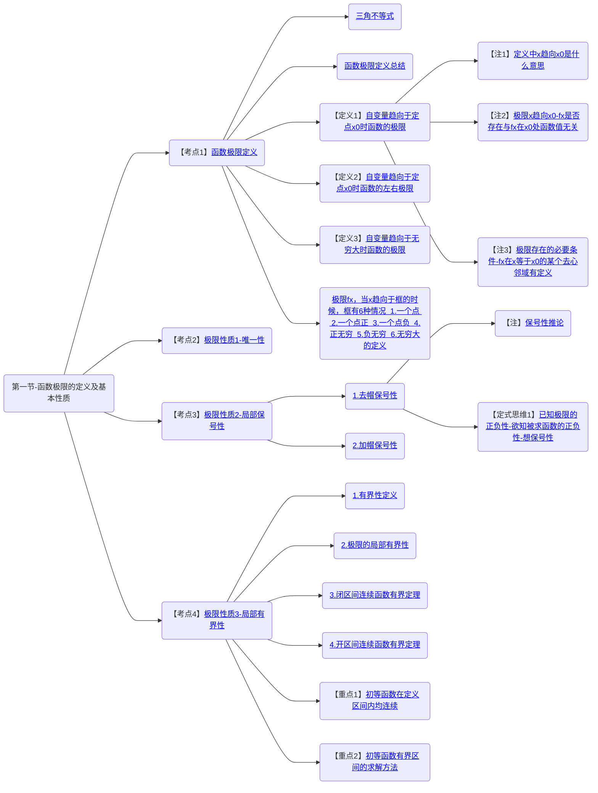
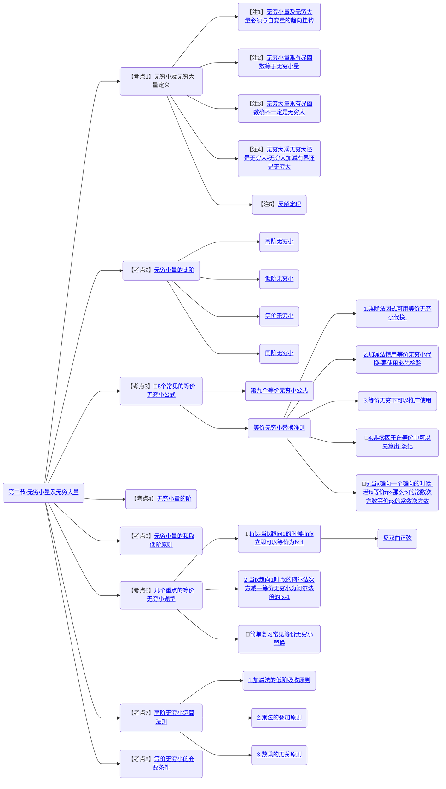
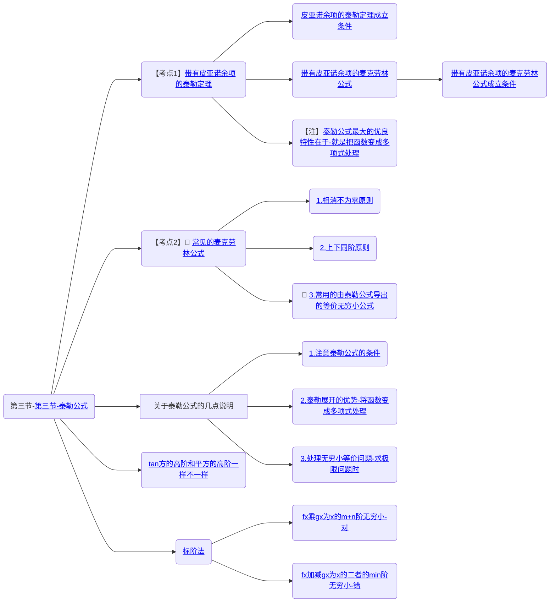
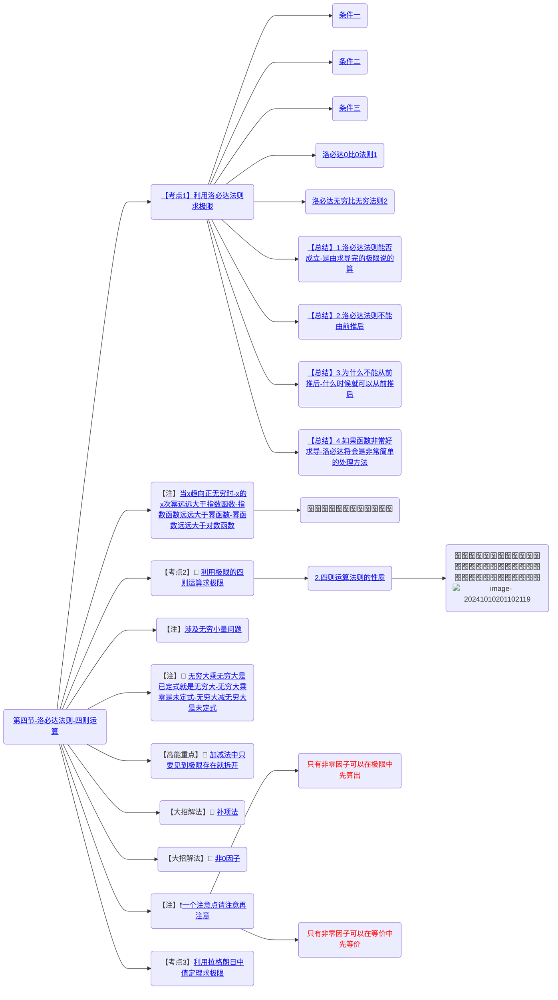
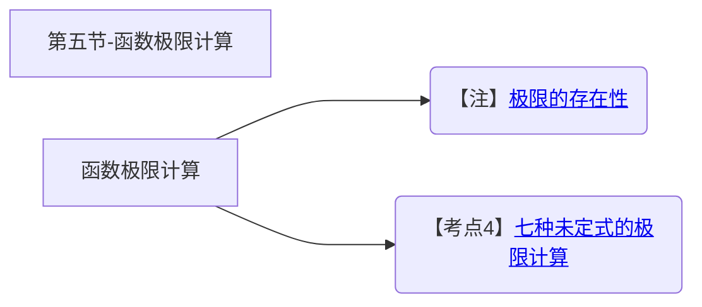

# 第一节-函数极限的定义及基本性质

```mermaid
graph LR
第一节-函数极限的定义及基本性质(第一节-函数极限的定义及基本性质)

第一节-函数极限的定义及基本性质--->函数极限定义(【考点1】<a href="/Users/yuebinghui/Documents/program/github/note/笔记/数学/周洋鑫/基础班/01.函数极限的定义与性质.md#函数极限定义">函数极限定义</>)

函数极限定义--->三角不等式(<a href="/Users/yuebinghui/Documents/program/github/note/笔记/数学/周洋鑫/基础班/01.函数极限的定义与性质.md#三角不等式">三角不等式</>)
函数极限定义--->函数极限定义总结(<a href="/Users/yuebinghui/Documents/program/github/note/笔记/数学/周洋鑫/基础班/01.函数极限的定义与性质.md#函数极限定义总结">函数极限定义总结</>)
函数极限定义--->自变量趋向于定点x0时函数的极限(【定义1】<a href="/Users/yuebinghui/Documents/program/github/note/笔记/数学/周洋鑫/基础班/01.函数极限的定义与性质.md#自变量趋向于定点x0时函数的极限">自变量趋向于定点x0时函数的极限</>)
自变量趋向于定点x0时函数的极限--->定义中x趋向x0是什么意思(【注1】<a href="/Users/yuebinghui/Documents/program/github/note/笔记/数学/周洋鑫/基础班/01.函数极限的定义与性质.md#定义中x趋向x0是什么意思">定义中x趋向x0是什么意思</>)
自变量趋向于定点x0时函数的极限--->极限x趋向x0-fx是否存在与fx在x0处函数值无关(【注2】<a href="/Users/yuebinghui/Documents/program/github/note/笔记/数学/周洋鑫/基础班/01.函数极限的定义与性质.md#极限x趋向x0-fx是否存在与fx在x0处函数值无关">极限x趋向x0-fx是否存在与fx在x0处函数值无关</>)
自变量趋向于定点x0时函数的极限--->极限存在的必要条件-fx在x等于x0的某个去心邻域有定义(【注3】<a href="/Users/yuebinghui/Documents/program/github/note/笔记/数学/周洋鑫/基础班/01.函数极限的定义与性质.md#极限存在的必要条件-fx在x等于x0的某个去心邻域有定义">极限存在的必要条件-fx在x等于x0的某个去心邻域有定义</>)
函数极限定义--->自变量趋向于定点x0时函数的左右极限(【定义2】<a href="/Users/yuebinghui/Documents/program/github/note/笔记/数学/周洋鑫/基础班/01.函数极限的定义与性质.md#自变量趋向于定点x0时函数的左右极限">自变量趋向于定点x0时函数的左右极限</>)
函数极限定义--->自变量趋向于无穷大时函数的极限(【定义3】<a href="/Users/yuebinghui/Documents/program/github/note/笔记/数学/周洋鑫/基础班/01.函数极限的定义与性质.md#自变量趋向于无穷大时函数的极限">自变量趋向于无穷大时函数的极限</>)
函数极限定义--->极限fx-x趋向于框的时候框有6种情况1.一个点2.一个点正3.一个点负4.正无穷5.负无穷6.无穷大的定义(<a href="/Users/yuebinghui/Documents/program/github/note/笔记/数学/周洋鑫/基础班/01.函数极限的定义与性质.md#极限fx-x趋向于框的时候框有6种情况1.一个点2.一个点正3.一个点负4.正无穷5.负无穷6.无穷大的定义">极限fx，当x趋向于框的时候，框有6种情况  1.一个点  2.一个点正  3.一个点负  4.正无穷  5.负无穷  6.无穷大的定义</>)

第一节-函数极限的定义及基本性质--->极限性质1-唯一性(【考点2】<a href="/Users/yuebinghui/Documents/program/github/note/笔记/数学/周洋鑫/基础班/01.函数极限的定义与性质.md#极限性质1-唯一性">极限性质1-唯一性</>)

第一节-函数极限的定义及基本性质--->极限性质2-局部保号性(【考点3】<a href="/Users/yuebinghui/Documents/program/github/note/笔记/数学/周洋鑫/基础班/01.函数极限的定义与性质.md#极限性质2-局部保号性">极限性质2-局部保号性</>)
极限性质2-局部保号性--->1.去帽保号性(<a href="/Users/yuebinghui/Documents/program/github/note/笔记/数学/周洋鑫/基础班/01.函数极限的定义与性质.md#1.去帽保号性">1.去帽保号性</>)
1.去帽保号性--->保号性推论(【注】<a href="/Users/yuebinghui/Documents/program/github/note/笔记/数学/周洋鑫/基础班/01.函数极限的定义与性质.md#保号性推论">保号性推论</>)
1.去帽保号性--->已知极限的正负性-欲知被求函数的正负性-想保号性(【定式思维1】<a href="/Users/yuebinghui/Documents/program/github/note/笔记/数学/周洋鑫/基础班/01.函数极限的定义与性质.md#已知极限的正负性-欲知被求函数的正负性-想保号性">已知极限的正负性-欲知被求函数的正负性-想保号性</>)
极限性质2-局部保号性--->加帽保号性(<a href="/Users/yuebinghui/Documents/program/github/note/笔记/数学/周洋鑫/基础班/01.函数极限的定义与性质.md#加帽保号性">2.加帽保号性</>)

第一节-函数极限的定义及基本性质--->极限性质3-局部有界性(【考点4】<a href="/Users/yuebinghui/Documents/program/github/note/笔记/数学/周洋鑫/基础班/01.函数极限的定义与性质.md#极限性质3-局部有界性">极限性质3-局部有界性</>)
极限性质3-局部有界性--->1.有界性定义(<a href="/Users/yuebinghui/Documents/program/github/note/笔记/数学/周洋鑫/基础班/01.函数极限的定义与性质.md#1.有界性定义">1.有界性定义</>)
极限性质3-局部有界性--->2.极限的局部有界性(<a href="/Users/yuebinghui/Documents/program/github/note/笔记/数学/周洋鑫/基础班/01.函数极限的定义与性质.md#2.极限的局部有界性">2.极限的局部有界性</>)
极限性质3-局部有界性--->3.闭区间连续函数有界定理(<a href="/Users/yuebinghui/Documents/program/github/note/笔记/数学/周洋鑫/基础班/01.函数极限的定义与性质.md#3.闭区间连续函数有界定理">3.闭区间连续函数有界定理</>)
极限性质3-局部有界性--->4.开区间连续函数有界定理(<a href="/Users/yuebinghui/Documents/program/github/note/笔记/数学/周洋鑫/基础班/01.函数极限的定义与性质.md#4.开区间连续函数有界定理">4.开区间连续函数有界定理</>)

极限性质3-局部有界性--->初等函数在定义区间内均连续(【重点1】<a href="/Users/yuebinghui/Documents/program/github/note/笔记/数学/周洋鑫/基础班/01.函数极限的定义与性质.md#初等函数在定义区间内均连续">初等函数在定义区间内均连续</>)
极限性质3-局部有界性--->初等函数有界区间的求解方法(【重点2】<a href="/Users/yuebinghui/Documents/program/github/note/笔记/数学/周洋鑫/基础班/01.函数极限的定义与性质.md#初等函数有界区间的求解方法">初等函数有界区间的求解方法</>)


```

# 第二节-无穷小量及无穷大量

```mermaid
graph LR

第二节-无穷小量及无穷大量(<a href="/Users/yuebinghui/Documents/program/github/note/笔记/数学/周洋鑫/基础班/02.无穷小量及无穷大量.md#第二节-无穷小量及无穷大量">第二节-无穷小量及无穷大量</>)

第二节-无穷小量及无穷大量--->无穷小及无穷大量定义(【考点1】无穷小及无穷大量定义)

无穷小及无穷大量定义--->无穷小量及无穷大量必须与自变量的趋向挂钩(【注1】<a href="/Users/yuebinghui/Documents/program/github/note/笔记/数学/周洋鑫/基础班/02.无穷小量及无穷大量.md#无穷小量及无穷大量必须与自变量的趋向挂钩">无穷小量及无穷大量必须与自变量的趋向挂钩</>)
无穷小及无穷大量定义--->无穷小量乘有界函数等于无穷小量(【注2】<a href="/Users/yuebinghui/Documents/program/github/note/笔记/数学/周洋鑫/基础班/02.无穷小量及无穷大量.md#无穷小量乘有界函数等于无穷小量">无穷小量乘有界函数等于无穷小量</>)
无穷小及无穷大量定义--->无穷大量乘有界函数确不一定是无穷大(【注3】<a href="/Users/yuebinghui/Documents/program/github/note/笔记/数学/周洋鑫/基础班/02.无穷小量及无穷大量.md#无穷大量乘有界函数确不一定是无穷大">无穷大量乘有界函数确不一定是无穷大</>)
无穷小及无穷大量定义--->无穷大乘无穷大还是无穷大-无穷大加减有界还是无穷大(【注4】<a href="/Users/yuebinghui/Documents/program/github/note/笔记/数学/周洋鑫/基础班/02.无穷小量及无穷大量.md#无穷大乘无穷大还是无穷大-无穷大加减有界还是无穷大">无穷大乘无穷大还是无穷大-无穷大加减有界还是无穷大</>)
无穷小及无穷大量定义--->反解定理(【注5】<a href="/Users/yuebinghui/Documents/program/github/note/笔记/数学/周洋鑫/基础班/02.无穷小量及无穷大量.md#反解定理">反解定理</>)

第二节-无穷小量及无穷大量--->无穷小量的比阶(【考点2】<a href="/Users/yuebinghui/Documents/program/github/note/笔记/数学/周洋鑫/基础班/02.无穷小量及无穷大量.md#无穷小量的比阶">无穷小量的比阶</>)
无穷小量的比阶--->高阶无穷小(<a href="/Users/yuebinghui/Documents/program/github/note/笔记/数学/周洋鑫/基础班/02.无穷小量及无穷大量.md#高阶无穷小">高阶无穷小</>)
无穷小量的比阶--->低阶无穷小(<a href="/Users/yuebinghui/Documents/program/github/note/笔记/数学/周洋鑫/基础班/02.无穷小量及无穷大量.md#低阶无穷小">低阶无穷小</>)
无穷小量的比阶--->等价无穷小(<a href="/Users/yuebinghui/Documents/program/github/note/笔记/数学/周洋鑫/基础班/02.无穷小量及无穷大量.md#等价无穷小">等价无穷小</>)
无穷小量的比阶--->同阶无穷小(<a href="/Users/yuebinghui/Documents/program/github/note/笔记/数学/周洋鑫/基础班/02.无穷小量及无穷大量.md#同阶无穷小">同阶无穷小</>)

第二节-无穷小量及无穷大量--->8个常见的等价无穷小公式(【考点3】🌟<a href="/Users/yuebinghui/Documents/program/github/note/笔记/数学/周洋鑫/基础班/02.无穷小量及无穷大量.md#8个常见的等价无穷小公式">8个常见的等价无穷小公式</>)
8个常见的等价无穷小公式--->第九个等价无穷小公式(<a href="/Users/yuebinghui/Documents/program/github/note/笔记/数学/周洋鑫/基础班/02.无穷小量及无穷大量.md#第九个等价无穷小公式">第九个等价无穷小公式</>)
8个常见的等价无穷小公式--->等价无穷小替换准则(<a href="/Users/yuebinghui/Documents/program/github/note/笔记/数学/周洋鑫/基础班/02.无穷小量及无穷大量.md#等价无穷小替换准则">等价无穷小替换准则</>)
等价无穷小替换准则--->1.乘除法因式可用等价无穷小代换.(<a href="/Users/yuebinghui/Documents/program/github/note/笔记/数学/周洋鑫/基础班/02.无穷小量及无穷大量.md#1.乘除法因式可用等价无穷小代换.">1.乘除法因式可用等价无穷小代换.</>)
等价无穷小替换准则--->2.加减法慎用等价无穷小代换-要使用必先检验(<a href="/Users/yuebinghui/Documents/program/github/note/笔记/数学/周洋鑫/基础班/02.无穷小量及无穷大量.md#2.加减法慎用等价无穷小代换-要使用必先检验">2.加减法慎用等价无穷小代换-要使用必先检验</>)
等价无穷小替换准则--->3.等价无穷下可以推广使用(<a href="/Users/yuebinghui/Documents/program/github/note/笔记/数学/周洋鑫/基础班/02.无穷小量及无穷大量.md#3.等价无穷下可以推广使用">3.等价无穷下可以推广使用</>)
等价无穷小替换准则--->4.非零因子在等价中可以先算出-淡化(🌟<a href="/Users/yuebinghui/Documents/program/github/note/笔记/数学/周洋鑫/基础班/02.无穷小量及无穷大量.md#4.非零因子在等价中可以先算出-淡化">4.非零因子在等价中可以先算出-淡化</>)
等价无穷小替换准则--->5.当x趋向一个趋向的时候-若fx等价gx-那么fx的常数次方数等价gx的常数次方数(🌟<a href="/Users/yuebinghui/Documents/program/github/note/笔记/数学/周洋鑫/基础班/02.无穷小量及无穷大量.md#5.当x趋向一个趋向的时候-若fx等价gx-那么fx的常数次方数等价gx的常数次方数">5.当x趋向一个趋向的时候-若fx等价gx-那么fx的常数次方数等价gx的常数次方数</>)


第二节-无穷小量及无穷大量--->无穷小量的阶(【考点4】<a href="/Users/yuebinghui/Documents/program/github/note/笔记/数学/周洋鑫/基础班/02.无穷小量及无穷大量.md#无穷小量的阶">无穷小量的阶</>)

第二节-无穷小量及无穷大量--->无穷小量的和取低阶原则(【考点5】<a href="/Users/yuebinghui/Documents/program/github/note/笔记/数学/周洋鑫/基础班/02.无穷小量及无穷大量.md#无穷小量的和取低阶原则">无穷小量的和取低阶原则</>)

第二节-无穷小量及无穷大量--->几个重点的等价无穷小题型(【考点6】<a href="/Users/yuebinghui/Documents/program/github/note/笔记/数学/周洋鑫/基础班/02.无穷小量及无穷大量.md#几个重点的等价无穷小题型">几个重点的等价无穷小题型</>)
几个重点的等价无穷小题型--->lnfx-当fx趋向1的时候-lnfx立即可以等价为fx-1(1.<a href="/Users/yuebinghui/Documents/program/github/note/笔记/数学/周洋鑫/基础班/02.无穷小量及无穷大量.md#lnfx-当fx趋向1的时候-lnfx立即可以等价为fx-1">lnfx-当fx趋向1的时候-lnfx立即可以等价为fx-1</>)
lnfx-当fx趋向1的时候-lnfx立即可以等价为fx-1--->反双曲正弦(<a href="/Users/yuebinghui/Documents/program/github/note/笔记/数学/周洋鑫/基础班/02.无穷小量及无穷大量.md#反双曲正弦">反双曲正弦</>)
几个重点的等价无穷小题型--->2.当fx趋向1时-fx的阿尔法次方减一等价无穷小为阿尔法倍的fx-1(<a href="/Users/yuebinghui/Documents/program/github/note/笔记/数学/周洋鑫/基础班/02.无穷小量及无穷大量.md#2.当fx趋向1时-fx的阿尔法次方减一等价无穷小为阿尔法倍的fx-1">2.当fx趋向1时-fx的阿尔法次方减一等价无穷小为阿尔法倍的fx-1</>)
几个重点的等价无穷小题型--->简单复习常见等价无穷小替换(🌟<a href="/Users/yuebinghui/Documents/program/github/note/笔记/数学/周洋鑫/基础班/03.泰勒公式-洛必达法则.md#简单复习常见等价无穷小替换">简单复习常见等价无穷小替换</>)

第二节-无穷小量及无穷大量--->高阶无穷小运算法则(【考点7】<a href="/Users/yuebinghui/Documents/program/github/note/笔记/数学/周洋鑫/基础班/03.泰勒公式-洛必达法则.md#高阶无穷小运算法则">高阶无穷小运算法则</>)
高阶无穷小运算法则--->1.加减法的低阶吸收原则(<a href="/Users/yuebinghui/Documents/program/github/note/笔记/数学/周洋鑫/基础班/03.泰勒公式-洛必达法则.md#1.加减法的低阶吸收原则">1.加减法的低阶吸收原则</>)
高阶无穷小运算法则--->2.乘法的叠加原则(<a href="/Users/yuebinghui/Documents/program/github/note/笔记/数学/周洋鑫/基础班/03.泰勒公式-洛必达法则.md#2.乘法的叠加原则">2.乘法的叠加原则</>)
高阶无穷小运算法则--->3.数乘的无关原则(<a href="/Users/yuebinghui/Documents/program/github/note/笔记/数学/周洋鑫/基础班/03.泰勒公式-洛必达法则.md#3.数乘的无关原则">3.数乘的无关原则</>)

第二节-无穷小量及无穷大量--->等价无穷小的充要条件(【考点8】<a href="/Users/yuebinghui/Documents/program/github/note/笔记/数学/周洋鑫/基础班/03.泰勒公式-洛必达法则.md#等价无穷小的充要条件">等价无穷小的充要条件</>)

```

# 第三节-泰勒公式

```mermaid
graph LR

带有皮亚诺余项的泰勒公式(第三节-<a href="/Users/yuebinghui/Documents/program/github/note/笔记/数学/周洋鑫/基础班/03.泰勒公式-洛必达法则.md#带有皮亚诺余项的泰勒公式">第三节-泰勒公式</>)

带有皮亚诺余项的泰勒公式--->带有皮亚诺余项的泰勒定理(【考点1】<a href="/Users/yuebinghui/Documents/program/github/note/笔记/数学/周洋鑫/基础班/03.泰勒公式-洛必达法则.md#带有皮亚诺余项的泰勒定理">带有皮亚诺余项的泰勒定理</>)
带有皮亚诺余项的泰勒定理--->皮亚诺余项的泰勒定理成立条件(<a href="/Users/yuebinghui/Documents/program/github/note/笔记/数学/周洋鑫/基础班/03.泰勒公式-洛必达法则.md#皮亚诺余项的泰勒定理成立条件">皮亚诺余项的泰勒定理成立条件</>)
带有皮亚诺余项的泰勒定理--->带有皮亚诺余项的麦克劳林公式(<a href="/Users/yuebinghui/Documents/program/github/note/笔记/数学/周洋鑫/基础班/03.泰勒公式-洛必达法则.md#带有皮亚诺余项的麦克劳林公式">带有皮亚诺余项的麦克劳林公式</>)
带有皮亚诺余项的麦克劳林公式--->带有皮亚诺余项的麦克劳林公式成立条件(<a href="/Users/yuebinghui/Documents/program/github/note/笔记/数学/周洋鑫/基础班/03.泰勒公式-洛必达法则.md#带有皮亚诺余项的麦克劳林公式成立条件">带有皮亚诺余项的麦克劳林公式成立条件</>)
带有皮亚诺余项的泰勒定理--->泰勒公式最大的优良特性在于-就是把函数变成多项式处理(【注】<a href="/Users/yuebinghui/Documents/program/github/note/笔记/数学/周洋鑫/基础班/03.泰勒公式-洛必达法则.md#泰勒公式最大的优良特性在于-就是把函数变成多项式处理">泰勒公式最大的优良特性在于-就是把函数变成多项式处理</>)

带有皮亚诺余项的泰勒公式--->常见的麦克劳林公式(【考点2】🌟 <a href="/Users/yuebinghui/Documents/program/github/note/笔记/数学/周洋鑫/基础班/03.泰勒公式-洛必达法则.md#常见的麦克劳林公式">常见的麦克劳林公式</>)
常见的麦克劳林公式--->1.相消不为零原则(<a href="/Users/yuebinghui/Documents/program/github/note/笔记/数学/周洋鑫/基础班/03.泰勒公式-洛必达法则.md#1.相消不为零原则">1.相消不为零原则</>)
常见的麦克劳林公式--->2.上下同阶原则(<a href="/Users/yuebinghui/Documents/program/github/note/笔记/数学/周洋鑫/基础班/03.泰勒公式-洛必达法则.md#2.上下同阶原则">2.上下同阶原则</>)
常见的麦克劳林公式--->3.常用的由泰勒公式导出的等价无穷小公式(🌟 <a href="/Users/yuebinghui/Documents/program/github/note/笔记/数学/周洋鑫/基础班/03.泰勒公式-洛必达法则.md#3.常用的由泰勒公式导出的等价无穷小公式">3.常用的由泰勒公式导出的等价无穷小公式</>)
带有皮亚诺余项的泰勒公式--->关于泰勒公式的几点说明
关于泰勒公式的几点说明--->1.注意泰勒公式的条件(<a href="/Users/yuebinghui/Documents/program/github/note/笔记/数学/周洋鑫/基础班/03.泰勒公式-洛必达法则.md#1.注意泰勒公式的条件">1.注意泰勒公式的条件</>)
关于泰勒公式的几点说明--->2.泰勒展开的优势-将函数变成多项式处理(<a href="/Users/yuebinghui/Documents/program/github/note/笔记/数学/周洋鑫/基础班/03.泰勒公式-洛必达法则.md#2.泰勒展开的优势-将函数变成多项式处理">2.泰勒展开的优势-将函数变成多项式处理</>)
关于泰勒公式的几点说明--->3.处理无穷小等价问题-求极限问题时(<a href="/Users/yuebinghui/Documents/program/github/note/笔记/数学/周洋鑫/基础班/03.泰勒公式-洛必达法则.md#3.处理无穷小等价问题-求极限问题时">3.处理无穷小等价问题-求极限问题时</>)

带有皮亚诺余项的泰勒公式--->tan方的高阶和平方的高阶一样不一样(<a href="/Users/yuebinghui/Documents/program/github/note/笔记/数学/周洋鑫/基础班/03.泰勒公式-洛必达法则.md#tan方的高阶和平方的高阶一样不一样">tan方的高阶和平方的高阶一样不一样</>)

带有皮亚诺余项的泰勒公式--->标阶法(<a href="/Users/yuebinghui/Documents/program/github/note/笔记/数学/周洋鑫/基础班/03.泰勒公式-洛必达法则.md#标阶法">标阶法</>)
标阶法--->fx乘gx为x的m+n阶无穷小-对(<a href="/Users/yuebinghui/Documents/program/github/note/笔记/数学/周洋鑫/基础班/03.泰勒公式-洛必达法则.md#fx乘gx为x的m+n阶无穷小-对">fx乘gx为x的m+n阶无穷小-对</>)
标阶法--->fx加减gx为x的二者的min阶无穷小-错(<a href="/Users/yuebinghui/Documents/program/github/note/笔记/数学/周洋鑫/基础班/03.泰勒公式-洛必达法则.md#fx加减gx为x的二者的min阶无穷小-错">fx加减gx为x的二者的min阶无穷小-错</>)
```

# 第四节-洛必达法则-四则运算

```mermaid
graph LR

第四节-函数极限计算(<a href="/Users/yuebinghui/Documents/program/github/note/笔记/数学/周洋鑫/基础班/04.四则运算-拉格朗日及函数极限计算.md#第四节-函数极限计算">第四节-洛必达法则-四则运算</>)

第四节-函数极限计算--->利用洛必达法则求极限(<a href="/Users/yuebinghui/Documents/program/github/note/笔记/数学/周洋鑫/基础班/04.四则运算-拉格朗日及函数极限计算.md#利用洛必达法则求极限">【考点1】利用洛必达法则求极限</>)
利用洛必达法则求极限--->条件一(<a href="/Users/yuebinghui/Documents/program/github/note/笔记/数学/周洋鑫/基础班/04.四则运算-拉格朗日及函数极限计算.md#条件一">条件一</>)
利用洛必达法则求极限--->条件二(<a href="/Users/yuebinghui/Documents/program/github/note/笔记/数学/周洋鑫/基础班/04.四则运算-拉格朗日及函数极限计算.md#条件二">条件二</>)
利用洛必达法则求极限--->条件三(<a href="/Users/yuebinghui/Documents/program/github/note/笔记/数学/周洋鑫/基础班/04.四则运算-拉格朗日及函数极限计算.md#条件三">条件三</>)

利用洛必达法则求极限--->洛必达0比0法则1(<a href="/Users/yuebinghui/Documents/program/github/note/笔记/数学/周洋鑫/基础班/04.四则运算-拉格朗日及函数极限计算.md#洛必达0比0法则1">洛必达0比0法则1</>)
利用洛必达法则求极限--->洛必达无穷比无穷法则2(<a href="/Users/yuebinghui/Documents/program/github/note/笔记/数学/周洋鑫/基础班/04.四则运算-拉格朗日及函数极限计算.md#洛必达无穷比无穷法则2">洛必达无穷比无穷法则2</>)
利用洛必达法则求极限--->1.洛必达法则能否成立-是由求导完的极限说的算(<a href="/Users/yuebinghui/Documents/program/github/note/笔记/数学/周洋鑫/基础班/04.四则运算-拉格朗日及函数极限计算.md#1.洛必达法则能否成立-是由求导完的极限说的算">【总结】1.洛必达法则能否成立-是由求导完的极限说的算</>)
利用洛必达法则求极限--->2.洛必达法则不能由前推后(<a href="/Users/yuebinghui/Documents/program/github/note/笔记/数学/周洋鑫/基础班/04.四则运算-拉格朗日及函数极限计算.md#2.洛必达法则不能由前推后">【总结】2.洛必达法则不能由前推后</>)
利用洛必达法则求极限--->3.为什么不能从前推后-什么时候就可以从前推后(<a href="/Users/yuebinghui/Documents/program/github/note/笔记/数学/周洋鑫/基础班/04.四则运算-拉格朗日及函数极限计算.md#3.为什么不能从前推后-什么时候就可以从前推后">【总结】3.为什么不能从前推后-什么时候就可以从前推后</>)
利用洛必达法则求极限--->4.如果函数非常好求导-洛必达将会是非常简单的处理方法(<a href="/Users/yuebinghui/Documents/program/github/note/笔记/数学/周洋鑫/基础班/04.四则运算-拉格朗日及函数极限计算.md#4.如果函数非常好求导-洛必达将会是非常简单的处理方法">【总结】4.如果函数非常好求导-洛必达将会是非常简单的处理方法</>)

第四节-函数极限计算--->当x趋向正无穷时-x的x次幂远远大于指数函数-指数函数远远大于幂函数-幂函数远远大于对数函数(【注】<a href="/Users/yuebinghui/Documents/program/github/note/笔记/数学/周洋鑫/基础班/04.四则运算-拉格朗日及函数极限计算.md#当x趋向正无穷时-x的x次幂远远大于指数函数-指数函数远远大于幂函数-幂函数远远大于对数函数">当x趋向正无穷时-x的x次幂远远大于指数函数-指数函数远远大于幂函数-幂函数远远大于对数函数</>)
当x趋向正无穷时-x的x次幂远远大于指数函数-指数函数远远大于幂函数-幂函数远远大于对数函数--->远远大于(图图图图图图图图图图图图<img src="/Users/yuebinghui/Documents/program/github/note/images/image-20241010155838004.png" style="zoom:10%;" alt="image-20241010155838004" />)

第四节-函数极限计算--->利用极限的四则运算求极限(【考点2】🌟 <a href="/Users/yuebinghui/Documents/program/github/note/笔记/数学/周洋鑫/基础班/04.四则运算-拉格朗日及函数极限计算.md#利用极限的四则运算求极限">利用极限的四则运算求极限</>)

第四节-函数极限计算--->涉及无穷小量问题(【注】<a href="/Users/yuebinghui/Documents/program/github/note/笔记/数学/周洋鑫/基础班/04.四则运算-拉格朗日及函数极限计算.md#涉及无穷小量问题">涉及无穷小量问题</>)
第四节-函数极限计算--->无穷大乘无穷大是已定式就是无穷大-无穷大乘零是未定式-无穷大减无穷大是未定式(【注】🌟 <a href="/Users/yuebinghui/Documents/program/github/note/笔记/数学/周洋鑫/基础班/04.四则运算-拉格朗日及函数极限计算.md#无穷大乘无穷大是已定式就是无穷大-无穷大乘零是未定式-无穷大减无穷大是未定式">无穷大乘无穷大是已定式就是无穷大-无穷大乘零是未定式-无穷大减无穷大是未定式</>)

利用极限的四则运算求极限--->2.四则运算法则的性质(<a href="/Users/yuebinghui/Documents/program/github/note/笔记/数学/周洋鑫/基础班/04.四则运算-拉格朗日及函数极限计算.md#2.四则运算法则的性质">2.四则运算法则的性质</>)
2.四则运算法则的性质--->四则运算性质(图图图图图图图图图图图图图图图图图图图图图图图图图图图图图图图图图图图图<img src="/Users/yuebinghui/Documents/program/github/note/images/image-20241010201102119.png" alt="image-20241010201102119" />)

第四节-函数极限计算--->加减法中只要见到极限存在就拆开(【高能重点】🌟 <a href="/Users/yuebinghui/Documents/program/github/note/笔记/数学/周洋鑫/基础班/04.四则运算-拉格朗日及函数极限计算.md#加减法中只要见到极限存在就拆开">加减法中只要见到极限存在就拆开</>)

第四节-函数极限计算--->补项法(【大招解法】🌟 <a href="/Users/yuebinghui/Documents/program/github/note/笔记/数学/周洋鑫/基础班/04.四则运算-拉格朗日及函数极限计算.md#补项法">补项法</>)

第四节-函数极限计算--->非0因子(【大招解法】🌟 <a href="/Users/yuebinghui/Documents/program/github/note/笔记/数学/周洋鑫/基础班/04.四则运算-拉格朗日及函数极限计算.md#非0因子">非0因子</>)

第四节-函数极限计算--->一个注意点请注意再注意(【注】❗️<a href="/Users/yuebinghui/Documents/program/github/note/笔记/数学/周洋鑫/基础班/04.四则运算-拉格朗日及函数极限计算.md#一个注意点请注意再注意">一个注意点请注意再注意</>)
一个注意点请注意再注意--->只有非零因子可以在极限中先算出(<span style="color:red">只有非零因子可以在极限中先算出</span>)
一个注意点请注意再注意--->只有非零因子可以在等价中先等价(<span style="color:red">只有非零因子可以在等价中先等价</span>)

第四节-函数极限计算--->利用拉格朗日中值定理求极限(【考点3】<a href="/Users/yuebinghui/Documents/program/github/note/笔记/数学/周洋鑫/基础班/04.四则运算-拉格朗日及函数极限计算.md#利用拉格朗日中值定理求极限">利用拉格朗日中值定理求极限</>)

```

# 第五节-函数极限计算

```mermaid
graph LR
第五节-函数极限计算

函数极限计算--->极限的存在性(【注】<a href="/Users/yuebinghui/Documents/program/github/note/笔记/数学/周洋鑫/基础班/05.函数极限计算.md#极限的存在性">极限的存在性</>)

函数极限计算--->七种未定式的极限计算(【考点4】<a href="/Users/yuebinghui/Documents/program/github/note/笔记/数学/周洋鑫/基础班/05.函数极限计算.md#七种未定式的极限计算">七种未定式的极限计算</>)


```

