## 第一节-函数极限的定义及基本性质 

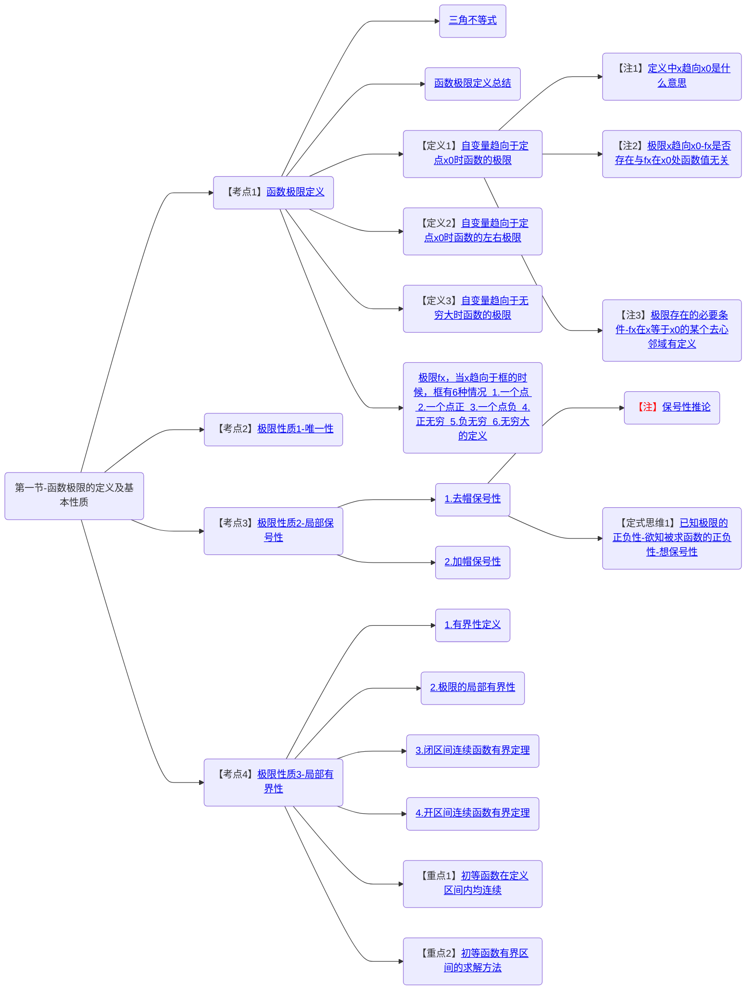
```mermaid
graph LR
第一节-函数极限的定义及基本性质(第一节-函数极限的定义及基本性质)

第一节-函数极限的定义及基本性质--->函数极限定义(【考点1】<a href="/Users/yuebinghui/Documents/program/github/note/笔记/数学/周洋鑫/基础班/01.函数极限的定义与性质.md#函数极限定义">函数极限定义</>)

函数极限定义--->三角不等式(<a href="/Users/yuebinghui/Documents/program/github/note/笔记/数学/周洋鑫/基础班/01.函数极限的定义与性质.md#三角不等式">三角不等式</>)
函数极限定义--->函数极限定义总结(<a href="/Users/yuebinghui/Documents/program/github/note/笔记/数学/周洋鑫/基础班/01.函数极限的定义与性质.md#函数极限定义总结">函数极限定义总结</>)
函数极限定义--->自变量趋向于定点x0时函数的极限(【定义1】<a href="/Users/yuebinghui/Documents/program/github/note/笔记/数学/周洋鑫/基础班/01.函数极限的定义与性质.md#自变量趋向于定点x0时函数的极限">自变量趋向于定点x0时函数的极限</>)
自变量趋向于定点x0时函数的极限--->定义中x趋向x0是什么意思(【注1】<a href="/Users/yuebinghui/Documents/program/github/note/笔记/数学/周洋鑫/基础班/01.函数极限的定义与性质.md#定义中x趋向x0是什么意思">定义中x趋向x0是什么意思</>)
自变量趋向于定点x0时函数的极限--->极限x趋向x0-fx是否存在与fx在x0处函数值无关(【注2】<a href="/Users/yuebinghui/Documents/program/github/note/笔记/数学/周洋鑫/基础班/01.函数极限的定义与性质.md#极限x趋向x0-fx是否存在与fx在x0处函数值无关">极限x趋向x0-fx是否存在与fx在x0处函数值无关</>)
自变量趋向于定点x0时函数的极限--->极限存在的必要条件-fx在x等于x0的某个去心邻域有定义(【注3】<a href="/Users/yuebinghui/Documents/program/github/note/笔记/数学/周洋鑫/基础班/01.函数极限的定义与性质.md#极限存在的必要条件-fx在x等于x0的某个去心邻域有定义">极限存在的必要条件-fx在x等于x0的某个去心邻域有定义</>)
函数极限定义--->自变量趋向于定点x0时函数的左右极限(【定义2】<a href="/Users/yuebinghui/Documents/program/github/note/笔记/数学/周洋鑫/基础班/01.函数极限的定义与性质.md#自变量趋向于定点x0时函数的左右极限">自变量趋向于定点x0时函数的左右极限</>)
函数极限定义--->自变量趋向于无穷大时函数的极限(【定义3】<a href="/Users/yuebinghui/Documents/program/github/note/笔记/数学/周洋鑫/基础班/01.函数极限的定义与性质.md#自变量趋向于无穷大时函数的极限">自变量趋向于无穷大时函数的极限</>)
函数极限定义--->极限fx-x趋向于框的时候框有6种情况1.一个点2.一个点正3.一个点负4.正无穷5.负无穷6.无穷大的定义(<a href="/Users/yuebinghui/Documents/program/github/note/笔记/数学/周洋鑫/基础班/01.函数极限的定义与性质.md#极限fx-x趋向于框的时候框有6种情况1.一个点2.一个点正3.一个点负4.正无穷5.负无穷6.无穷大的定义">极限fx，当x趋向于框的时候，框有6种情况  1.一个点  2.一个点正  3.一个点负  4.正无穷  5.负无穷  6.无穷大的定义</>)

第一节-函数极限的定义及基本性质--->极限性质1-唯一性(【考点2】<a href="/Users/yuebinghui/Documents/program/github/note/笔记/数学/周洋鑫/基础班/01.函数极限的定义与性质.md#极限性质1-唯一性">极限性质1-唯一性</>)

第一节-函数极限的定义及基本性质--->极限性质2-局部保号性(【考点3】<a href="/Users/yuebinghui/Documents/program/github/note/笔记/数学/周洋鑫/基础班/01.函数极限的定义与性质.md#极限性质2-局部保号性">极限性质2-局部保号性</>)
极限性质2-局部保号性--->1.去帽保号性(<a href="/Users/yuebinghui/Documents/program/github/note/笔记/数学/周洋鑫/基础班/01.函数极限的定义与性质.md#1.去帽保号性">1.去帽保号性</>)
1.去帽保号性--->保号性推论(<span style="color:red">【注】</span><a href="/Users/yuebinghui/Documents/program/github/note/笔记/数学/周洋鑫/基础班/01.函数极限的定义与性质.md#保号性推论">保号性推论</>)
1.去帽保号性--->已知极限的正负性-欲知被求函数的正负性-想保号性(【定式思维1】<a href="/Users/yuebinghui/Documents/program/github/note/笔记/数学/周洋鑫/基础班/01.函数极限的定义与性质.md#已知极限的正负性-欲知被求函数的正负性-想保号性">已知极限的正负性-欲知被求函数的正负性-想保号性</>)
极限性质2-局部保号性--->加帽保号性(<a href="/Users/yuebinghui/Documents/program/github/note/笔记/数学/周洋鑫/基础班/01.函数极限的定义与性质.md#加帽保号性">2.加帽保号性</>)

第一节-函数极限的定义及基本性质--->极限性质3-局部有界性(【考点4】<a href="/Users/yuebinghui/Documents/program/github/note/笔记/数学/周洋鑫/基础班/01.函数极限的定义与性质.md#极限性质3-局部有界性">极限性质3-局部有界性</>)
极限性质3-局部有界性--->1.有界性定义(<a href="/Users/yuebinghui/Documents/program/github/note/笔记/数学/周洋鑫/基础班/01.函数极限的定义与性质.md#1.有界性定义">1.有界性定义</>)
极限性质3-局部有界性--->2.极限的局部有界性(<a href="/Users/yuebinghui/Documents/program/github/note/笔记/数学/周洋鑫/基础班/01.函数极限的定义与性质.md#2.极限的局部有界性">2.极限的局部有界性</>)
极限性质3-局部有界性--->3.闭区间连续函数有界定理(<a href="/Users/yuebinghui/Documents/program/github/note/笔记/数学/周洋鑫/基础班/01.函数极限的定义与性质.md#3.闭区间连续函数有界定理">3.闭区间连续函数有界定理</>)
极限性质3-局部有界性--->4.开区间连续函数有界定理(<a href="/Users/yuebinghui/Documents/program/github/note/笔记/数学/周洋鑫/基础班/01.函数极限的定义与性质.md#4.开区间连续函数有界定理">4.开区间连续函数有界定理</>)

极限性质3-局部有界性--->初等函数在定义区间内均连续(【重点1】<a href="/Users/yuebinghui/Documents/program/github/note/笔记/数学/周洋鑫/基础班/01.函数极限的定义与性质.md#初等函数在定义区间内均连续">初等函数在定义区间内均连续</>)
极限性质3-局部有界性--->初等函数有界区间的求解方法(【重点2】<a href="/Users/yuebinghui/Documents/program/github/note/笔记/数学/周洋鑫/基础班/01.函数极限的定义与性质.md#初等函数有界区间的求解方法">初等函数有界区间的求解方法</>)


```

## 第二节-无穷小量及无穷大量

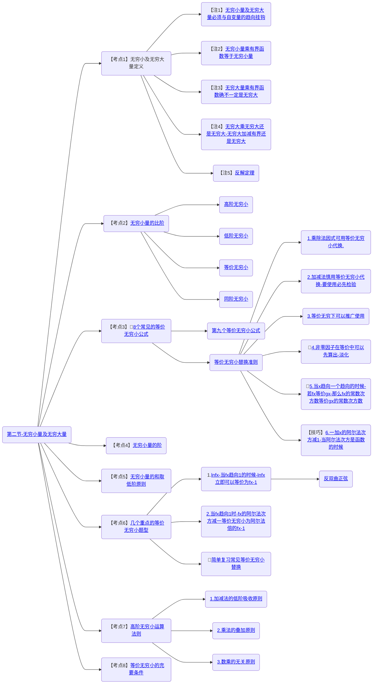
```mermaid
graph LR

第二节-无穷小量及无穷大量(<a href="/Users/yuebinghui/Documents/program/github/note/笔记/数学/周洋鑫/基础班/02.无穷小量及无穷大量.md#第二节-无穷小量及无穷大量">第二节-无穷小量及无穷大量</>)

第二节-无穷小量及无穷大量--->无穷小及无穷大量定义(【考点1】无穷小及无穷大量定义)

无穷小及无穷大量定义--->无穷小量及无穷大量必须与自变量的趋向挂钩(【注1】<a href="/Users/yuebinghui/Documents/program/github/note/笔记/数学/周洋鑫/基础班/02.无穷小量及无穷大量.md#无穷小量及无穷大量必须与自变量的趋向挂钩">无穷小量及无穷大量必须与自变量的趋向挂钩</>)
无穷小及无穷大量定义--->无穷小量乘有界函数等于无穷小量(【注2】<a href="/Users/yuebinghui/Documents/program/github/note/笔记/数学/周洋鑫/基础班/02.无穷小量及无穷大量.md#无穷小量乘有界函数等于无穷小量">无穷小量乘有界函数等于无穷小量</>)
无穷小及无穷大量定义--->无穷大量乘有界函数确不一定是无穷大(【注3】<a href="/Users/yuebinghui/Documents/program/github/note/笔记/数学/周洋鑫/基础班/02.无穷小量及无穷大量.md#无穷大量乘有界函数确不一定是无穷大">无穷大量乘有界函数确不一定是无穷大</>)
无穷小及无穷大量定义--->无穷大乘无穷大还是无穷大-无穷大加减有界还是无穷大(【注4】<a href="/Users/yuebinghui/Documents/program/github/note/笔记/数学/周洋鑫/基础班/02.无穷小量及无穷大量.md#无穷大乘无穷大还是无穷大-无穷大加减有界还是无穷大">无穷大乘无穷大还是无穷大-无穷大加减有界还是无穷大</>)
无穷小及无穷大量定义--->反解定理(【注5】<a href="/Users/yuebinghui/Documents/program/github/note/笔记/数学/周洋鑫/基础班/02.无穷小量及无穷大量.md#反解定理">反解定理</>)

第二节-无穷小量及无穷大量--->无穷小量的比阶(【考点2】<a href="/Users/yuebinghui/Documents/program/github/note/笔记/数学/周洋鑫/基础班/02.无穷小量及无穷大量.md#无穷小量的比阶">无穷小量的比阶</>)
无穷小量的比阶--->高阶无穷小(<a href="/Users/yuebinghui/Documents/program/github/note/笔记/数学/周洋鑫/基础班/02.无穷小量及无穷大量.md#高阶无穷小">高阶无穷小</>)
无穷小量的比阶--->低阶无穷小(<a href="/Users/yuebinghui/Documents/program/github/note/笔记/数学/周洋鑫/基础班/02.无穷小量及无穷大量.md#低阶无穷小">低阶无穷小</>)
无穷小量的比阶--->等价无穷小(<a href="/Users/yuebinghui/Documents/program/github/note/笔记/数学/周洋鑫/基础班/02.无穷小量及无穷大量.md#等价无穷小">等价无穷小</>)
无穷小量的比阶--->同阶无穷小(<a href="/Users/yuebinghui/Documents/program/github/note/笔记/数学/周洋鑫/基础班/02.无穷小量及无穷大量.md#同阶无穷小">同阶无穷小</>)

第二节-无穷小量及无穷大量--->8个常见的等价无穷小公式(【考点3】🌟<a href="/Users/yuebinghui/Documents/program/github/note/笔记/数学/周洋鑫/基础班/02.无穷小量及无穷大量.md#8个常见的等价无穷小公式">8个常见的等价无穷小公式</>)
8个常见的等价无穷小公式--->第九个等价无穷小公式(<a href="/Users/yuebinghui/Documents/program/github/note/笔记/数学/周洋鑫/基础班/02.无穷小量及无穷大量.md#第九个等价无穷小公式">第九个等价无穷小公式</>)
8个常见的等价无穷小公式--->等价无穷小替换准则(<a href="/Users/yuebinghui/Documents/program/github/note/笔记/数学/周洋鑫/基础班/02.无穷小量及无穷大量.md#等价无穷小替换准则">等价无穷小替换准则</>)
等价无穷小替换准则--->1.乘除法因式可用等价无穷小代换.(<a href="/Users/yuebinghui/Documents/program/github/note/笔记/数学/周洋鑫/基础班/02.无穷小量及无穷大量.md#1.乘除法因式可用等价无穷小代换.">1.乘除法因式可用等价无穷小代换.</>)
等价无穷小替换准则--->2.加减法慎用等价无穷小代换-要使用必先检验(<a href="/Users/yuebinghui/Documents/program/github/note/笔记/数学/周洋鑫/基础班/02.无穷小量及无穷大量.md#2.加减法慎用等价无穷小代换-要使用必先检验">2.加减法慎用等价无穷小代换-要使用必先检验</>)
等价无穷小替换准则--->3.等价无穷下可以推广使用(<a href="/Users/yuebinghui/Documents/program/github/note/笔记/数学/周洋鑫/基础班/02.无穷小量及无穷大量.md#3.等价无穷下可以推广使用">3.等价无穷下可以推广使用</>)
等价无穷小替换准则--->4.非零因子在等价中可以先算出-淡化(🌟<a href="/Users/yuebinghui/Documents/program/github/note/笔记/数学/周洋鑫/基础班/02.无穷小量及无穷大量.md#4.非零因子在等价中可以先算出-淡化">4.非零因子在等价中可以先算出-淡化</>)
等价无穷小替换准则--->5.当x趋向一个趋向的时候-若fx等价gx-那么fx的常数次方数等价gx的常数次方数(🌟<a href="/Users/yuebinghui/Documents/program/github/note/笔记/数学/周洋鑫/基础班/02.无穷小量及无穷大量.md#5.当x趋向一个趋向的时候-若fx等价gx-那么fx的常数次方数等价gx的常数次方数">5.当x趋向一个趋向的时候-若fx等价gx-那么fx的常数次方数等价gx的常数次方数</>)
等价无穷小替换准则--->1加x的阿尔法次方减1-当阿尔法次方是函数的时候(【技巧】<a href="/Users/yuebinghui/Documents/program/github/note/笔记/数学/周洋鑫/基础班/02.无穷小量及无穷大量.md#1加x的阿尔法次方减1-当阿尔法次方是函数的时候">6.一加x的阿尔法次方减1-当阿尔法次方是函数的时候</>)


第二节-无穷小量及无穷大量--->无穷小量的阶(【考点4】<a href="/Users/yuebinghui/Documents/program/github/note/笔记/数学/周洋鑫/基础班/02.无穷小量及无穷大量.md#无穷小量的阶">无穷小量的阶</>)

第二节-无穷小量及无穷大量--->无穷小量的和取低阶原则(【考点5】<a href="/Users/yuebinghui/Documents/program/github/note/笔记/数学/周洋鑫/基础班/02.无穷小量及无穷大量.md#无穷小量的和取低阶原则">无穷小量的和取低阶原则</>)

第二节-无穷小量及无穷大量--->几个重点的等价无穷小题型(【考点6】<a href="/Users/yuebinghui/Documents/program/github/note/笔记/数学/周洋鑫/基础班/02.无穷小量及无穷大量.md#几个重点的等价无穷小题型">几个重点的等价无穷小题型</>)
几个重点的等价无穷小题型--->lnfx-当fx趋向1的时候-lnfx立即可以等价为fx-1(1.<a href="/Users/yuebinghui/Documents/program/github/note/笔记/数学/周洋鑫/基础班/02.无穷小量及无穷大量.md#lnfx-当fx趋向1的时候-lnfx立即可以等价为fx-1">lnfx-当fx趋向1的时候-lnfx立即可以等价为fx-1</>)
lnfx-当fx趋向1的时候-lnfx立即可以等价为fx-1--->反双曲正弦(<a href="/Users/yuebinghui/Documents/program/github/note/笔记/数学/周洋鑫/基础班/02.无穷小量及无穷大量.md#反双曲正弦">反双曲正弦</>)
几个重点的等价无穷小题型--->2.当fx趋向1时-fx的阿尔法次方减一等价无穷小为阿尔法倍的fx-1(<a href="/Users/yuebinghui/Documents/program/github/note/笔记/数学/周洋鑫/基础班/02.无穷小量及无穷大量.md#2.当fx趋向1时-fx的阿尔法次方减一等价无穷小为阿尔法倍的fx-1">2.当fx趋向1时-fx的阿尔法次方减一等价无穷小为阿尔法倍的fx-1</>)
几个重点的等价无穷小题型--->简单复习常见等价无穷小替换(🌟<a href="/Users/yuebinghui/Documents/program/github/note/笔记/数学/周洋鑫/基础班/03.泰勒公式-洛必达法则.md#简单复习常见等价无穷小替换">简单复习常见等价无穷小替换</>)

第二节-无穷小量及无穷大量--->高阶无穷小运算法则(【考点7】<a href="/Users/yuebinghui/Documents/program/github/note/笔记/数学/周洋鑫/基础班/03.泰勒公式-洛必达法则.md#高阶无穷小运算法则">高阶无穷小运算法则</>)
高阶无穷小运算法则--->1.加减法的低阶吸收原则(<a href="/Users/yuebinghui/Documents/program/github/note/笔记/数学/周洋鑫/基础班/03.泰勒公式-洛必达法则.md#1.加减法的低阶吸收原则">1.加减法的低阶吸收原则</>)
高阶无穷小运算法则--->2.乘法的叠加原则(<a href="/Users/yuebinghui/Documents/program/github/note/笔记/数学/周洋鑫/基础班/03.泰勒公式-洛必达法则.md#2.乘法的叠加原则">2.乘法的叠加原则</>)
高阶无穷小运算法则--->3.数乘的无关原则(<a href="/Users/yuebinghui/Documents/program/github/note/笔记/数学/周洋鑫/基础班/03.泰勒公式-洛必达法则.md#3.数乘的无关原则">3.数乘的无关原则</>)

第二节-无穷小量及无穷大量--->等价无穷小的充要条件(【考点8】<a href="/Users/yuebinghui/Documents/program/github/note/笔记/数学/周洋鑫/基础班/03.泰勒公式-洛必达法则.md#等价无穷小的充要条件">等价无穷小的充要条件</>)

```

## 第三节-泰勒公式

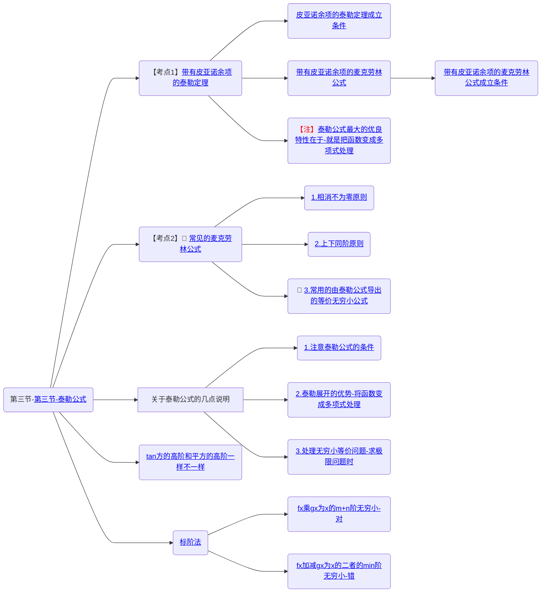
```mermaid
graph LR

带有皮亚诺余项的泰勒公式(第三节-<a href="/Users/yuebinghui/Documents/program/github/note/笔记/数学/周洋鑫/基础班/03.泰勒公式-洛必达法则.md#带有皮亚诺余项的泰勒公式">第三节-泰勒公式</>)

带有皮亚诺余项的泰勒公式--->带有皮亚诺余项的泰勒定理(【考点1】<a href="/Users/yuebinghui/Documents/program/github/note/笔记/数学/周洋鑫/基础班/03.泰勒公式-洛必达法则.md#带有皮亚诺余项的泰勒定理">带有皮亚诺余项的泰勒定理</>)
带有皮亚诺余项的泰勒定理--->皮亚诺余项的泰勒定理成立条件(<a href="/Users/yuebinghui/Documents/program/github/note/笔记/数学/周洋鑫/基础班/03.泰勒公式-洛必达法则.md#皮亚诺余项的泰勒定理成立条件">皮亚诺余项的泰勒定理成立条件</>)
带有皮亚诺余项的泰勒定理--->带有皮亚诺余项的麦克劳林公式(<a href="/Users/yuebinghui/Documents/program/github/note/笔记/数学/周洋鑫/基础班/03.泰勒公式-洛必达法则.md#带有皮亚诺余项的麦克劳林公式">带有皮亚诺余项的麦克劳林公式</>)
带有皮亚诺余项的麦克劳林公式--->带有皮亚诺余项的麦克劳林公式成立条件(<a href="/Users/yuebinghui/Documents/program/github/note/笔记/数学/周洋鑫/基础班/03.泰勒公式-洛必达法则.md#带有皮亚诺余项的麦克劳林公式成立条件">带有皮亚诺余项的麦克劳林公式成立条件</>)
带有皮亚诺余项的泰勒定理--->泰勒公式最大的优良特性在于-就是把函数变成多项式处理(<span style="color:red">【注】</span><a href="/Users/yuebinghui/Documents/program/github/note/笔记/数学/周洋鑫/基础班/03.泰勒公式-洛必达法则.md#泰勒公式最大的优良特性在于-就是把函数变成多项式处理">泰勒公式最大的优良特性在于-就是把函数变成多项式处理</>)

带有皮亚诺余项的泰勒公式--->常见的麦克劳林公式(【考点2】🌟 <a href="/Users/yuebinghui/Documents/program/github/note/笔记/数学/周洋鑫/基础班/03.泰勒公式-洛必达法则.md#常见的麦克劳林公式">常见的麦克劳林公式</>)
常见的麦克劳林公式--->1.相消不为零原则(<a href="/Users/yuebinghui/Documents/program/github/note/笔记/数学/周洋鑫/基础班/03.泰勒公式-洛必达法则.md#1.相消不为零原则">1.相消不为零原则</>)
常见的麦克劳林公式--->2.上下同阶原则(<a href="/Users/yuebinghui/Documents/program/github/note/笔记/数学/周洋鑫/基础班/03.泰勒公式-洛必达法则.md#2.上下同阶原则">2.上下同阶原则</>)
常见的麦克劳林公式--->3.常用的由泰勒公式导出的等价无穷小公式(🌟 <a href="/Users/yuebinghui/Documents/program/github/note/笔记/数学/周洋鑫/基础班/03.泰勒公式-洛必达法则.md#3.常用的由泰勒公式导出的等价无穷小公式">3.常用的由泰勒公式导出的等价无穷小公式</>)
带有皮亚诺余项的泰勒公式--->关于泰勒公式的几点说明
关于泰勒公式的几点说明--->1.注意泰勒公式的条件(<a href="/Users/yuebinghui/Documents/program/github/note/笔记/数学/周洋鑫/基础班/03.泰勒公式-洛必达法则.md#1.注意泰勒公式的条件">1.注意泰勒公式的条件</>)
关于泰勒公式的几点说明--->2.泰勒展开的优势-将函数变成多项式处理(<a href="/Users/yuebinghui/Documents/program/github/note/笔记/数学/周洋鑫/基础班/03.泰勒公式-洛必达法则.md#2.泰勒展开的优势-将函数变成多项式处理">2.泰勒展开的优势-将函数变成多项式处理</>)
关于泰勒公式的几点说明--->3.处理无穷小等价问题-求极限问题时(<a href="/Users/yuebinghui/Documents/program/github/note/笔记/数学/周洋鑫/基础班/03.泰勒公式-洛必达法则.md#3.处理无穷小等价问题-求极限问题时">3.处理无穷小等价问题-求极限问题时</>)

带有皮亚诺余项的泰勒公式--->tan方的高阶和平方的高阶一样不一样(<a href="/Users/yuebinghui/Documents/program/github/note/笔记/数学/周洋鑫/基础班/03.泰勒公式-洛必达法则.md#tan方的高阶和平方的高阶一样不一样">tan方的高阶和平方的高阶一样不一样</>)

带有皮亚诺余项的泰勒公式--->标阶法(<a href="/Users/yuebinghui/Documents/program/github/note/笔记/数学/周洋鑫/基础班/03.泰勒公式-洛必达法则.md#标阶法">标阶法</>)
标阶法--->fx乘gx为x的m+n阶无穷小-对(<a href="/Users/yuebinghui/Documents/program/github/note/笔记/数学/周洋鑫/基础班/03.泰勒公式-洛必达法则.md#fx乘gx为x的m+n阶无穷小-对">fx乘gx为x的m+n阶无穷小-对</>)
标阶法--->fx加减gx为x的二者的min阶无穷小-错(<a href="/Users/yuebinghui/Documents/program/github/note/笔记/数学/周洋鑫/基础班/03.泰勒公式-洛必达法则.md#fx加减gx为x的二者的min阶无穷小-错">fx加减gx为x的二者的min阶无穷小-错</>)
```

## 第四节-洛必达法则-四则运算

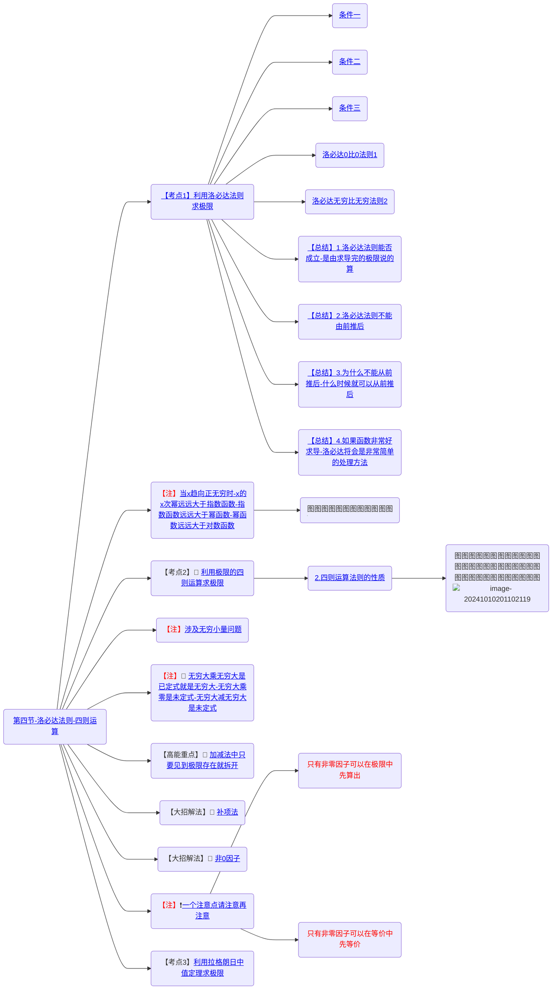
```mermaid
graph LR

第四节-函数极限计算(<a href="/Users/yuebinghui/Documents/program/github/note/笔记/数学/周洋鑫/基础班/04.四则运算-拉格朗日及函数极限计算.md#第四节-函数极限计算">第四节-洛必达法则-四则运算</>)

第四节-函数极限计算--->利用洛必达法则求极限(<a href="/Users/yuebinghui/Documents/program/github/note/笔记/数学/周洋鑫/基础班/04.四则运算-拉格朗日及函数极限计算.md#利用洛必达法则求极限">【考点1】利用洛必达法则求极限</>)
利用洛必达法则求极限--->条件一(<a href="/Users/yuebinghui/Documents/program/github/note/笔记/数学/周洋鑫/基础班/04.四则运算-拉格朗日及函数极限计算.md#条件一">条件一</>)
利用洛必达法则求极限--->条件二(<a href="/Users/yuebinghui/Documents/program/github/note/笔记/数学/周洋鑫/基础班/04.四则运算-拉格朗日及函数极限计算.md#条件二">条件二</>)
利用洛必达法则求极限--->条件三(<a href="/Users/yuebinghui/Documents/program/github/note/笔记/数学/周洋鑫/基础班/04.四则运算-拉格朗日及函数极限计算.md#条件三">条件三</>)

利用洛必达法则求极限--->洛必达0比0法则1(<a href="/Users/yuebinghui/Documents/program/github/note/笔记/数学/周洋鑫/基础班/04.四则运算-拉格朗日及函数极限计算.md#洛必达0比0法则1">洛必达0比0法则1</>)
利用洛必达法则求极限--->洛必达无穷比无穷法则2(<a href="/Users/yuebinghui/Documents/program/github/note/笔记/数学/周洋鑫/基础班/04.四则运算-拉格朗日及函数极限计算.md#洛必达无穷比无穷法则2">洛必达无穷比无穷法则2</>)
利用洛必达法则求极限--->1.洛必达法则能否成立-是由求导完的极限说的算(<a href="/Users/yuebinghui/Documents/program/github/note/笔记/数学/周洋鑫/基础班/04.四则运算-拉格朗日及函数极限计算.md#1.洛必达法则能否成立-是由求导完的极限说的算">【总结】1.洛必达法则能否成立-是由求导完的极限说的算</>)
利用洛必达法则求极限--->2.洛必达法则不能由前推后(<a href="/Users/yuebinghui/Documents/program/github/note/笔记/数学/周洋鑫/基础班/04.四则运算-拉格朗日及函数极限计算.md#2.洛必达法则不能由前推后">【总结】2.洛必达法则不能由前推后</>)
利用洛必达法则求极限--->3.为什么不能从前推后-什么时候就可以从前推后(<a href="/Users/yuebinghui/Documents/program/github/note/笔记/数学/周洋鑫/基础班/04.四则运算-拉格朗日及函数极限计算.md#3.为什么不能从前推后-什么时候就可以从前推后">【总结】3.为什么不能从前推后-什么时候就可以从前推后</>)
利用洛必达法则求极限--->4.如果函数非常好求导-洛必达将会是非常简单的处理方法(<a href="/Users/yuebinghui/Documents/program/github/note/笔记/数学/周洋鑫/基础班/04.四则运算-拉格朗日及函数极限计算.md#4.如果函数非常好求导-洛必达将会是非常简单的处理方法">【总结】4.如果函数非常好求导-洛必达将会是非常简单的处理方法</>)

第四节-函数极限计算--->当x趋向正无穷时-x的x次幂远远大于指数函数-指数函数远远大于幂函数-幂函数远远大于对数函数(<span style="color:red">【注】</span><a href="/Users/yuebinghui/Documents/program/github/note/笔记/数学/周洋鑫/基础班/04.四则运算-拉格朗日及函数极限计算.md#当x趋向正无穷时-x的x次幂远远大于指数函数-指数函数远远大于幂函数-幂函数远远大于对数函数">当x趋向正无穷时-x的x次幂远远大于指数函数-指数函数远远大于幂函数-幂函数远远大于对数函数</>)
当x趋向正无穷时-x的x次幂远远大于指数函数-指数函数远远大于幂函数-幂函数远远大于对数函数--->远远大于(图图图图图图图图图图图图<img src="/Users/yuebinghui/Documents/program/github/note/images/image-20241010155838004.png" style="zoom:10%;" alt="image-20241010155838004" />)

第四节-函数极限计算--->利用极限的四则运算求极限(【考点2】🌟 <a href="/Users/yuebinghui/Documents/program/github/note/笔记/数学/周洋鑫/基础班/04.四则运算-拉格朗日及函数极限计算.md#利用极限的四则运算求极限">利用极限的四则运算求极限</>)

第四节-函数极限计算--->涉及无穷小量问题(<span style="color:red">【注】</span><a href="/Users/yuebinghui/Documents/program/github/note/笔记/数学/周洋鑫/基础班/04.四则运算-拉格朗日及函数极限计算.md#涉及无穷小量问题">涉及无穷小量问题</>)
第四节-函数极限计算--->无穷大乘无穷大是已定式就是无穷大-无穷大乘零是未定式-无穷大减无穷大是未定式(<span style="color:red">【注】</span>🌟 <a href="/Users/yuebinghui/Documents/program/github/note/笔记/数学/周洋鑫/基础班/04.四则运算-拉格朗日及函数极限计算.md#无穷大乘无穷大是已定式就是无穷大-无穷大乘零是未定式-无穷大减无穷大是未定式">无穷大乘无穷大是已定式就是无穷大-无穷大乘零是未定式-无穷大减无穷大是未定式</>)

利用极限的四则运算求极限--->2.四则运算法则的性质(<a href="/Users/yuebinghui/Documents/program/github/note/笔记/数学/周洋鑫/基础班/04.四则运算-拉格朗日及函数极限计算.md#2.四则运算法则的性质">2.四则运算法则的性质</>)
2.四则运算法则的性质--->四则运算性质(图图图图图图图图图图图图图图图图图图图图图图图图图图图图图图图图图图图图<img src="/Users/yuebinghui/Documents/program/github/note/images/image-20241010201102119.png" alt="image-20241010201102119" />)

第四节-函数极限计算--->加减法中只要见到极限存在就拆开(【高能重点】🌟 <a href="/Users/yuebinghui/Documents/program/github/note/笔记/数学/周洋鑫/基础班/04.四则运算-拉格朗日及函数极限计算.md#加减法中只要见到极限存在就拆开">加减法中只要见到极限存在就拆开</>)

第四节-函数极限计算--->补项法(【大招解法】🌟 <a href="/Users/yuebinghui/Documents/program/github/note/笔记/数学/周洋鑫/基础班/04.四则运算-拉格朗日及函数极限计算.md#补项法">补项法</>)

第四节-函数极限计算--->非0因子(【大招解法】🌟 <a href="/Users/yuebinghui/Documents/program/github/note/笔记/数学/周洋鑫/基础班/04.四则运算-拉格朗日及函数极限计算.md#非0因子">非0因子</>)

第四节-函数极限计算--->一个注意点请注意再注意(<span style="color:red">【注】</span>❗️<a href="/Users/yuebinghui/Documents/program/github/note/笔记/数学/周洋鑫/基础班/04.四则运算-拉格朗日及函数极限计算.md#一个注意点请注意再注意">一个注意点请注意再注意</>)
一个注意点请注意再注意--->只有非零因子可以在极限中先算出(<span style="color:red">只有非零因子可以在极限中先算出</span>)
一个注意点请注意再注意--->只有非零因子可以在等价中先等价(<span style="color:red">只有非零因子可以在等价中先等价</span>)

第四节-函数极限计算--->利用拉格朗日中值定理求极限(【考点3】<a href="/Users/yuebinghui/Documents/program/github/note/笔记/数学/周洋鑫/基础班/04.四则运算-拉格朗日及函数极限计算.md#利用拉格朗日中值定理求极限">利用拉格朗日中值定理求极限</>)

```

## 第五节-函数极限计算

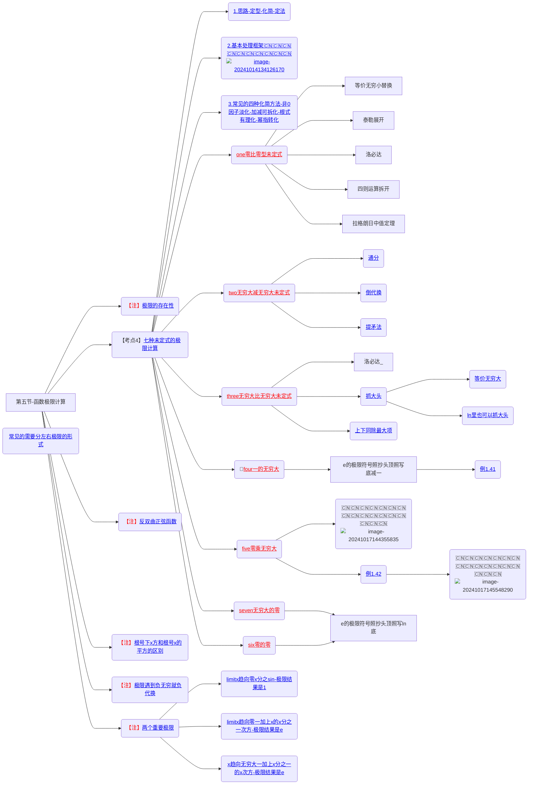
```mermaid
graph LR
第五节-函数极限计算 

第五节-函数极限计算--->极限的存在性(<span style="color:red">【注】</span><a href="/Users/yuebinghui/Documents/program/github/note/笔记/数学/周洋鑫/基础班/05.函数极限计算.md#极限的存在性">极限的存在性</>)

第五节-函数极限计算--->七种未定式的极限计算(【考点4】<a href="/Users/yuebinghui/Documents/program/github/note/笔记/数学/周洋鑫/基础班/05.函数极限计算.md#七种未定式的极限计算">七种未定式的极限计算</>)
七种未定式的极限计算--->1.思路-定型-化简-定法(<a href="/Users/yuebinghui/Documents/program/github/note/笔记/数学/周洋鑫/基础班/05.函数极限计算.md#1.思路-定型-化简-定法">1.思路-定型-化简-定法</>)
七种未定式的极限计算--->2.基本处理框架(<a href="/Users/yuebinghui/Documents/program/github/note/笔记/数学/周洋鑫/基础班/05.函数极限计算.md#2.基本处理框架">2.基本处理框架</>🇨🇳🇨🇳🇨🇳🇨🇳🇨🇳🇨🇳🇨🇳🇨🇳🇨🇳🇨🇳<img src="/Users/yuebinghui/Documents/program/github/note/images/image-20241014134126170.png" alt="image-20241014134126170" />)
七种未定式的极限计算--->3.常见的四种化简方法-非0因子淡化-加减可拆化-根式有理化-幂指转化(<a href="/Users/yuebinghui/Documents/program/github/note/笔记/数学/周洋鑫/基础班/05.函数极限计算.md#3.常见的四种化简方法-非0因子淡化-加减可拆化-根式有理化-幂指转化">3.常见的四种化简方法-非0因子淡化-加减可拆化-根式有理化-幂指转化</>)
七种未定式的极限计算--->one零比零型未定式(<a style="color:red" href="/Users/yuebinghui/Documents/program/github/note/笔记/数学/周洋鑫/基础班/05.函数极限计算.md#one零比零型未定式">one零比零型未定式</>)
one零比零型未定式--->等价无穷小替换
one零比零型未定式--->泰勒展开
one零比零型未定式--->洛必达
one零比零型未定式--->四则运算拆开
one零比零型未定式--->拉格朗日中值定理
七种未定式的极限计算--->two无穷大减无穷大未定式(<a style="color:red" href="/Users/yuebinghui/Documents/program/github/note/笔记/数学/周洋鑫/基础班/05.函数极限计算.md#two无穷大减无穷大未定式">two无穷大减无穷大未定式</>)
two无穷大减无穷大未定式--->通分(<a href="/Users/yuebinghui/Documents/program/github/note/笔记/数学/周洋鑫/基础班/05.函数极限计算.md#通分">通分</>)
two无穷大减无穷大未定式--->倒代换(<a href="/Users/yuebinghui/Documents/program/github/note/笔记/数学/周洋鑫/基础班/05.函数极限计算.md#倒代换">倒代换</>)
two无穷大减无穷大未定式--->提矛法(<a href="/Users/yuebinghui/Documents/program/github/note/笔记/数学/周洋鑫/基础班/05.函数极限计算.md#提矛法">提矛法</>)
第五节-函数极限计算--->反双曲正弦函数(<span style="color:red">【注】</span><a href="/Users/yuebinghui/Documents/program/github/note/笔记/数学/周洋鑫/基础班/05.函数极限计算.md#反双曲正弦函数">反双曲正弦函数</>)
七种未定式的极限计算--->three无穷大比无穷大未定式(<a style="color:red" href="/Users/yuebinghui/Documents/program/github/note/笔记/数学/周洋鑫/基础班/05.函数极限计算.md#three无穷大比无穷大未定式">three无穷大比无穷大未定式</>)
three无穷大比无穷大未定式--->洛必达_
three无穷大比无穷大未定式--->抓大头(<a href="/Users/yuebinghui/Documents/program/github/note/笔记/数学/周洋鑫/基础班/05.函数极限计算.md#抓大头">抓大头</>)
抓大头--->等价无穷大(<a href="/Users/yuebinghui/Documents/program/github/note/笔记/数学/周洋鑫/基础班/05.函数极限计算.md#等价无穷大">等价无穷大</>)
抓大头--->ln里也可以抓大头(<a href="/Users/yuebinghui/Documents/program/github/note/笔记/数学/周洋鑫/基础班/05.函数极限计算.md#ln里也可以抓大头">ln里也可以抓大头</>)
three无穷大比无穷大未定式--->上下同除最大项(<a href="/Users/yuebinghui/Documents/program/github/note/笔记/数学/周洋鑫/基础班/05.函数极限计算.md#上下同除最大项">上下同除最大项</>)

第五节-函数极限计算--->根号下x方和根号x的平方的区别(<span style="color:red">【注】</span><a href="/Users/yuebinghui/Documents/program/github/note/笔记/数学/周洋鑫/基础班/05.函数极限计算.md#根号下x方和根号x的平方的区别">根号下x方和根号x的平方的区别</>)

第五节-函数极限计算--->极限遇到负无穷就负代换(<span style="color:red">【注】</span><a href="/Users/yuebinghui/Documents/program/github/note/笔记/数学/周洋鑫/基础班/05.函数极限计算.md#极限遇到负无穷就负代换">极限遇到负无穷就负代换</>)

七种未定式的极限计算--->four一的无穷大(🌟<a style="color:red" href="/Users/yuebinghui/Documents/program/github/note/笔记/数学/周洋鑫/基础班/06.函数极限计算_2.md#four一的无穷大">four一的无穷大</>)
four一的无穷大--->e的极限符号照抄头顶照写底减一

第五节-函数极限计算--->两个重要极限(<span style="color:red">【注】</span><a href="/Users/yuebinghui/Documents/program/github/note/笔记/数学/周洋鑫/基础班/06.函数极限计算_2.md#两个重要极限">两个重要极限</>)
两个重要极限--->limitx趋向零x分之sin-极限结果是1(<a href="/Users/yuebinghui/Documents/program/github/note/笔记/数学/周洋鑫/基础班/06.函数极限计算_2.md#limitx趋向零x分之sin-极限结果是1">limitx趋向零x分之sin-极限结果是1</>)
两个重要极限--->limitx趋向零一加上x的x分之一次方(<a href="/Users/yuebinghui/Documents/program/github/note/笔记/数学/周洋鑫/基础班/06.函数极限计算_2.md#limitx趋向零一加上x的x分之一次方">limitx趋向零一加上x的x分之一次方-极限结果是e</>)
两个重要极限--->x趋向无穷大一加上x分之一的x次方(<a href="/Users/yuebinghui/Documents/program/github/note/笔记/数学/周洋鑫/基础班/06.函数极限计算_2.md#x趋向无穷大一加上x分之一的x次方">x趋向无穷大一加上x分之一的x次方-极限结果是e</>)

e的极限符号照抄头顶照写底减一--->例1.41(<a href="/Users/yuebinghui/Documents/program/github/note/笔记/数学/周洋鑫/基础班/06.函数极限计算_2.md#例1.41">例1.41</>)

七种未定式的极限计算--->five零乘无穷大(<a style="color:red" href="/Users/yuebinghui/Documents/program/github/note/笔记/数学/周洋鑫/基础班/06.函数极限计算_2.md#five零乘无穷大">five零乘无穷大</>)
five零乘无穷大--->注意如何下放(🇨🇳🇨🇳🇨🇳🇨🇳🇨🇳🇨🇳🇨🇳🇨🇳🇨🇳🇨🇳🇨🇳🇨🇳🇨🇳🇨🇳🇨🇳🇨🇳🇨🇳<img src="/Users/yuebinghui/Documents/program/github/note/images/image-20241017144355835.png" alt="image-20241017144355835" />)
five零乘无穷大--->例1.42(<a href="/Users/yuebinghui/Documents/program/github/note/笔记/数学/周洋鑫/基础班/06.函数极限计算_2.md#例1.42">例1.42</>)
例1.42--->xlnx(🇨🇳🇨🇳🇨🇳🇨🇳🇨🇳🇨🇳🇨🇳🇨🇳🇨🇳🇨🇳🇨🇳🇨🇳🇨🇳🇨🇳🇨🇳🇨🇳🇨🇳<img src="/Users/yuebinghui/Documents/program/github/note/images/image-20241017145548290.png" alt="image-20241017145548290" />)

七种未定式的极限计算--->seven无穷大的零(<a style="color:red"  href="/Users/yuebinghui/Documents/program/github/note/笔记/数学/周洋鑫/基础班/06.函数极限计算_2.md#seven无穷大的零">seven无穷大的零</>)
七种未定式的极限计算--->six零的零(<a style="color:red"  href="/Users/yuebinghui/Documents/program/github/note/笔记/数学/周洋鑫/基础班/06.函数极限计算_2.md#six零的零">six零的零</>)
seven无穷大的零--->e的极限符号照抄头顶照写ln底
six零的零--->e的极限符号照抄头顶照写ln底

常见的需要分左右极限的形式(<a href="/Users/yuebinghui/Documents/program/github/note/笔记/数学/周洋鑫/基础班/06.函数极限计算_2.md#常见的需要分左右极限的形式">常见的需要分左右极限的形式</>)


```

## 第六节-函数极限计算_2

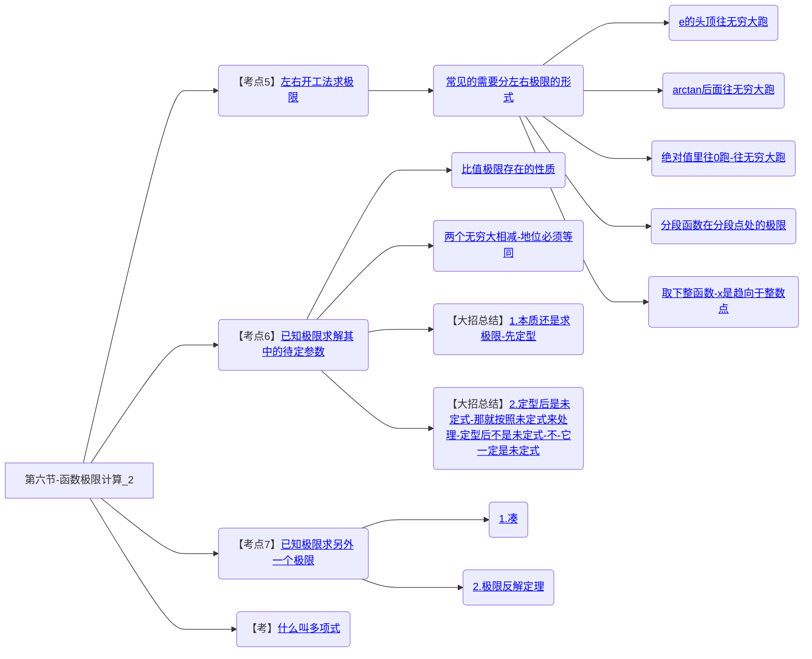
```mermaid
graph LR
第六节-函数极限计算_2

第六节-函数极限计算_2--->左右开工法求极限(【考点5】<a href="/Users/yuebinghui/Documents/program/github/note/笔记/数学/周洋鑫/基础班/06.函数极限计算_2.md#左右开工法求极限">左右开工法求极限</>)
左右开工法求极限--->常见的需要分左右极限的形式(<a href="/Users/yuebinghui/Documents/program/github/note/笔记/数学/周洋鑫/基础班/06.函数极限计算_2.md#常见的需要分左右极限的形式">常见的需要分左右极限的形式</>)
常见的需要分左右极限的形式--->e的头顶往无穷大跑(<a href="/Users/yuebinghui/Documents/program/github/note/笔记/数学/周洋鑫/基础班/06.函数极限计算_2.md#e的头顶往无穷大跑">e的头顶往无穷大跑</>)
常见的需要分左右极限的形式--->arctan后面往无穷大跑(<a href="/Users/yuebinghui/Documents/program/github/note/笔记/数学/周洋鑫/基础班/06.函数极限计算_2.md#arctan后面往无穷大跑">arctan后面往无穷大跑</>)
常见的需要分左右极限的形式--->绝对值里往0跑(<a href="/Users/yuebinghui/Documents/program/github/note/笔记/数学/周洋鑫/基础班/06.函数极限计算_2.md#绝对值里往0跑">绝对值里往0跑-往无穷大跑</>)
常见的需要分左右极限的形式--->分段函数在分段点处的极限(<a href="/Users/yuebinghui/Documents/program/github/note/笔记/数学/周洋鑫/基础班/06.函数极限计算_2.md#分段函数在分段点处的极限">分段函数在分段点处的极限</>)
常见的需要分左右极限的形式--->取整函数(<a href="/Users/yuebinghui/Documents/program/github/note/笔记/数学/周洋鑫/基础班/06.函数极限计算_2.md#取整函数">取下整函数-x是趋向于整数点</>)

第六节-函数极限计算_2--->已知极限求解其中的待定参数(【考点6】<a href="/Users/yuebinghui/Documents/program/github/note/笔记/数学/周洋鑫/基础班/06.函数极限计算_2.md#已知极限求解其中的待定参数">已知极限求解其中的待定参数</>)
已知极限求解其中的待定参数--->比值极限存在的性质(<a href="/Users/yuebinghui/Documents/program/github/note/笔记/数学/周洋鑫/基础班/06.函数极限计算_2.md#比值极限存在的性质">比值极限存在的性质</>)
已知极限求解其中的待定参数--->两个无穷大相减-地位必须等同(<a href="/Users/yuebinghui/Documents/program/github/note/笔记/数学/周洋鑫/基础班/06.函数极限计算_2.md#两个无穷大相减-地位必须等同">两个无穷大相减-地位必须等同</>)
已知极限求解其中的待定参数--->1.本质还是求极限-先定型(【大招总结】<a href="/Users/yuebinghui/Documents/program/github/note/笔记/数学/周洋鑫/基础班/06.函数极限计算_2.md#1.本质还是求极限-先定型">1.本质还是求极限-先定型</>)
已知极限求解其中的待定参数--->2.定型后是未定式-那就按照未定式来处理-定型后不是未定式-不-它一定是未定式(【大招总结】<a href="/Users/yuebinghui/Documents/program/github/note/笔记/数学/周洋鑫/基础班/06.函数极限计算_2.md#2.定型后是未定式-那就按照未定式来处理-定型后不是未定式-不-它一定是未定式">2.定型后是未定式-那就按照未定式来处理-定型后不是未定式-不-它一定是未定式</>)

第六节-函数极限计算_2--->已知极限求另外一个极限(【考点7】<a href="/Users/yuebinghui/Documents/program/github/note/笔记/数学/周洋鑫/基础班/06.函数极限计算_2.md#已知极限求另外一个极限">已知极限求另外一个极限</>)
已知极限求另外一个极限--->1.凑(<a href="/Users/yuebinghui/Documents/program/github/note/笔记/数学/周洋鑫/基础班/06.函数极限计算_2.md#1.凑">1.凑</>)
已知极限求另外一个极限--->2.极限反解定理(<a href="/Users/yuebinghui/Documents/program/github/note/笔记/数学/周洋鑫/基础班/06.函数极限计算_2.md#2.极限反解定理">2.极限反解定理</>)

第六节-函数极限计算_2--->什么叫多项式(【考】<a href="/Users/yuebinghui/Documents/program/github/note/笔记/数学/周洋鑫/基础班/06.函数极限计算_2.md#什么叫多项式">什么叫多项式</>)


```

## 第七节-数列极限定义与性质

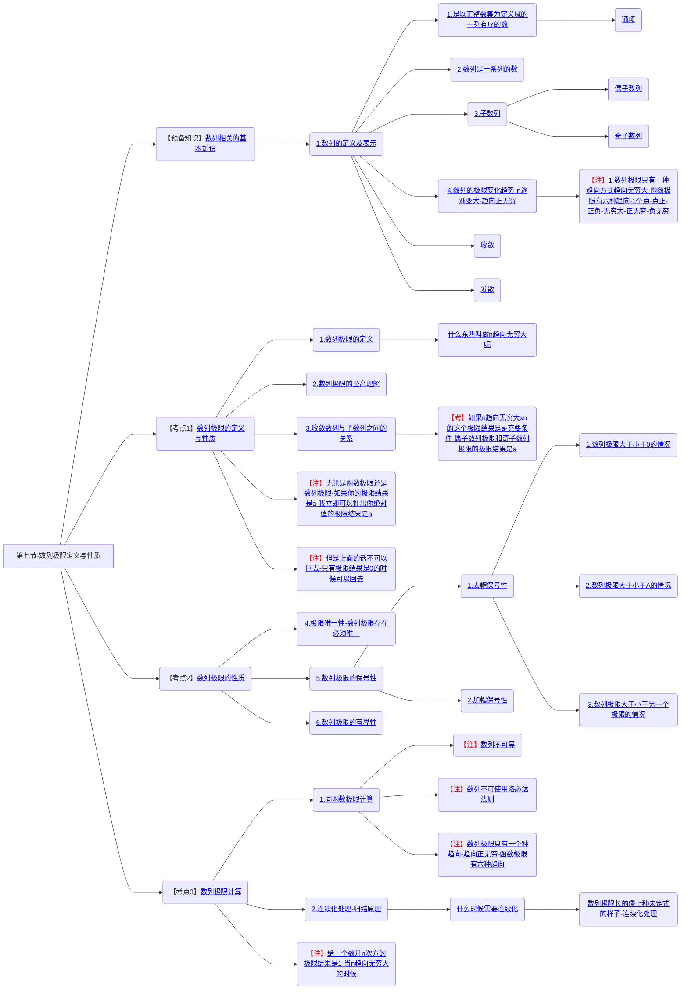
```mermaid
graph LR
第七节-数列极限定义与性质

第七节-数列极限定义与性质--->数列相关的基本知识(【预备知识】<a href="/Users/yuebinghui/Documents/program/github/note/笔记/数学/周洋鑫/基础班/07.数列极限定义与性质.md#数列相关的基本知识">数列相关的基本知识</>)
数列相关的基本知识--->1.数列的定义及表示(<a href="/Users/yuebinghui/Documents/program/github/note/笔记/数学/周洋鑫/基础班/07.数列极限定义与性质.md#1.数列的定义及表示">1.数列的定义及表示</>)
1.数列的定义及表示--->1.是以正整数集为定义域的一列有序的数(<a href="/Users/yuebinghui/Documents/program/github/note/笔记/数学/周洋鑫/基础班/07.数列极限定义与性质.md#1.是以正整数集为定义域的一列有序的数">1.是以正整数集为定义域的一列有序的数</>)
1.是以正整数集为定义域的一列有序的数--->通项(<a href="/Users/yuebinghui/Documents/program/github/note/笔记/数学/周洋鑫/基础班/07.数列极限定义与性质.md#通项">通项</>)

1.数列的定义及表示--->2.数列是一系列的数(<a href="/Users/yuebinghui/Documents/program/github/note/笔记/数学/周洋鑫/基础班/07.数列极限定义与性质.md#2.数列是一系列的数">2.数列是一系列的数</>)

1.数列的定义及表示--->3.子数列(<a href="/Users/yuebinghui/Documents/program/github/note/笔记/数学/周洋鑫/基础班/07.数列极限定义与性质.md#3.子数列">3.子数列</>)
3.子数列--->偶子数列(<a href="/Users/yuebinghui/Documents/program/github/note/笔记/数学/周洋鑫/基础班/07.数列极限定义与性质.md#偶子数列">偶子数列</>)
3.子数列--->奇子数列(<a href="/Users/yuebinghui/Documents/program/github/note/笔记/数学/周洋鑫/基础班/07.数列极限定义与性质.md#奇子数列">奇子数列</>)

1.数列的定义及表示--->4.数列的极限变化趋势-n逐渐变大-趋向正无穷(<a href="/Users/yuebinghui/Documents/program/github/note/笔记/数学/周洋鑫/基础班/07.数列极限定义与性质.md#4.数列的极限变化趋势-n逐渐变大-趋向正无穷">4.数列的极限变化趋势-n逐渐变大-趋向正无穷</>)
4.数列的极限变化趋势-n逐渐变大-趋向正无穷--->1.数列极限只有一种趋向方式趋向无穷大-函数极限有六种趋向-1个点-点正-正负-无穷大-正无穷-负无穷(<span style="color:red">【注】</span><a href="/Users/yuebinghui/Documents/program/github/note/笔记/数学/周洋鑫/基础班/07.数列极限定义与性质.md#1.数列极限只有一种趋向方式趋向无穷大-函数极限有六种趋向-1个点-点正-正负-无穷大-正无穷-负无穷">1.数列极限只有一种趋向方式趋向无穷大-函数极限有六种趋向-1个点-点正-正负-无穷大-正无穷-负无穷</>)
1.数列的定义及表示--->收敛(<a href="/Users/yuebinghui/Documents/program/github/note/笔记/数学/周洋鑫/基础班/07.数列极限定义与性质.md#收敛">收敛</>)
1.数列的定义及表示--->发散(<a href="/Users/yuebinghui/Documents/program/github/note/笔记/数学/周洋鑫/基础班/07.数列极限定义与性质.md#发散">发散</>)


第七节-数列极限定义与性质--->数列极限的定义与性质(【考点1】<a href="/Users/yuebinghui/Documents/program/github/note/笔记/数学/周洋鑫/基础班/07.数列极限定义与性质.md#数列极限的定义与性质">数列极限的定义与性质</>)
数列极限的定义与性质--->1.数列极限的定义(<a href="/Users/yuebinghui/Documents/program/github/note/笔记/数学/周洋鑫/基础班/07.数列极限定义与性质.md#1.数列极限的定义">1.数列极限的定义</>)
1.数列极限的定义--->什么东西叫做n趋向无穷大呢(<a href="/Users/yuebinghui/Documents/program/github/note/笔记/数学/周洋鑫/基础班/07.数列极限定义与性质.md#什么东西叫做n趋向无穷大呢">什么东西叫做n趋向无穷大呢</>)
数列极限的定义与性质--->2.数列极限的至高理解(<a href="/Users/yuebinghui/Documents/program/github/note/笔记/数学/周洋鑫/基础班/07.数列极限定义与性质.md#2.数列极限的至高理解">2.数列极限的至高理解</>)
数列极限的定义与性质--->3.收敛数列与子数列之间的关系(<a href="/Users/yuebinghui/Documents/program/github/note/笔记/数学/周洋鑫/基础班/07.数列极限定义与性质.md#3.收敛数列与子数列之间的关系">3.收敛数列与子数列之间的关系</>)
3.收敛数列与子数列之间的关系--->如果n趋向无穷大xn的这个极限结果是a-充要条件-偶子数列极限和奇子数列极限的极限结果是a(<span style="color:red">【考】</span><a href="/Users/yuebinghui/Documents/program/github/note/笔记/数学/周洋鑫/基础班/07.数列极限定义与性质.md#如果n趋向无穷大xn的这个极限结果是a-充要条件-偶子数列极限和奇子数列极限的极限结果是a">如果n趋向无穷大xn的这个极限结果是a-充要条件-偶子数列极限和奇子数列极限的极限结果是a</>)
数列极限的定义与性质--->无论是函数极限还是数列极限-如果你的极限结果是a-我立即可以推出你绝对值的极限结果是a(<span style="color:red">【注】</span><a href="/Users/yuebinghui/Documents/program/github/note/笔记/数学/周洋鑫/基础班/07.数列极限定义与性质.md#无论是函数极限还是数列极限-如果你的极限结果是a-我立即可以推出你绝对值的极限结果是a">无论是函数极限还是数列极限-如果你的极限结果是a-我立即可以推出你绝对值的极限结果是a</>)
数列极限的定义与性质--->但是上面的话不可以回去-只有极限结果是0的时候可以回去(<span style="color:red">【注】</span><a href="/Users/yuebinghui/Documents/program/github/note/笔记/数学/周洋鑫/基础班/07.数列极限定义与性质.md#但是上面的话不可以回去-只有极限结果是0的时候可以回去">但是上面的话不可以回去-只有极限结果是0的时候可以回去</>)

第七节-数列极限定义与性质--->数列极限的性质(【考点2】<a href="/Users/yuebinghui/Documents/program/github/note/笔记/数学/周洋鑫/基础班/07.数列极限定义与性质.md#数列极限的性质">数列极限的性质</>)
数列极限的性质--->4.极限唯一性-数列极限存在必须唯一(<a href="/Users/yuebinghui/Documents/program/github/note/笔记/数学/周洋鑫/基础班/07.数列极限定义与性质.md#4.极限唯一性-数列极限存在必须唯一">4.极限唯一性-数列极限存在必须唯一</>)
数列极限的性质--->5.数列极限的保号性(<a href="/Users/yuebinghui/Documents/program/github/note/笔记/数学/周洋鑫/基础班/07.数列极限定义与性质.md#5.数列极限的保号性">5.数列极限的保号性</>)
5.数列极限的保号性--->1.去帽保号性(<a href="/Users/yuebinghui/Documents/program/github/note/笔记/数学/周洋鑫/基础班/07.数列极限定义与性质.md#1.去帽保号性">1.去帽保号性</>)
1.去帽保号性--->1.数列极限大于小于0的情况(<a href="/Users/yuebinghui/Documents/program/github/note/笔记/数学/周洋鑫/基础班/07.数列极限定义与性质.md#1.数列极限大于小于0的情况">1.数列极限大于小于0的情况</>)
1.去帽保号性--->2.数列极限大于小于A的情况(<a href="/Users/yuebinghui/Documents/program/github/note/笔记/数学/周洋鑫/基础班/07.数列极限定义与性质.md#2.数列极限大于小于A的情况">2.数列极限大于小于A的情况</>)
1.去帽保号性--->3.数列极限大于小于另一个极限的情况(<a href="/Users/yuebinghui/Documents/program/github/note/笔记/数学/周洋鑫/基础班/07.数列极限定义与性质.md#3.数列极限大于小于另一个极限的情况">3.数列极限大于小于另一个极限的情况</>)
5.数列极限的保号性--->2.加帽保号性(<a href="/Users/yuebinghui/Documents/program/github/note/笔记/数学/周洋鑫/基础班/07.数列极限定义与性质.md#2.加帽保号性">2.加帽保号性</>)
数列极限的性质--->6.数列极限的有界性(<a href="/Users/yuebinghui/Documents/program/github/note/笔记/数学/周洋鑫/基础班/07.数列极限定义与性质.md#6.数列极限的有界性">6.数列极限的有界性</>)

第七节-数列极限定义与性质--->数列极限计算(【考点3】<a href="/Users/yuebinghui/Documents/program/github/note/笔记/数学/周洋鑫/基础班/07.数列极限定义与性质.md#数列极限计算">数列极限计算</>)
数列极限计算--->1.同函数极限计算(<a href="/Users/yuebinghui/Documents/program/github/note/笔记/数学/周洋鑫/基础班/07.数列极限定义与性质.md#1.同函数极限计算">1.同函数极限计算</>)
1.同函数极限计算--->数列不可导(<span style="color:red">【注】</span><a href="/Users/yuebinghui/Documents/program/github/note/笔记/数学/周洋鑫/基础班/07.数列极限定义与性质.md#数列不可导">数列不可导</>)
1.同函数极限计算--->数列不可使用洛必达法则(<span style="color:red">【注】</span><a href="/Users/yuebinghui/Documents/program/github/note/笔记/数学/周洋鑫/基础班/07.数列极限定义与性质.md#数列不可使用洛必达法则">数列不可使用洛必达法则</>)
1.同函数极限计算--->数列极限只有一个种趋向-趋向正无穷-函数极限有六种趋向(<span style="color:red">【注】</span><a href="/Users/yuebinghui/Documents/program/github/note/笔记/数学/周洋鑫/基础班/07.数列极限定义与性质.md#数列极限只有一个种趋向-趋向正无穷-函数极限有六种趋向">数列极限只有一个种趋向-趋向正无穷-函数极限有六种趋向</>)

数列极限计算--->2.连续化处理-归结原理(<a href="/Users/yuebinghui/Documents/program/github/note/笔记/数学/周洋鑫/基础班/07.数列极限定义与性质.md#2.连续化处理-归结原理">2.连续化处理-归结原理</>)
2.连续化处理-归结原理--->什么时候需要连续化(<a href="/Users/yuebinghui/Documents/program/github/note/笔记/数学/周洋鑫/基础班/07.数列极限定义与性质.md#什么时候需要连续化">什么时候需要连续化</>)
什么时候需要连续化--->数列极限长的像七种未定式的样子-连续化处理(<a href="/Users/yuebinghui/Documents/program/github/note/笔记/数学/周洋鑫/基础班/07.数列极限定义与性质.md#数列极限长的像七种未定式的样子-连续化处理">数列极限长的像七种未定式的样子-连续化处理</>)
数列极限计算--->给一个数开n次方的极限结果是1(<span style="color:red">【注】</span><a href="/Users/yuebinghui/Documents/program/github/note/笔记/数学/周洋鑫/基础班/07.数列极限定义与性质.md#给一个数开n次方的极限结果是1">给一个数开n次方的极限结果是1-当n趋向无穷大的时候</>)


```

## 第八节-数列的极限计算_1

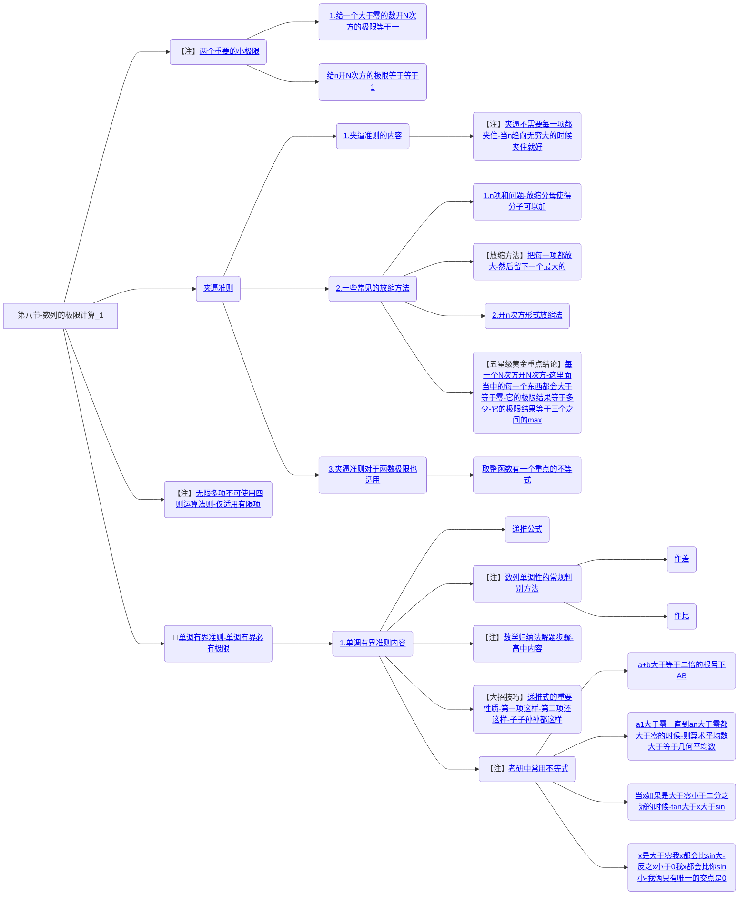
```mermaid
graph LR
第八节-数列的极限计算_1

第八节-数列的极限计算_1--->两个重要的小极限(【注】<a href="/Users/yuebinghui/Documents/program/github/note/笔记/数学/周洋鑫/基础班/08.数列的极限计算_1.md#两个重要的小极限">两个重要的小极限</>)
两个重要的小极限--->1.给一个大于零的数开N次方的极限等于一(<a href="/Users/yuebinghui/Documents/program/github/note/笔记/数学/周洋鑫/基础班/08.数列的极限计算_1.md#1.给一个大于零的数开N次方的极限等于一">1.给一个大于零的数开N次方的极限等于一</>)
两个重要的小极限--->给n开N次方的极限等于等于1(<a href="/Users/yuebinghui/Documents/program/github/note/笔记/数学/周洋鑫/基础班/08.数列的极限计算_1.md#给n开N次方的极限等于等于1">给n开N次方的极限等于等于1</>)

第八节-数列的极限计算_1--->夹逼准则(<a href="/Users/yuebinghui/Documents/program/github/note/笔记/数学/周洋鑫/基础班/08.数列的极限计算_1.md#夹逼准则">夹逼准则</>)
夹逼准则--->1.夹逼准则的内容(<a href="/Users/yuebinghui/Documents/program/github/note/笔记/数学/周洋鑫/基础班/08.数列的极限计算_1.md#1.夹逼准则的内容">1.夹逼准则的内容</>)
1.夹逼准则的内容--->夹逼不需要每一项都夹住-当n趋向无穷大的时候夹住就好(【注】<a href="/Users/yuebinghui/Documents/program/github/note/笔记/数学/周洋鑫/基础班/08.数列的极限计算_1.md#夹逼不需要每一项都夹住-当n趋向无穷大的时候夹住就好">夹逼不需要每一项都夹住-当n趋向无穷大的时候夹住就好</>)

第八节-数列的极限计算_1--->无限多项不可使用四则运算法则-仅适用有限项(【注】<a href="/Users/yuebinghui/Documents/program/github/note/笔记/数学/周洋鑫/基础班/08.数列的极限计算_1.md#无限多项不可使用四则运算法则-仅适用有限项">无限多项不可使用四则运算法则-仅适用有限项</>)

夹逼准则--->2.一些常见的放缩方法(<a href="/Users/yuebinghui/Documents/program/github/note/笔记/数学/周洋鑫/基础班/08.数列的极限计算_1.md#2.一些常见的放缩方法">2.一些常见的放缩方法</>)
2.一些常见的放缩方法--->1.n项和问题-放缩分母使得分子可以加(<a href="/Users/yuebinghui/Documents/program/github/note/笔记/数学/周洋鑫/基础班/08.数列的极限计算_1.md#1.n项和问题-放缩分母使得分子可以加">1.n项和问题-放缩分母使得分子可以加</>)
2.一些常见的放缩方法--->把每一项都放大-然后留下一个最大的(【放缩方法】<a href="/Users/yuebinghui/Documents/program/github/note/笔记/数学/周洋鑫/基础班/08.数列的极限计算_1.md#把每一项都放大-然后留下一个最大的">把每一项都放大-然后留下一个最大的</>)
2.一些常见的放缩方法--->2.开n次方形式放缩法(<a href="/Users/yuebinghui/Documents/program/github/note/笔记/数学/周洋鑫/基础班/08.数列的极限计算_1.md#2.开n次方形式放缩法">2.开n次方形式放缩法</>)
2.一些常见的放缩方法--->每一个N次方开N次方-这里面当中的每一个东西都会大于等于零-它的极限结果等于多少-它的极限结果等于三个之间的max(【五星级黄金重点结论】<a href="/Users/yuebinghui/Documents/program/github/note/笔记/数学/周洋鑫/基础班/08.数列的极限计算_1.md#每一个N次方开N次方-这里面当中的每一个东西都会大于等于零-它的极限结果等于多少-它的极限结果等于三个之间的max">每一个N次方开N次方-这里面当中的每一个东西都会大于等于零-它的极限结果等于多少-它的极限结果等于三个之间的max</>)

夹逼准则--->3.夹逼准则对于函数极限也适用(<a href="/Users/yuebinghui/Documents/program/github/note/笔记/数学/周洋鑫/基础班/08.数列的极限计算_1.md#3.夹逼准则对于函数极限也适用">3.夹逼准则对于函数极限也适用</>)
3.夹逼准则对于函数极限也适用--->取整函数有一个重点的不等式(<a href="/Users/yuebinghui/Documents/program/github/note/笔记/数学/周洋鑫/基础班/08.数列的极限计算_1.md#取整函数有一个重点的不等式">取整函数有一个重点的不等式</>)

第八节-数列的极限计算_1--->单调有界准则-单调有界必有极限(🌟<a href="/Users/yuebinghui/Documents/program/github/note/笔记/数学/周洋鑫/基础班/08.数列的极限计算_1.md#单调有界准则-单调有界必有极限">单调有界准则-单调有界必有极限</>)
单调有界准则-单调有界必有极限--->1.单调有界准则内容(<a href="/Users/yuebinghui/Documents/program/github/note/笔记/数学/周洋鑫/基础班/08.数列的极限计算_1.md#1.单调有界准则内容">1.单调有界准则内容</>)
1.单调有界准则内容--->递推公式(<a href="/Users/yuebinghui/Documents/program/github/note/笔记/数学/周洋鑫/基础班/08.数列的极限计算_1.md#递推公式">递推公式</>)
1.单调有界准则内容--->数列单调性的常规判别方法(【注】<a href="/Users/yuebinghui/Documents/program/github/note/笔记/数学/周洋鑫/基础班/08.数列的极限计算_1.md#数列单调性的常规判别方法">数列单调性的常规判别方法</>)
数列单调性的常规判别方法--->作差(<a href="/Users/yuebinghui/Documents/program/github/note/笔记/数学/周洋鑫/基础班/08.数列的极限计算_1.md#作差">作差</>)
数列单调性的常规判别方法--->作比(<a href="/Users/yuebinghui/Documents/program/github/note/笔记/数学/周洋鑫/基础班/08.数列的极限计算_1.md#作比">作比</>)
1.单调有界准则内容--->数学归纳法解题步骤-高中内容(【注】<a href="/Users/yuebinghui/Documents/program/github/note/笔记/数学/周洋鑫/基础班/08.数列的极限计算_1.md#数学归纳法解题步骤-高中内容">数学归纳法解题步骤-高中内容</>)
1.单调有界准则内容--->递推式的重要性质-第一项这样-第二项还这样-子子孙孙都这样(【大招技巧】<a href="/Users/yuebinghui/Documents/program/github/note/笔记/数学/周洋鑫/基础班/08.数列的极限计算_1.md#递推式的重要性质-第一项这样-第二项还这样-子子孙孙都这样">递推式的重要性质-第一项这样-第二项还这样-子子孙孙都这样</>)
1.单调有界准则内容--->考研中常用不等式(【注】<a href="/Users/yuebinghui/Documents/program/github/note/笔记/数学/周洋鑫/基础班/08.数列的极限计算_1.md#考研中常用不等式">考研中常用不等式</>)
考研中常用不等式--->a+b大于等于二倍的根号下AB(<a href="/Users/yuebinghui/Documents/program/github/note/笔记/数学/周洋鑫/基础班/08.数列的极限计算_1.md#a+b大于等于二倍的根号下AB">a+b大于等于二倍的根号下AB</>)
考研中常用不等式--->a1大于零一直到an大于零都大于零的时候-则算术平均数大于等于几何平均数(<a href="/Users/yuebinghui/Documents/program/github/note/笔记/数学/周洋鑫/基础班/08.数列的极限计算_1.md#a1大于零一直到an大于零都大于零的时候-则算术平均数大于等于几何平均数">a1大于零一直到an大于零都大于零的时候-则算术平均数大于等于几何平均数</>)
考研中常用不等式--->当x如果是大于零小于二分之派的时候-tan大于x大于sin(<a href="/Users/yuebinghui/Documents/program/github/note/笔记/数学/周洋鑫/基础班/08.数列的极限计算_1.md#当x如果是大于零小于二分之派的时候-tan大于x大于sin">当x如果是大于零小于二分之派的时候-tan大于x大于sin</>)
考研中常用不等式--->x是大于零我x都会比sin大-反之x小于0我x都会比你sin小-我俩只有唯一的交点是0(<a href="/Users/yuebinghui/Documents/program/github/note/笔记/数学/周洋鑫/基础班/08.数列的极限计算_1.md#x是大于零我x都会比sin大-反之x小于0我x都会比你sin小-我俩只有唯一的交点是0">x是大于零我x都会比sin大-反之x小于0我x都会比你sin小-我俩只有唯一的交点是0</>)

```

## 第九节-数列的极限计算_2\&连续

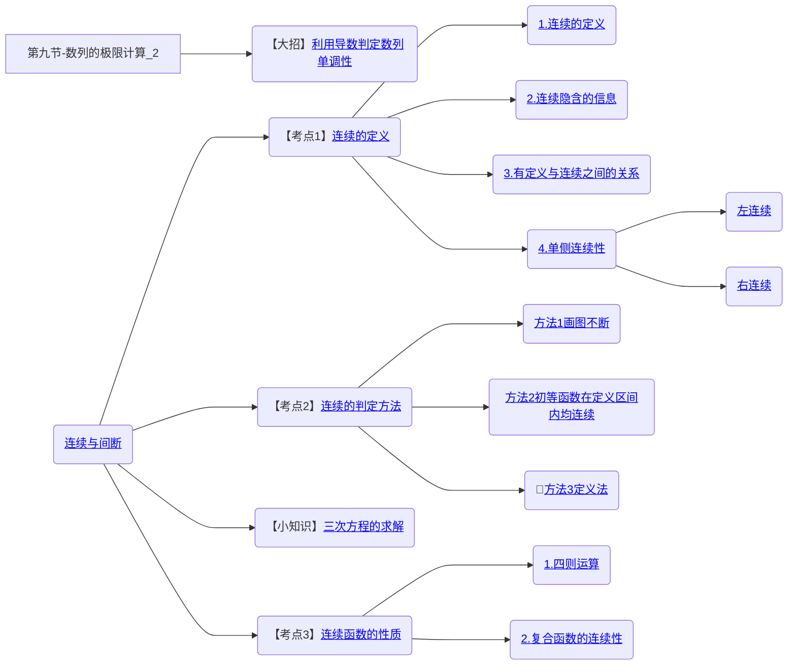
```mermaid
graph LR
第九节-数列的极限计算_2

第九节-数列的极限计算_2--->利用导数判定数列单调性(【大招】<a href="/Users/yuebinghui/Documents/program/github/note/笔记/数学/周洋鑫/基础班/09.数列的极限计算_2.md#利用导数判定数列单调性">利用导数判定数列单调性</>)

连续与间断(<a href="/Users/yuebinghui/Documents/program/github/note/笔记/数学/周洋鑫/基础班/09.数列的极限计算_2.md#连续与间断">连续与间断</>)
连续与间断--->连续的定义(【考点1】<a href="/Users/yuebinghui/Documents/program/github/note/笔记/数学/周洋鑫/基础班/09.数列的极限计算_2.md#连续的定义">连续的定义</>)
连续的定义--->1.连续的定义(<a href="/Users/yuebinghui/Documents/program/github/note/笔记/数学/周洋鑫/基础班/09.数列的极限计算_2.md#1.连续的定义">1.连续的定义</>)
连续的定义--->2.连续隐含的信息(<a href="/Users/yuebinghui/Documents/program/github/note/笔记/数学/周洋鑫/基础班/09.数列的极限计算_2.md#2.连续隐含的信息">2.连续隐含的信息</>)
连续的定义--->3.有定义与连续之间的关系(<a href="/Users/yuebinghui/Documents/program/github/note/笔记/数学/周洋鑫/基础班/09.数列的极限计算_2.md#3.有定义与连续之间的关系">3.有定义与连续之间的关系</>)
连续的定义--->4.单侧连续性(<a href="/Users/yuebinghui/Documents/program/github/note/笔记/数学/周洋鑫/基础班/09.数列的极限计算_2.md#4.单侧连续性">4.单侧连续性</>)
4.单侧连续性--->左连续(<a href="/Users/yuebinghui/Documents/program/github/note/笔记/数学/周洋鑫/基础班/09.数列的极限计算_2.md#左连续">左连续</>)
4.单侧连续性--->右连续(<a href="/Users/yuebinghui/Documents/program/github/note/笔记/数学/周洋鑫/基础班/09.数列的极限计算_2.md#右连续">右连续</>)

连续与间断--->连续的判定方法(【考点2】<a href="/Users/yuebinghui/Documents/program/github/note/笔记/数学/周洋鑫/基础班/09.数列的极限计算_2.md#连续的判定方法">连续的判定方法</>)
连续的判定方法--->方法1画图不断(<a href="/Users/yuebinghui/Documents/program/github/note/笔记/数学/周洋鑫/基础班/09.数列的极限计算_2.md#方法1画图不断">方法1画图不断</>)
连续的判定方法--->方法2初等函数在定义区间内均连续(<a href="/Users/yuebinghui/Documents/program/github/note/笔记/数学/周洋鑫/基础班/09.数列的极限计算_2.md#方法2初等函数在定义区间内均连续">方法2初等函数在定义区间内均连续</>)
连续的判定方法--->方法3定义法(🌟<a href="/Users/yuebinghui/Documents/program/github/note/笔记/数学/周洋鑫/基础班/09.数列的极限计算_2.md#方法3定义法">方法3定义法</>)

连续与间断--->三次方程的求解(【小知识】<a href="/Users/yuebinghui/Documents/program/github/note/笔记/数学/周洋鑫/基础班/09.数列的极限计算_2.md#三次方程的求解">三次方程的求解</>)

连续与间断--->连续函数的性质(【考点3】<a href="/Users/yuebinghui/Documents/program/github/note/笔记/数学/周洋鑫/基础班/09.数列的极限计算_2.md#连续函数的性质">连续函数的性质</>)
连续函数的性质--->1.四则运算(<a href="/Users/yuebinghui/Documents/program/github/note/笔记/数学/周洋鑫/基础班/09.数列的极限计算_2.md#1.四则运算">1.四则运算</>)
连续函数的性质--->2.复合函数的连续性(<a href="/Users/yuebinghui/Documents/program/github/note/笔记/数学/周洋鑫/基础班/09.数列的极限计算_2.md#2.复合函数的连续性">2.复合函数的连续性</>)
```

## 第十节-连续与间断-导数定义-1

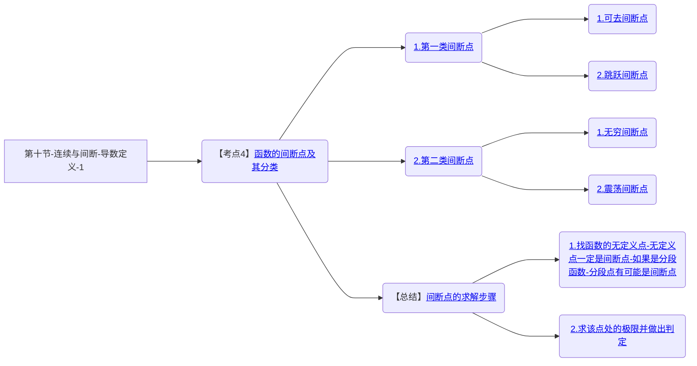
```mermaid
graph LR
第十节-连续与间断-导数定义-1

第十节-连续与间断-导数定义-1--->函数的间断点及其分类(【考点4】<a href="/Users/yuebinghui/Documents/program/github/note/笔记/数学/周洋鑫/基础班/10.连续与间断_导数定义_1.md#函数的间断点及其分类">函数的间断点及其分类</>)
函数的间断点及其分类--->1.第一类间断点(<a href="/Users/yuebinghui/Documents/program/github/note/笔记/数学/周洋鑫/基础班/10.连续与间断_导数定义_1.md#1.第一类间断点">1.第一类间断点</>)
1.第一类间断点--->1.可去间断点(<a href="/Users/yuebinghui/Documents/program/github/note/笔记/数学/周洋鑫/基础班/10.连续与间断_导数定义_1.md#1.可去间断点">1.可去间断点</>)
1.第一类间断点--->2.跳跃间断点(<a href="/Users/yuebinghui/Documents/program/github/note/笔记/数学/周洋鑫/基础班/10.连续与间断_导数定义_1.md#2.跳跃间断点">2.跳跃间断点</>)
函数的间断点及其分类--->2.第二类间断点(<a href="/Users/yuebinghui/Documents/program/github/note/笔记/数学/周洋鑫/基础班/10.连续与间断_导数定义_1.md#2.第二类间断点">2.第二类间断点</>)
2.第二类间断点--->1.无穷间断点(<a href="/Users/yuebinghui/Documents/program/github/note/笔记/数学/周洋鑫/基础班/10.连续与间断_导数定义_1.md#1.无穷间断点">1.无穷间断点</>)
2.第二类间断点--->2.震荡间断点(<a href="/Users/yuebinghui/Documents/program/github/note/笔记/数学/周洋鑫/基础班/10.连续与间断_导数定义_1.md#2.震荡间断点">2.震荡间断点</>)
函数的间断点及其分类--->间断点的求解步骤(【总结】<a href="/Users/yuebinghui/Documents/program/github/note/笔记/数学/周洋鑫/基础班/10.连续与间断_导数定义_1.md#间断点的求解步骤">间断点的求解步骤</>)
间断点的求解步骤--->1.找函数的无定义点-无定义点一定是间断点-如果是分段函数-分段点有可能是间断点(<a href="/Users/yuebinghui/Documents/program/github/note/笔记/数学/周洋鑫/基础班/10.连续与间断_导数定义_1.md#1.找函数的无定义点-无定义点一定是间断点-如果是分段函数-分段点有可能是间断点">1.找函数的无定义点-无定义点一定是间断点-如果是分段函数-分段点有可能是间断点</>)
间断点的求解步骤--->2.求该点处的极限并做出判定(<a href="/Users/yuebinghui/Documents/program/github/note/笔记/数学/周洋鑫/基础班/10.连续与间断_导数定义_1.md#2.求该点处的极限并做出判定">2.求该点处的极限并做出判定</>)
```

# 第二章-一元函数微分学

## 第一节-导数定义

```mermaid
graph LR
第一节-导数定义

第一节-导数定义--->1.导数定义的背景(<a href="/Users/yuebinghui/Documents/program/github/note/笔记/数学/周洋鑫/基础班/10.连续与间断_导数定义_1.md#1.导数定义的背景">1.导数定义的背景</>)
1.导数定义的背景--->背景1一点处的导数-即为一点处的瞬时变化率(<a href="/Users/yuebinghui/Documents/program/github/note/笔记/数学/周洋鑫/基础班/10.连续与间断_导数定义_1.md#背景1一点处的导数-即为一点处的瞬时变化率">背景1一点处的导数-即为一点处的瞬时变化率</>)
1.导数定义的背景--->背景2一点处的导数-即为一点处的切线斜率(<a href="/Users/yuebinghui/Documents/program/github/note/笔记/数学/周洋鑫/基础班/10.连续与间断_导数定义_1.md#背景2一点处的导数-即为一点处的切线斜率">背景2一点处的导数-即为一点处的切线斜率</>)

第一节-导数定义--->2.导数的核心定义(<a href="/Users/yuebinghui/Documents/program/github/note/笔记/数学/周洋鑫/基础班/10.连续与间断_导数定义_1.md#2.导数的核心定义">2.导数的核心定义</>)
第一节-导数定义--->3.导数的增量定义(<a href="/Users/yuebinghui/Documents/program/github/note/笔记/数学/周洋鑫/基础班/10.连续与间断_导数定义_1.md#3.导数的增量定义">3.导数的增量定义</>)
第一节-导数定义--->4.导数的计算型定义(<a href="/Users/yuebinghui/Documents/program/github/note/笔记/数学/周洋鑫/基础班/10.连续与间断_导数定义_1.md#4.导数的计算型定义">4.导数的计算型定义</>)

第一节-导数定义--->几种等价说法-fx在x等于x0处可导(【注】<a href="/Users/yuebinghui/Documents/program/github/note/笔记/数学/周洋鑫/基础班/10.连续与间断_导数定义_1.md#几种等价说法-fx在x等于x0处可导">几种等价说法-fx在x等于x0处可导</>)
第一节-导数定义--->可导与不可导(【注】<a href="/Users/yuebinghui/Documents/program/github/note/笔记/数学/周洋鑫/基础班/10.连续与间断_导数定义_1.md#可导与不可导">可导与不可导</>)
第一节-导数定义--->导数定义结构剖析-一动减一定-动点逼近定点(【注】<a href="/Users/yuebinghui/Documents/program/github/note/笔记/数学/周洋鑫/基础班/10.连续与间断_导数定义_1.md#导数定义结构剖析-一动减一定-动点逼近定点">导数定义结构剖析   一动减一定-动点逼近定点</>)

第一节-导数定义--->导数定义的使用场景(【考】<a href="/Users/yuebinghui/Documents/program/github/note/笔记/数学/周洋鑫/基础班/10.连续与间断_导数定义_1.md#导数定义的使用场景">导数定义的使用场景</>)
导数定义的使用场景--->1.分段函数在分段点处的导数(<a href="/Users/yuebinghui/Documents/program/github/note/笔记/数学/周洋鑫/基础班/10.连续与间断_导数定义_1.md#1.分段函数在分段点处的导数">1.分段函数在分段点处的导数</>)
导数定义的使用场景--->2.求一点处导数-但直接求导非常麻烦(<a href="/Users/yuebinghui/Documents/program/github/note/笔记/数学/周洋鑫/基础班/10.连续与间断_导数定义_1.md#2.求一点处导数-但直接求导非常麻烦">2.求一点处导数-但直接求导非常麻烦</>)
导数定义的使用场景--->3.欲求函数的导数-但未知函数的可导性(<a href="/Users/yuebinghui/Documents/program/github/note/笔记/数学/周洋鑫/基础班/10.连续与间断_导数定义_1.md#3.欲求函数的导数-但未知函数的可导性">3.欲求函数的导数-但未知函数的可导性</>)
导数定义的使用场景--->4.将极限与导数挂钩的问题(<a href="/Users/yuebinghui/Documents/program/github/note/笔记/数学/周洋鑫/基础班/10.连续与间断_导数定义_1.md#4.将极限与导数挂钩的问题">4.将极限与导数挂钩的问题</>)

第一节-导数定义--->可导与连续之间的关系(【考点】<a href="/Users/yuebinghui/Documents/program/github/note/笔记/数学/周洋鑫/基础班/10.连续与间断_导数定义_1.md#可导与连续之间的关系">可导与连续之间的关系</>)
可导与连续之间的关系--->1.连续与有定义(<a href="/Users/yuebinghui/Documents/program/github/note/笔记/数学/周洋鑫/基础班/10.连续与间断_导数定义_1.md#1.连续与有定义">1.连续与有定义</>)
可导与连续之间的关系--->2.连续与可导之间的关系(<a href="/Users/yuebinghui/Documents/program/github/note/笔记/数学/周洋鑫/基础班/10.连续与间断_导数定义_1.md#2.连续与可导之间的关系">2.连续与可导之间的关系</>)
可导与连续之间的关系--->3.导数存在与连续之间的关系(<a href="/Users/yuebinghui/Documents/program/github/note/笔记/数学/周洋鑫/基础班/10.连续与间断_导数定义_1.md#3.导数存在与连续之间的关系">3.导数存在与连续之间的关系</>)
可导与连续之间的关系--->4.什么叫做fx二阶可导(<a href="/Users/yuebinghui/Documents/program/github/note/笔记/数学/周洋鑫/基础班/10.连续与间断_导数定义_1.md#4.什么叫做fx二阶可导">4.什么叫做fx二阶可导</>)

第一节-导数定义--->什么叫可导(<a href="/Users/yuebinghui/Documents/program/github/note/笔记/数学/周洋鑫/基础班/11.导数定义_2.md#什么叫可导">什么叫可导</>)
第一节-导数定义--->再看洛必达法则(【注】<a href="/Users/yuebinghui/Documents/program/github/note/笔记/数学/周洋鑫/基础班/11.导数定义_2.md#再看洛必达法则">再看洛必达法则</>)
再看洛必达法则--->函数在一点连续-无法推出函数在该点邻域内也连续(<a href="/Users/yuebinghui/Documents/program/github/note/笔记/数学/周洋鑫/基础班/11.导数定义_2.md#函数在一点连续-无法推出函数在该点邻域内也连续">函数在一点连续-无法推出函数在该点邻域内也连续</>)
再看洛必达法则--->函数在一点可导-无法推出函数在该点邻域内也可导(<a href="/Users/yuebinghui/Documents/program/github/note/笔记/数学/周洋鑫/基础班/11.导数定义_2.md#函数在一点可导-无法推出函数在该点邻域内也可导">函数在一点可导-无法推出函数在该点邻域内也可导</>)

第一节-导数定义--->单侧导数(【考点2】<a href="/Users/yuebinghui/Documents/program/github/note/笔记/数学/周洋鑫/基础班/11.导数定义_2.md#单侧导数">单侧导数</>)
单侧导数--->右导数(<a href="/Users/yuebinghui/Documents/program/github/note/笔记/数学/周洋鑫/基础班/11.导数定义_2.md#右导数">右导数</>)
单侧导数--->左导数(<a href="/Users/yuebinghui/Documents/program/github/note/笔记/数学/周洋鑫/基础班/11.导数定义_2.md#左导数">左导数</>)

第一节-导数定义--->在这个点处可导的充要条件(<a href="/Users/yuebinghui/Documents/program/github/note/笔记/数学/周洋鑫/基础班/11.导数定义_2.md#在这个点处可导的充要条件">在这个点处可导的充要条件</>)
第一节-导数定义--->连续性和可导性的判定方法(【注】<a href="/Users/yuebinghui/Documents/program/github/note/笔记/数学/周洋鑫/基础班/11.导数定义_2.md#连续性和可导性的判定方法">连续性和可导性的判定方法</>)
第一节-导数定义--->极限-连续-导数(【注】<a href="/Users/yuebinghui/Documents/program/github/note/笔记/数学/周洋鑫/基础班/11.导数定义_2.md#极限-连续-导数">极限-连续-导数</>)

第一节-导数定义--->导数的推广定义(<a href="/Users/yuebinghui/Documents/program/github/note/笔记/数学/周洋鑫/基础班/12.导数计算_1.md#导数的推广定义">导数的推广定义</>)

第一节-导数定义--->含有抽象函数的极限问题(【考】<a href="/Users/yuebinghui/Documents/program/github/note/笔记/数学/周洋鑫/基础班/12.导数计算_1.md#含有抽象函数的极限问题">含有抽象函数的极限问题</>)

含有抽象函数的极限问题--->1.洛必达法则-易错点(<a href="/Users/yuebinghui/Documents/program/github/note/笔记/数学/周洋鑫/基础班/12.导数计算_1.md#1.洛必达法则-易错点">1.洛必达法则-易错点</>)
1.洛必达法则-易错点--->通常情况下,可以洛必达至抽象函数连续的那一阶(<a href="/Users/yuebinghui/Documents/program/github/note/笔记/数学/周洋鑫/基础班/12.导数计算_1.md#通常情况下,可以洛必达至抽象函数连续的那一阶">通常情况下,可以洛必达至抽象函数连续的那一阶</>)

含有抽象函数的极限问题--->2.使用导数定义(<a href="/Users/yuebinghui/Documents/program/github/note/笔记/数学/周洋鑫/基础班/12.导数计算_1.md#2.使用导数定义">2.使用导数定义</>)
```

## 第二节-导数计算

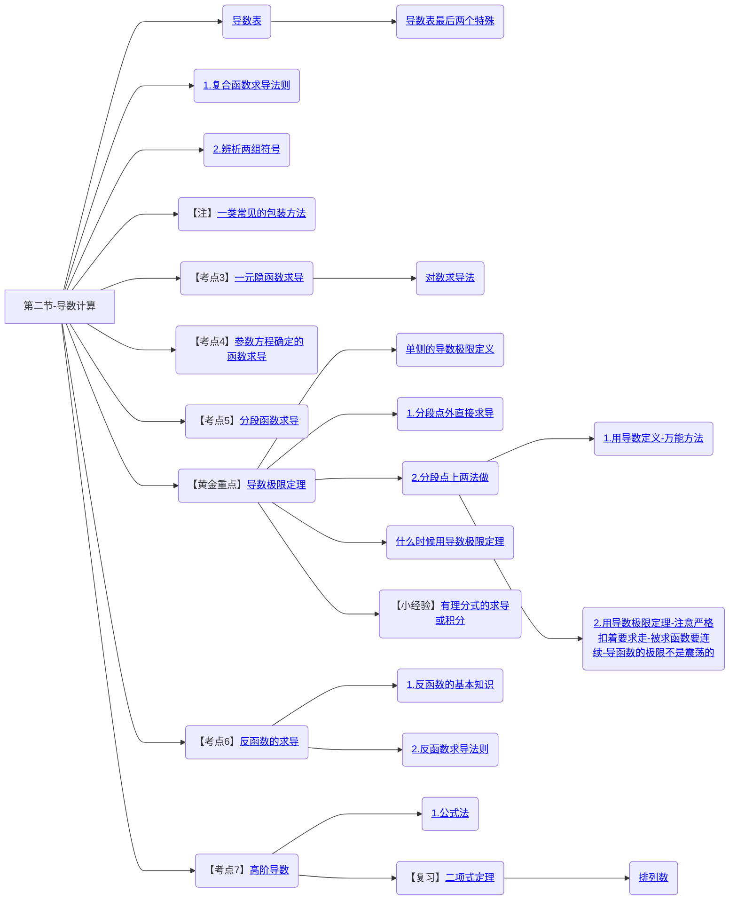
```mermaid
graph LR
第二节-导数计算

第二节-导数计算--->导数表(<a href="/Users/yuebinghui/Documents/program/github/note/笔记/数学/周洋鑫/零基础提前学/11.1零基础核心考点精讲10-1.md#导数表-必须记住">导数表</>)
导数表--->导数表最后两个特殊(<a href="/Users/yuebinghui/Documents/program/github/note/笔记/数学/周洋鑫/零基础提前学/11.1零基础核心考点精讲10-1.md#导数表最后两个特殊">导数表最后两个特殊</>)
第二节-导数计算--->复合函数求导法则(<a href="/Users/yuebinghui/Documents/program/github/note/笔记/数学/周洋鑫/基础班/12.导数计算_1.md#复合函数求导法则">1.复合函数求导法则</>)
第二节-导数计算--->2.辨析两组符号(<a href="/Users/yuebinghui/Documents/program/github/note/笔记/数学/周洋鑫/基础班/12.导数计算_1.md#2.辨析两组符号">2.辨析两组符号</>)

第二节-导数计算--->一类常见的包装方法(【注】<a href="/Users/yuebinghui/Documents/program/github/note/笔记/数学/周洋鑫/基础班/12.导数计算_1.md#一类常见的包装方法">一类常见的包装方法</>)

第二节-导数计算--->一元隐函数求导(【考点3】<a href="/Users/yuebinghui/Documents/program/github/note/笔记/数学/周洋鑫/基础班/12.导数计算_1.md#一元隐函数求导">一元隐函数求导</>)

一元隐函数求导--->对数求导法(<a href="/Users/yuebinghui/Documents/program/github/note/笔记/数学/周洋鑫/基础班/13.导数计算_2.md#对数求导法">对数求导法</>)

第二节-导数计算--->参数方程确定的函数求导(【考点4】<a href="/Users/yuebinghui/Documents/program/github/note/笔记/数学/周洋鑫/基础班/13.导数计算_2.md#参数方程确定的函数求导">参数方程确定的函数求导</>)

第二节-导数计算--->分段函数求导(【考点5】<a href="/Users/yuebinghui/Documents/program/github/note/笔记/数学/周洋鑫/基础班/13.导数计算_2.md#分段函数求导">分段函数求导</>)

第二节-导数计算--->导数极限定理(【黄金重点】<a href="/Users/yuebinghui/Documents/program/github/note/笔记/数学/周洋鑫/基础班/13.导数计算_2.md#导数极限定理">导数极限定理</>)
导数极限定理--->单侧的导数极限定义(<a href="/Users/yuebinghui/Documents/program/github/note/笔记/数学/周洋鑫/基础班/13.导数计算_2.md#单侧的导数极限定义">单侧的导数极限定义</>)
导数极限定理--->1.分段点外直接求导(<a href="/Users/yuebinghui/Documents/program/github/note/笔记/数学/周洋鑫/基础班/13.导数计算_2.md#1.分段点外直接求导">1.分段点外直接求导</>)
导数极限定理--->2.分段点上两法做(<a href="/Users/yuebinghui/Documents/program/github/note/笔记/数学/周洋鑫/基础班/13.导数计算_2.md#2.分段点上两法做">2.分段点上两法做</>)
2.分段点上两法做--->1.用导数定义-万能方法(<a href="/Users/yuebinghui/Documents/program/github/note/笔记/数学/周洋鑫/基础班/13.导数计算_2.md#1.用导数定义-万能方法">1.用导数定义-万能方法</>)
2.分段点上两法做--->2.用导数极限定理-注意严格扣着要求走-被求函数要连续-导函数的极限不是震荡的(<a href="/Users/yuebinghui/Documents/program/github/note/笔记/数学/周洋鑫/基础班/13.导数计算_2.md#2.用导数极限定理-注意严格扣着要求走-被求函数要连续-导函数的极限不是震荡的">2.用导数极限定理-注意严格扣着要求走-被求函数要连续-导函数的极限不是震荡的</>)
导数极限定理--->什么时候用导数极限定理(<a href="/Users/yuebinghui/Documents/program/github/note/笔记/数学/周洋鑫/基础班/13.导数计算_2.md#什么时候用导数极限定理">什么时候用导数极限定理</>)

导数极限定理--->有理分式的求导或积分(【小经验】<a href="/Users/yuebinghui/Documents/program/github/note/笔记/数学/周洋鑫/基础班/13.导数计算_2.md#有理分式的求导或积分">有理分式的求导或积分</>)

第二节-导数计算--->反函数的求导(【考点6】<a href="/Users/yuebinghui/Documents/program/github/note/笔记/数学/周洋鑫/基础班/13.导数计算_2.md#反函数的求导">反函数的求导</>)
反函数的求导--->1.反函数的基本知识(<a href="/Users/yuebinghui/Documents/program/github/note/笔记/数学/周洋鑫/基础班/13.导数计算_2.md#1.反函数的基本知识">1.反函数的基本知识</>)
反函数的求导--->2.反函数求导法则(<a href="/Users/yuebinghui/Documents/program/github/note/笔记/数学/周洋鑫/基础班/13.导数计算_2.md#2.反函数求导法则">2.反函数求导法则</>)

第二节-导数计算--->高阶导数(【考点7】<a href="/Users/yuebinghui/Documents/program/github/note/笔记/数学/周洋鑫/基础班/14.导数的几何意义与微分定义.md#高阶导数">高阶导数</>)
高阶导数--->1.公式法(<a href="/Users/yuebinghui/Documents/program/github/note/笔记/数学/周洋鑫/基础班/14.导数的几何意义与微分定义.md#1.公式法">1.公式法</>)

高阶导数--->二项式定理(【复习】<a href="/Users/yuebinghui/Documents/program/github/note/笔记/数学/周洋鑫/基础班/14.导数的几何意义与微分定义.md#二项式定理">二项式定理</>)

二项式定理--->排列数(<a href="/Users/yuebinghui/Documents/program/github/note/笔记/数学/周洋鑫/基础班/14.导数的几何意义与微分定义.md#排列数">排列数</>)

```

## 第三节-导数几何意义及切线-法线方程

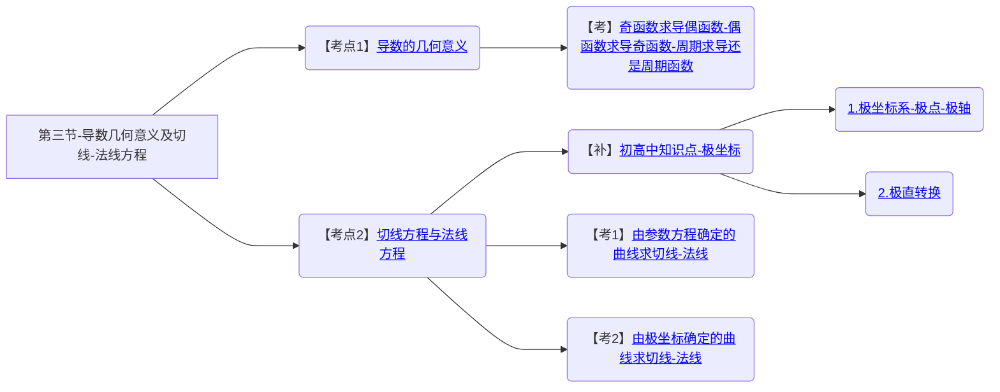
```mermaid
graph LR
第三节-导数几何意义及切线-法线方程

第三节-导数几何意义及切线-法线方程--->导数的几何意义(【考点1】<a href="/Users/yuebinghui/Documents/program/github/note/笔记/数学/周洋鑫/基础班/14.导数的几何意义与微分定义.md#导数的几何意义">导数的几何意义</>)
导数的几何意义--->奇函数求导偶函数-偶函数求导奇函数-周期求导还是周期函数(【考】<a href="/Users/yuebinghui/Documents/program/github/note/笔记/数学/周洋鑫/基础班/14.导数的几何意义与微分定义.md#奇函数求导偶函数-偶函数求导奇函数-周期求导还是周期函数">奇函数求导偶函数-偶函数求导奇函数-周期求导还是周期函数</>)

第三节-导数几何意义及切线-法线方程--->切线方程与法线方程(【考点2】<a href="/Users/yuebinghui/Documents/program/github/note/笔记/数学/周洋鑫/基础班/14.导数的几何意义与微分定义.md#切线方程与法线方程">切线方程与法线方程</>)

切线方程与法线方程--->初高中知识点-极坐标(【补】<a href="/Users/yuebinghui/Documents/program/github/note/笔记/数学/周洋鑫/基础班/14.导数的几何意义与微分定义.md#初高中知识点-极坐标">初高中知识点-极坐标</>)
初高中知识点-极坐标--->1.极坐标系-极点-极轴(<a href="/Users/yuebinghui/Documents/program/github/note/笔记/数学/周洋鑫/基础班/14.导数的几何意义与微分定义.md#1.极坐标系-极点-极轴">1.极坐标系-极点-极轴</>)
初高中知识点-极坐标--->2.极直转换(<a href="/Users/yuebinghui/Documents/program/github/note/笔记/数学/周洋鑫/基础班/14.导数的几何意义与微分定义.md#2.极直转换">2.极直转换</>)

切线方程与法线方程--->参数方程确定的曲线求切线-法线(【考1】<a href="/Users/yuebinghui/Documents/program/github/note/笔记/数学/周洋鑫/基础班/14.导数的几何意义与微分定义.md#参数方程确定的曲线求切线-法线">由参数方程确定的曲线求切线-法线</>)
切线方程与法线方程--->由极坐标确定的曲线求切线-法线(【考2】<a href="/Users/yuebinghui/Documents/program/github/note/笔记/数学/周洋鑫/基础班/14.导数的几何意义与微分定义.md#由极坐标确定的曲线求切线-法线">由极坐标确定的曲线求切线-法线</>)
```

## 第四节-微分定义

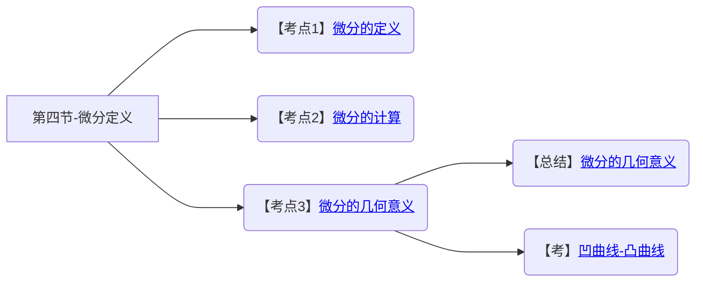
```mermaid
graph LR
第四节-微分定义

第四节-微分定义--->微分的定义(【考点1】<a href="/Users/yuebinghui/Documents/program/github/note/笔记/数学/周洋鑫/基础班/15.导数的微分学应用_1.md#微分的定义">微分的定义</>)
第四节-微分定义--->微分的计算(【考点2】<a href="/Users/yuebinghui/Documents/program/github/note/笔记/数学/周洋鑫/基础班/15.导数的微分学应用_1.md#微分的计算">微分的计算</>)
第四节-微分定义--->微分的几何意义(【考点3】<a href="/Users/yuebinghui/Documents/program/github/note/笔记/数学/周洋鑫/基础班/15.导数的微分学应用_1.md#微分的几何意义">微分的几何意义</>)
微分的几何意义--->总结微分的几何意义(【总结】<a href="/Users/yuebinghui/Documents/program/github/note/笔记/数学/周洋鑫/基础班/15.导数的微分学应用_1.md#总结微分的几何意义">微分的几何意义</>)
微分的几何意义--->凹曲线-凸曲线(【考】<a href="/Users/yuebinghui/Documents/program/github/note/笔记/数学/周洋鑫/基础班/15.导数的微分学应用_1.md#凹曲线-凸曲线">凹曲线-凸曲线</>)
```

## 第五节-导数的微分学应用

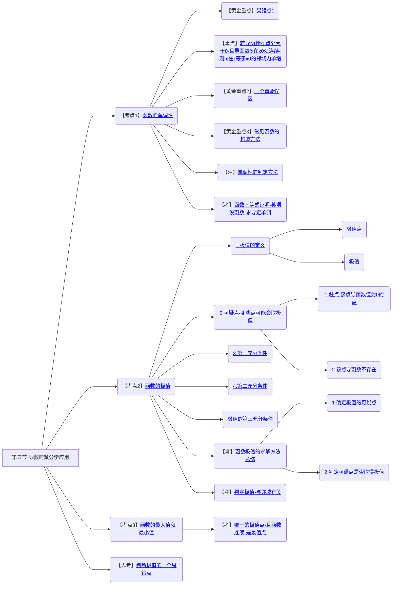
```mermaid
graph LR
第五节-导数的微分学应用

第五节-导数的微分学应用--->函数的单调性(【考点1】<a href="/Users/yuebinghui/Documents/program/github/note/笔记/数学/周洋鑫/基础班/15.导数的微分学应用_1.md#函数的单调性">函数的单调性</>)
函数的单调性--->易错点1(【黄金重点】<a href="/Users/yuebinghui/Documents/program/github/note/笔记/数学/周洋鑫/基础班/15.导数的微分学应用_1.md#易错点1">易错点1</>)
函数的单调性--->若导函数x0点处大于0-且导函数fx在x0处连续-则fx在x等于x0的邻域内单增(【重点】<a href="/Users/yuebinghui/Documents/program/github/note/笔记/数学/周洋鑫/基础班/15.导数的微分学应用_1.md#若导函数x0点处大于0-且导函数fx在x0处连续-则fx在x等于x0的邻域内单增">若导函数x0点处大于0-且导函数fx在x0处连续-则fx在x等于x0的邻域内单增</>)
函数的单调性--->一个重要误区(【黄金重点2】<a href="/Users/yuebinghui/Documents/program/github/note/笔记/数学/周洋鑫/基础班/15.导数的微分学应用_1.md#一个重要误区">一个重要误区</>)
函数的单调性--->常见函数的构造方法(【黄金重点3】<a href="/Users/yuebinghui/Documents/program/github/note/笔记/数学/周洋鑫/基础班/15.导数的微分学应用_1.md#常见函数的构造方法">常见函数的构造方法</>)
函数的单调性--->单调性的判定方法(【注】<a href="/Users/yuebinghui/Documents/program/github/note/笔记/数学/周洋鑫/基础班/15.导数的微分学应用_1.md#单调性的判定方法">单调性的判定方法</>)
函数的单调性--->函数不等式证明-移项设函数-求导定单调(【考】<a href="/Users/yuebinghui/Documents/program/github/note/笔记/数学/周洋鑫/基础班/15.导数的微分学应用_1.md#函数不等式证明-移项设函数-求导定单调">函数不等式证明-移项设函数-求导定单调</>)

第五节-导数的微分学应用--->函数的极值(【考点2】<a href="/Users/yuebinghui/Documents/program/github/note/笔记/数学/周洋鑫/基础班/16.导数的微分学应用_2.md#函数的极值">函数的极值</>)
函数的极值--->1.极值的定义(<a href="/Users/yuebinghui/Documents/program/github/note/笔记/数学/周洋鑫/基础班/16.导数的微分学应用_2.md#1.极值的定义">1.极值的定义</>)
1.极值的定义--->极值点(<a href="/Users/yuebinghui/Documents/program/github/note/笔记/数学/周洋鑫/基础班/16.导数的微分学应用_2.md#极值点">极值点</>)
1.极值的定义--->极值(<a href="/Users/yuebinghui/Documents/program/github/note/笔记/数学/周洋鑫/基础班/16.导数的微分学应用_2.md#极值">极值</>)
函数的极值--->2.可疑点-哪些点可能会取极值(<a href="/Users/yuebinghui/Documents/program/github/note/笔记/数学/周洋鑫/基础班/16.导数的微分学应用_2.md#2.可疑点-哪些点可能会取极值">2.可疑点-哪些点可能会取极值</>)
2.可疑点-哪些点可能会取极值--->1.驻点-该点导函数值为0的点(<a href="/Users/yuebinghui/Documents/program/github/note/笔记/数学/周洋鑫/基础班/16.导数的微分学应用_2.md#1.驻点-该点导函数值为0的点">1.驻点-该点导函数值为0的点</>)
2.可疑点-哪些点可能会取极值--->2.该点导函数不存在(<a href="/Users/yuebinghui/Documents/program/github/note/笔记/数学/周洋鑫/基础班/16.导数的微分学应用_2.md#2.该点导函数不存在">2.该点导函数不存在</>)
函数的极值--->3.第一充分条件(<a href="/Users/yuebinghui/Documents/program/github/note/笔记/数学/周洋鑫/基础班/16.导数的微分学应用_2.md#3.第一充分条件">3.第一充分条件</>)
函数的极值--->4.第二充分条件(<a href="/Users/yuebinghui/Documents/program/github/note/笔记/数学/周洋鑫/基础班/16.导数的微分学应用_2.md#4.第二充分条件">4.第二充分条件</>)
函数的极值--->极值的第三充分条件(<a href="/Users/yuebinghui/Documents/program/github/note/笔记/数学/周洋鑫/基础班/17.导数的微分学应用_3.md#极值的第三充分条件">极值的第三充分条件</>)
函数的极值--->函数极值的求解方法总结(【考】<a href="/Users/yuebinghui/Documents/program/github/note/笔记/数学/周洋鑫/基础班/16.导数的微分学应用_2.md#函数极值的求解方法总结">函数极值的求解方法总结</>)
函数极值的求解方法总结--->1.确定极值的可疑点(<a href="/Users/yuebinghui/Documents/program/github/note/笔记/数学/周洋鑫/基础班/16.导数的微分学应用_2.md#1.确定极值的可疑点">1.确定极值的可疑点</>)
函数极值的求解方法总结--->2.判定可疑点是否取得极值(<a href="/Users/yuebinghui/Documents/program/github/note/笔记/数学/周洋鑫/基础班/16.导数的微分学应用_2.md#2.判定可疑点是否取得极值">2.判定可疑点是否取得极值</>)
函数的极值--->判定极值-与邻域有关(【注】<a href="/Users/yuebinghui/Documents/program/github/note/笔记/数学/周洋鑫/基础班/16.导数的微分学应用_2.md#判定极值-与邻域有关">判定极值-与邻域有关</>)

第五节-导数的微分学应用--->函数的最大值和最小值(【考点3】<a href="/Users/yuebinghui/Documents/program/github/note/笔记/数学/周洋鑫/基础班/16.导数的微分学应用_2.md#函数的最大值和最小值">函数的最大值和最小值</>)
函数的最大值和最小值--->唯一的极值点-且函数连续-是最值点(【考】<a href="/Users/yuebinghui/Documents/program/github/note/笔记/数学/周洋鑫/基础班/16.导数的微分学应用_2.md#唯一的极值点-且函数连续-是最值点">唯一的极值点-且函数连续-是最值点</>)

第五节-导数的微分学应用--->一个易错点(【思考】<a href="/Users/yuebinghui/Documents/program/github/note/笔记/数学/周洋鑫/基础班/17.导数的微分学应用_3.md#一个易错点">判断极值的一个易错点</>)


```

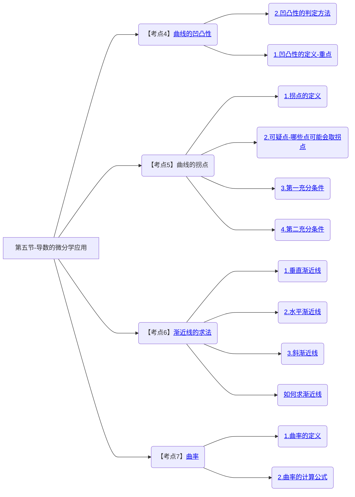
```mermaid
graph LR
第五节-导数的微分学应用


第五节-导数的微分学应用--->曲线的凹凸性(【考点4】<a href="/Users/yuebinghui/Documents/program/github/note/笔记/数学/周洋鑫/基础班/17.导数的微分学应用_3.md#曲线的凹凸性">曲线的凹凸性</>)
曲线的凹凸性--->2.凹凸性的判定方法(<a href="/Users/yuebinghui/Documents/program/github/note/笔记/数学/周洋鑫/基础班/17.导数的微分学应用_3.md#2.凹凸性的判定方法">2.凹凸性的判定方法</>)
曲线的凹凸性--->1.凹凸性的定义-重点(<a href="/Users/yuebinghui/Documents/program/github/note/笔记/数学/周洋鑫/基础班/17.导数的微分学应用_3.md#1.凹凸性的定义-重点">1.凹凸性的定义-重点</>)

第五节-导数的微分学应用--->曲线的拐点(【考点5】曲线的拐点)
曲线的拐点--->1.拐点的定义(<a href="/Users/yuebinghui/Documents/program/github/note/笔记/数学/周洋鑫/基础班/17.导数的微分学应用_3.md#1.拐点的定义">1.拐点的定义</>)
曲线的拐点--->2.可疑点-哪些点可能会取拐点(<a href="/Users/yuebinghui/Documents/program/github/note/笔记/数学/周洋鑫/基础班/17.导数的微分学应用_3.md#2.可疑点-哪些点可能会取拐点">2.可疑点-哪些点可能会取拐点</>)
曲线的拐点--->3.第一充分条件(<a href="/Users/yuebinghui/Documents/program/github/note/笔记/数学/周洋鑫/基础班/17.导数的微分学应用_3.md#3.第一充分条件">3.第一充分条件</>)
曲线的拐点--->4.第二充分条件(<a href="/Users/yuebinghui/Documents/program/github/note/笔记/数学/周洋鑫/基础班/17.导数的微分学应用_3.md#4.第二充分条件">4.第二充分条件</>)

第五节-导数的微分学应用--->渐近线的求法(【考点6】<a href="/Users/yuebinghui/Documents/program/github/note/笔记/数学/周洋鑫/基础班/17.导数的微分学应用_3.md#渐近线的求法">渐近线的求法</>)
渐近线的求法--->1.垂直渐近线(<a href="/Users/yuebinghui/Documents/program/github/note/笔记/数学/周洋鑫/基础班/17.导数的微分学应用_3.md#1.垂直渐近线">1.垂直渐近线</>)
渐近线的求法--->2.水平渐近线(<a href="/Users/yuebinghui/Documents/program/github/note/笔记/数学/周洋鑫/基础班/17.导数的微分学应用_3.md#2.水平渐近线">2.水平渐近线</>)
渐近线的求法--->3.斜渐近线(<a href="/Users/yuebinghui/Documents/program/github/note/笔记/数学/周洋鑫/基础班/17.导数的微分学应用_3.md#3.斜渐近线">3.斜渐近线</>)
渐近线的求法--->如何求渐近线(<a href="/Users/yuebinghui/Documents/program/github/note/笔记/数学/周洋鑫/基础班/17.导数的微分学应用_3.md#如何求渐近线">如何求渐近线</>)

第五节-导数的微分学应用--->曲率(【考点7】<a href="/Users/yuebinghui/Documents/program/github/note/笔记/数学/周洋鑫/基础班/17.导数的微分学应用_3.md#曲率">曲率</>)
曲率--->1.曲率的定义(<a href="/Users/yuebinghui/Documents/program/github/note/笔记/数学/周洋鑫/基础班/17.导数的微分学应用_3.md#1.曲率的定义">1.曲率的定义</>)
曲率--->2.曲率的计算公式(<a href="/Users/yuebinghui/Documents/program/github/note/笔记/数学/周洋鑫/基础班/17.导数的微分学应用_3.md#2.曲率的计算公式">2.曲率的计算公式</>)
```

# 第三章-不定积分

## 第一节-不定积分定义与性质

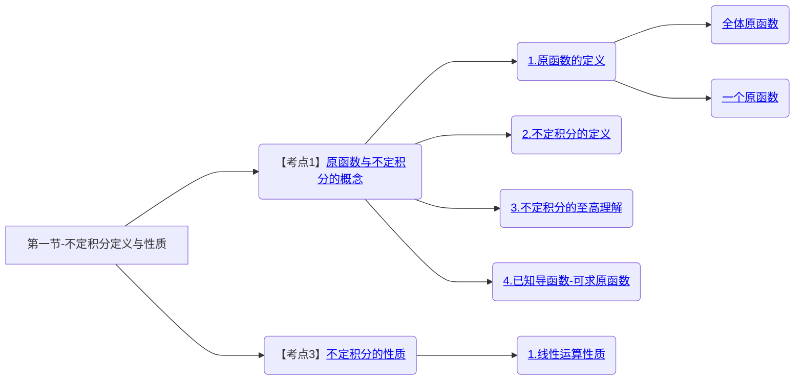
```mermaid
graph LR
第一节-不定积分定义与性质

第一节-不定积分定义与性质--->原函数与不定积分的概念(【考点1】<a href="/Users/yuebinghui/Documents/program/github/note/笔记/数学/周洋鑫/基础班/18.不定积分_1.md#原函数与不定积分的概念">原函数与不定积分的概念</>)
原函数与不定积分的概念--->1.原函数的定义(<a href="/Users/yuebinghui/Documents/program/github/note/笔记/数学/周洋鑫/基础班/18.不定积分_1.md#1.原函数的定义">1.原函数的定义</>)
1.原函数的定义--->全体原函数(<a href="/Users/yuebinghui/Documents/program/github/note/笔记/数学/周洋鑫/基础班/18.不定积分_1.md#全体原函数">全体原函数</>)
1.原函数的定义--->一个原函数(<a href="/Users/yuebinghui/Documents/program/github/note/笔记/数学/周洋鑫/基础班/18.不定积分_1.md#一个原函数">一个原函数</>)
原函数与不定积分的概念--->2.不定积分的定义(<a href="/Users/yuebinghui/Documents/program/github/note/笔记/数学/周洋鑫/基础班/18.不定积分_1.md#2.不定积分的定义">2.不定积分的定义</>)
原函数与不定积分的概念--->3.不定积分的至高理解(<a href="/Users/yuebinghui/Documents/program/github/note/笔记/数学/周洋鑫/基础班/18.不定积分_1.md#3.不定积分的至高理解">3.不定积分的至高理解</>)
原函数与不定积分的概念--->4.已知导函数-可求原函数(<a href="/Users/yuebinghui/Documents/program/github/note/笔记/数学/周洋鑫/基础班/18.不定积分_1.md#4.已知导函数-可求原函数">4.已知导函数-可求原函数</>)

第一节-不定积分定义与性质--->不定积分的性质(【考点3】<a href="/Users/yuebinghui/Documents/program/github/note/笔记/数学/周洋鑫/基础班/18.不定积分_1.md#不定积分的性质">不定积分的性质</>)
不定积分的性质--->1.线性运算性质(<a href="/Users/yuebinghui/Documents/program/github/note/笔记/数学/周洋鑫/基础班/18.不定积分_1.md#1.线性运算性质">1.线性运算性质</>)

```

