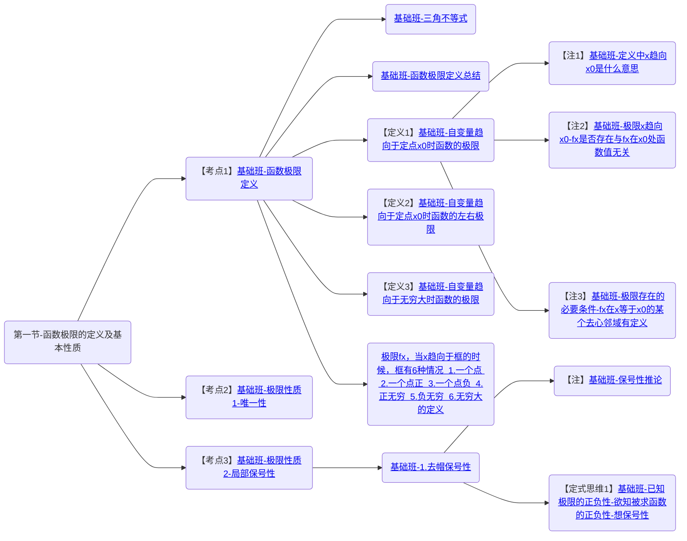

```mermaid
graph LR
第一节-函数极限的定义及基本性质(第一节-函数极限的定义及基本性质)

第一节-函数极限的定义及基本性质--->基础班-函数极限定义(【考点1】<a href="/Users/yuebinghui/Documents/program/github/note/笔记/数学/周洋鑫/基础班/01.函数极限的定义与性质-1.md#基础班-函数极限定义">基础班-函数极限定义</>)

基础班-函数极限定义--->基础班-三角不等式(<a href="/Users/yuebinghui/Documents/program/github/note/笔记/数学/周洋鑫/基础班/01.函数极限的定义与性质-1.md#基础班-三角不等式">基础班-三角不等式</>)
基础班-函数极限定义--->基础班-函数极限定义总结(<a href="/Users/yuebinghui/Documents/program/github/note/笔记/数学/周洋鑫/基础班/01.函数极限的定义与性质-1.md#基础班-函数极限定义总结">基础班-函数极限定义总结</>)
基础班-函数极限定义--->基础班-自变量趋向于定点x0时函数的极限(【定义1】<a href="/Users/yuebinghui/Documents/program/github/note/笔记/数学/周洋鑫/基础班/01.函数极限的定义与性质-1.md#基础班-自变量趋向于定点x0时函数的极限">基础班-自变量趋向于定点x0时函数的极限</>)
基础班-自变量趋向于定点x0时函数的极限--->基础班-定义中x趋向x0是什么意思(【注1】<a href="/Users/yuebinghui/Documents/program/github/note/笔记/数学/周洋鑫/基础班/01.函数极限的定义与性质-1.md#基础班-定义中x趋向x0是什么意思">基础班-定义中x趋向x0是什么意思</>)
基础班-自变量趋向于定点x0时函数的极限--->基础班-极限x趋向x0-fx是否存在与fx在x0处函数值无关(【注2】<a href="/Users/yuebinghui/Documents/program/github/note/笔记/数学/周洋鑫/基础班/01.函数极限的定义与性质-1.md#基础班-极限x趋向x0-fx是否存在与fx在x0处函数值无关">基础班-极限x趋向x0-fx是否存在与fx在x0处函数值无关</>)
基础班-自变量趋向于定点x0时函数的极限--->基础班-极限存在的必要条件-fx在x等于x0的某个去心邻域有定义(【注3】<a href="/Users/yuebinghui/Documents/program/github/note/笔记/数学/周洋鑫/基础班/01.函数极限的定义与性质-1.md#基础班-极限存在的必要条件-fx在x等于x0的某个去心邻域有定义">基础班-极限存在的必要条件-fx在x等于x0的某个去心邻域有定义</>)
基础班-函数极限定义--->基础班-自变量趋向于定点x0时函数的左右极限(【定义2】<a href="/Users/yuebinghui/Documents/program/github/note/笔记/数学/周洋鑫/基础班/01.函数极限的定义与性质-1.md#基础班-自变量趋向于定点x0时函数的左右极限">基础班-自变量趋向于定点x0时函数的左右极限</>)
基础班-函数极限定义--->基础班-自变量趋向于无穷大时函数的极限(【定义3】<a href="/Users/yuebinghui/Documents/program/github/note/笔记/数学/周洋鑫/基础班/01.函数极限的定义与性质-1.md#基础班-自变量趋向于无穷大时函数的极限">基础班-自变量趋向于无穷大时函数的极限</>)
基础班-函数极限定义--->基础班-极限fx-x趋向于框的时候框有6种情况1.一个点2.一个点正3.一个点负4.正无穷5.负无穷6.无穷大的定义(<a href="/Users/yuebinghui/Documents/program/github/note/笔记/数学/周洋鑫/基础班/01.函数极限的定义与性质-1.md#基础班-极限fx-x趋向于框的时候框有6种情况1.一个点2.一个点正3.一个点负4.正无穷5.负无穷6.无穷大的定义">极限fx，当x趋向于框的时候，框有6种情况  1.一个点  2.一个点正  3.一个点负  4.正无穷  5.负无穷  6.无穷大的定义</>)

第一节-函数极限的定义及基本性质--->基础班-极限性质1-唯一性(【考点2】<a href="/Users/yuebinghui/Documents/program/github/note/笔记/数学/周洋鑫/基础班/01.函数极限的定义与性质-1.md#基础班-极限性质1-唯一性">基础班-极限性质1-唯一性</>)

第一节-函数极限的定义及基本性质--->基础班-极限性质2-局部保号性(【考点3】<a href="/Users/yuebinghui/Documents/program/github/note/笔记/数学/周洋鑫/基础班/01.函数极限的定义与性质-1.md#基础班-极限性质2-局部保号性">基础班-极限性质2-局部保号性</>)
基础班-极限性质2-局部保号性--->基础班-1.去帽保号性(<a href="/Users/yuebinghui/Documents/program/github/note/笔记/数学/周洋鑫/基础班/01.函数极限的定义与性质-1.md#基础班-1.去帽保号性">基础班-1.去帽保号性</>)
基础班-1.去帽保号性--->基础班-保号性推论(【注】<a href="/Users/yuebinghui/Documents/program/github/note/笔记/数学/周洋鑫/基础班/01.函数极限的定义与性质-1.md#基础班-保号性推论">基础班-保号性推论</>)
基础班-1.去帽保号性--->基础班-已知极限的正负性-欲知被求函数的正负性-想保号性(【定式思维1】<a href="/Users/yuebinghui/Documents/program/github/note/笔记/数学/周洋鑫/基础班/01.函数极限的定义与性质-1.md#基础班-已知极限的正负性-欲知被求函数的正负性-想保号性">基础班-已知极限的正负性-欲知被求函数的正负性-想保号性</>)

```

