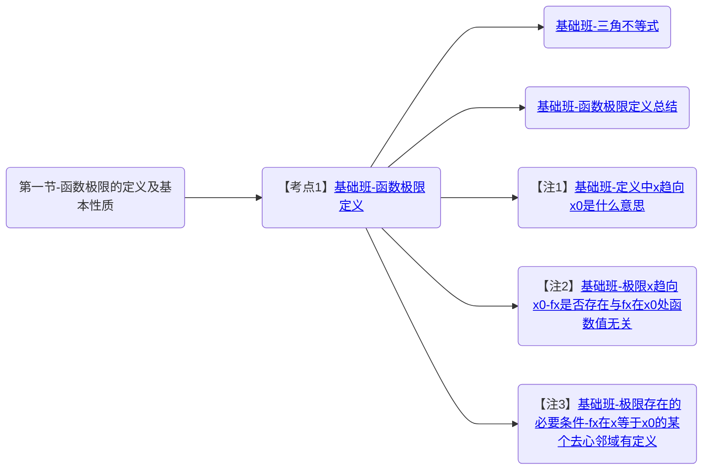

```mermaid
graph LR
第一节-函数极限的定义及基本性质(第一节-函数极限的定义及基本性质)

第一节-函数极限的定义及基本性质--->基础班-函数极限定义(【考点1】<a href="/Users/yuebinghui/Documents/program/github/note/笔记/数学/周洋鑫/基础班/01.函数极限的定义与性质-1.md#基础班-函数极限定义">基础班-函数极限定义</>)
基础班-函数极限定义--->基础班-三角不等式(<a href="/Users/yuebinghui/Documents/program/github/note/笔记/数学/周洋鑫/基础班/01.函数极限的定义与性质-1.md#基础班-三角不等式">基础班-三角不等式</>)
基础班-函数极限定义--->基础班-函数极限定义总结(<a href="/Users/yuebinghui/Documents/program/github/note/笔记/数学/周洋鑫/基础班/01.函数极限的定义与性质-1.md#基础班-函数极限定义总结">基础班-函数极限定义总结</>)
基础班-函数极限定义--->基础班-定义中x趋向x0是什么意思(【注1】<a href="/Users/yuebinghui/Documents/program/github/note/笔记/数学/周洋鑫/基础班/01.函数极限的定义与性质-1.md#基础班-定义中x趋向x0是什么意思">基础班-定义中x趋向x0是什么意思</>)
基础班-函数极限定义--->基础班-极限x趋向x0-fx是否存在与fx在x0处函数值无关(【注2】<a href="/Users/yuebinghui/Documents/program/github/note/笔记/数学/周洋鑫/基础班/01.函数极限的定义与性质-1.md#基础班-极限x趋向x0-fx是否存在与fx在x0处函数值无关">基础班-极限x趋向x0-fx是否存在与fx在x0处函数值无关</>)
基础班-函数极限定义--->基础班-极限存在的必要条件-fx在x等于x0的某个去心邻域有定义(【注3】<a href="/Users/yuebinghui/Documents/program/github/note/笔记/数学/周洋鑫/基础班/01.函数极限的定义与性质-1.md#基础班-极限存在的必要条件-fx在x等于x0的某个去心邻域有定义">基础班-极限存在的必要条件-fx在x等于x0的某个去心邻域有定义</>)

```

