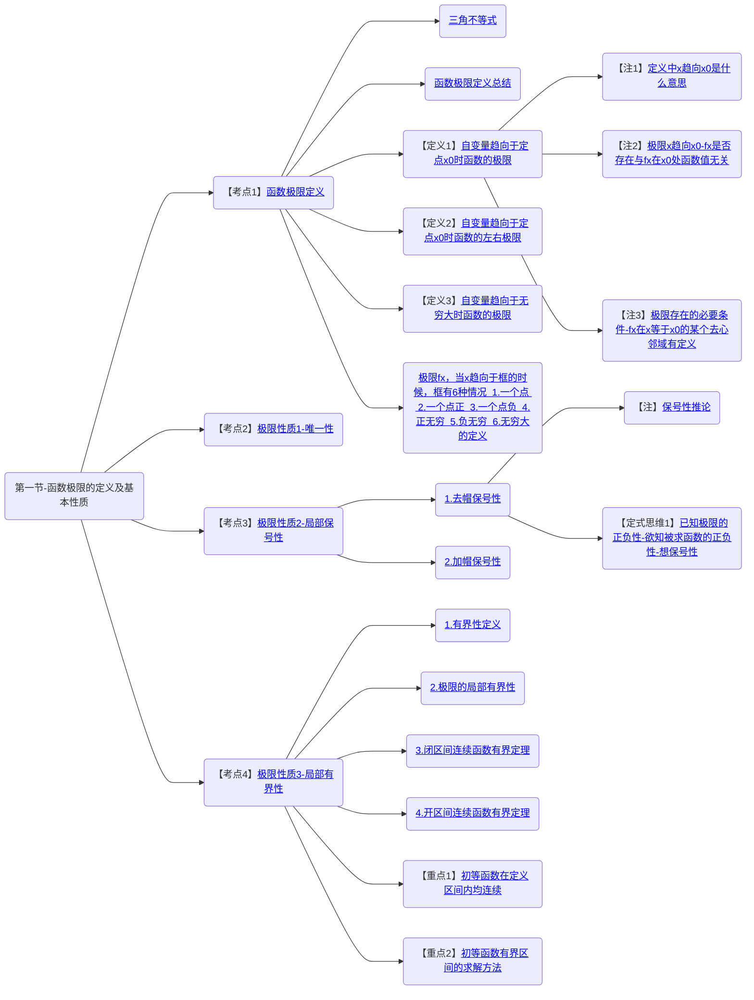
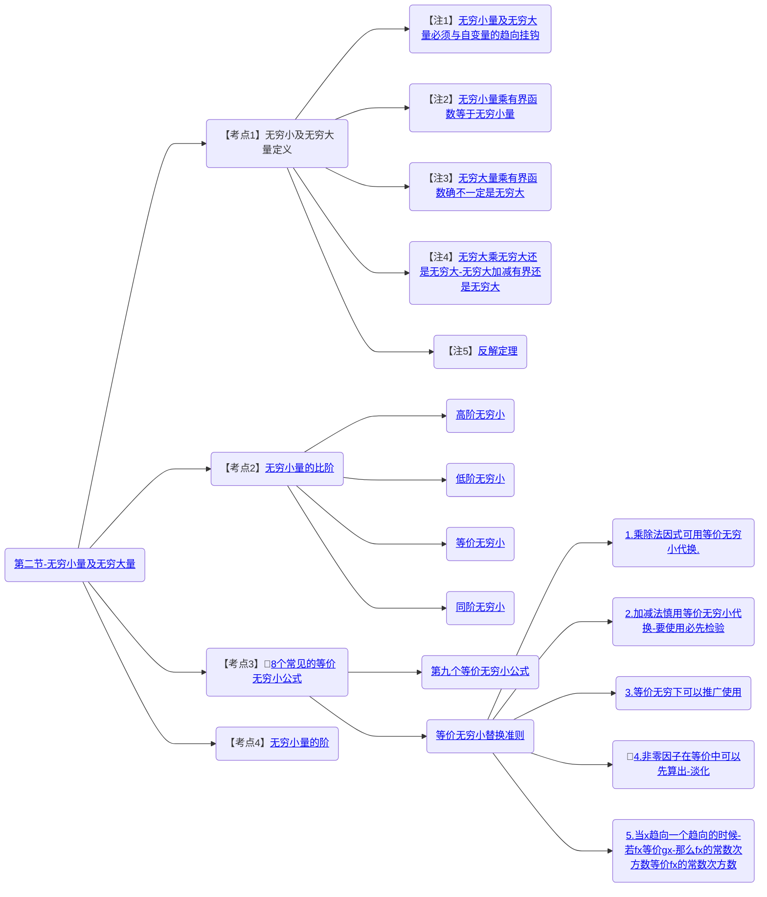

# 第一节-函数极限的定义及基本性质

```mermaid
graph LR
第一节-函数极限的定义及基本性质(第一节-函数极限的定义及基本性质)

第一节-函数极限的定义及基本性质--->函数极限定义(【考点1】<a href="/Users/yuebinghui/Documents/program/github/note/笔记/数学/周洋鑫/基础班/01.函数极限的定义与性质.md#函数极限定义">函数极限定义</>)

函数极限定义--->三角不等式(<a href="/Users/yuebinghui/Documents/program/github/note/笔记/数学/周洋鑫/基础班/01.函数极限的定义与性质.md#三角不等式">三角不等式</>)
函数极限定义--->函数极限定义总结(<a href="/Users/yuebinghui/Documents/program/github/note/笔记/数学/周洋鑫/基础班/01.函数极限的定义与性质.md#函数极限定义总结">函数极限定义总结</>)
函数极限定义--->自变量趋向于定点x0时函数的极限(【定义1】<a href="/Users/yuebinghui/Documents/program/github/note/笔记/数学/周洋鑫/基础班/01.函数极限的定义与性质.md#自变量趋向于定点x0时函数的极限">自变量趋向于定点x0时函数的极限</>)
自变量趋向于定点x0时函数的极限--->定义中x趋向x0是什么意思(【注1】<a href="/Users/yuebinghui/Documents/program/github/note/笔记/数学/周洋鑫/基础班/01.函数极限的定义与性质.md#定义中x趋向x0是什么意思">定义中x趋向x0是什么意思</>)
自变量趋向于定点x0时函数的极限--->极限x趋向x0-fx是否存在与fx在x0处函数值无关(【注2】<a href="/Users/yuebinghui/Documents/program/github/note/笔记/数学/周洋鑫/基础班/01.函数极限的定义与性质.md#极限x趋向x0-fx是否存在与fx在x0处函数值无关">极限x趋向x0-fx是否存在与fx在x0处函数值无关</>)
自变量趋向于定点x0时函数的极限--->极限存在的必要条件-fx在x等于x0的某个去心邻域有定义(【注3】<a href="/Users/yuebinghui/Documents/program/github/note/笔记/数学/周洋鑫/基础班/01.函数极限的定义与性质.md#极限存在的必要条件-fx在x等于x0的某个去心邻域有定义">极限存在的必要条件-fx在x等于x0的某个去心邻域有定义</>)
函数极限定义--->自变量趋向于定点x0时函数的左右极限(【定义2】<a href="/Users/yuebinghui/Documents/program/github/note/笔记/数学/周洋鑫/基础班/01.函数极限的定义与性质.md#自变量趋向于定点x0时函数的左右极限">自变量趋向于定点x0时函数的左右极限</>)
函数极限定义--->自变量趋向于无穷大时函数的极限(【定义3】<a href="/Users/yuebinghui/Documents/program/github/note/笔记/数学/周洋鑫/基础班/01.函数极限的定义与性质.md#自变量趋向于无穷大时函数的极限">自变量趋向于无穷大时函数的极限</>)
函数极限定义--->极限fx-x趋向于框的时候框有6种情况1.一个点2.一个点正3.一个点负4.正无穷5.负无穷6.无穷大的定义(<a href="/Users/yuebinghui/Documents/program/github/note/笔记/数学/周洋鑫/基础班/01.函数极限的定义与性质.md#极限fx-x趋向于框的时候框有6种情况1.一个点2.一个点正3.一个点负4.正无穷5.负无穷6.无穷大的定义">极限fx，当x趋向于框的时候，框有6种情况  1.一个点  2.一个点正  3.一个点负  4.正无穷  5.负无穷  6.无穷大的定义</>)

第一节-函数极限的定义及基本性质--->极限性质1-唯一性(【考点2】<a href="/Users/yuebinghui/Documents/program/github/note/笔记/数学/周洋鑫/基础班/01.函数极限的定义与性质.md#极限性质1-唯一性">极限性质1-唯一性</>)

第一节-函数极限的定义及基本性质--->极限性质2-局部保号性(【考点3】<a href="/Users/yuebinghui/Documents/program/github/note/笔记/数学/周洋鑫/基础班/01.函数极限的定义与性质.md#极限性质2-局部保号性">极限性质2-局部保号性</>)
极限性质2-局部保号性--->1.去帽保号性(<a href="/Users/yuebinghui/Documents/program/github/note/笔记/数学/周洋鑫/基础班/01.函数极限的定义与性质.md#1.去帽保号性">1.去帽保号性</>)
1.去帽保号性--->保号性推论(【注】<a href="/Users/yuebinghui/Documents/program/github/note/笔记/数学/周洋鑫/基础班/01.函数极限的定义与性质.md#保号性推论">保号性推论</>)
1.去帽保号性--->已知极限的正负性-欲知被求函数的正负性-想保号性(【定式思维1】<a href="/Users/yuebinghui/Documents/program/github/note/笔记/数学/周洋鑫/基础班/01.函数极限的定义与性质.md#已知极限的正负性-欲知被求函数的正负性-想保号性">已知极限的正负性-欲知被求函数的正负性-想保号性</>)
极限性质2-局部保号性--->加帽保号性(<a href="/Users/yuebinghui/Documents/program/github/note/笔记/数学/周洋鑫/基础班/01.函数极限的定义与性质.md#加帽保号性">2.加帽保号性</>)

第一节-函数极限的定义及基本性质--->极限性质3-局部有界性(【考点4】<a href="/Users/yuebinghui/Documents/program/github/note/笔记/数学/周洋鑫/基础班/01.函数极限的定义与性质.md#极限性质3-局部有界性">极限性质3-局部有界性</>)
极限性质3-局部有界性--->1.有界性定义(<a href="/Users/yuebinghui/Documents/program/github/note/笔记/数学/周洋鑫/基础班/01.函数极限的定义与性质.md#1.有界性定义">1.有界性定义</>)
极限性质3-局部有界性--->2.极限的局部有界性(<a href="/Users/yuebinghui/Documents/program/github/note/笔记/数学/周洋鑫/基础班/01.函数极限的定义与性质.md#2.极限的局部有界性">2.极限的局部有界性</>)
极限性质3-局部有界性--->3.闭区间连续函数有界定理(<a href="/Users/yuebinghui/Documents/program/github/note/笔记/数学/周洋鑫/基础班/01.函数极限的定义与性质.md#3.闭区间连续函数有界定理">3.闭区间连续函数有界定理</>)
极限性质3-局部有界性--->4.开区间连续函数有界定理(<a href="/Users/yuebinghui/Documents/program/github/note/笔记/数学/周洋鑫/基础班/01.函数极限的定义与性质.md#4.开区间连续函数有界定理">4.开区间连续函数有界定理</>)

极限性质3-局部有界性--->初等函数在定义区间内均连续(【重点1】<a href="/Users/yuebinghui/Documents/program/github/note/笔记/数学/周洋鑫/基础班/01.函数极限的定义与性质.md#初等函数在定义区间内均连续">初等函数在定义区间内均连续</>)
极限性质3-局部有界性--->初等函数有界区间的求解方法(【重点2】<a href="/Users/yuebinghui/Documents/program/github/note/笔记/数学/周洋鑫/基础班/01.函数极限的定义与性质.md#初等函数有界区间的求解方法">初等函数有界区间的求解方法</>)


```

# 第二节-无穷小量及无穷大量

```mermaid
graph LR

第二节-无穷小量及无穷大量(<a href="/Users/yuebinghui/Documents/program/github/note/笔记/数学/周洋鑫/基础班/02.无穷小量及无穷大量.md#第二节-无穷小量及无穷大量">第二节-无穷小量及无穷大量</>)

第二节-无穷小量及无穷大量--->无穷小及无穷大量定义(【考点1】无穷小及无穷大量定义)

无穷小及无穷大量定义--->无穷小量及无穷大量必须与自变量的趋向挂钩(【注1】<a href="/Users/yuebinghui/Documents/program/github/note/笔记/数学/周洋鑫/基础班/02.无穷小量及无穷大量.md#无穷小量及无穷大量必须与自变量的趋向挂钩">无穷小量及无穷大量必须与自变量的趋向挂钩</>)
无穷小及无穷大量定义--->无穷小量乘有界函数等于无穷小量(【注2】<a href="/Users/yuebinghui/Documents/program/github/note/笔记/数学/周洋鑫/基础班/02.无穷小量及无穷大量.md#无穷小量乘有界函数等于无穷小量">无穷小量乘有界函数等于无穷小量</>)
无穷小及无穷大量定义--->无穷大量乘有界函数确不一定是无穷大(【注3】<a href="/Users/yuebinghui/Documents/program/github/note/笔记/数学/周洋鑫/基础班/02.无穷小量及无穷大量.md#无穷大量乘有界函数确不一定是无穷大">无穷大量乘有界函数确不一定是无穷大</>)
无穷小及无穷大量定义--->无穷大乘无穷大还是无穷大-无穷大加减有界还是无穷大(【注4】<a href="/Users/yuebinghui/Documents/program/github/note/笔记/数学/周洋鑫/基础班/02.无穷小量及无穷大量.md#无穷大乘无穷大还是无穷大-无穷大加减有界还是无穷大">无穷大乘无穷大还是无穷大-无穷大加减有界还是无穷大</>)
无穷小及无穷大量定义--->反解定理(【注5】<a href="/Users/yuebinghui/Documents/program/github/note/笔记/数学/周洋鑫/基础班/02.无穷小量及无穷大量.md#反解定理">反解定理</>)

第二节-无穷小量及无穷大量--->无穷小量的比阶(【考点2】<a href="/Users/yuebinghui/Documents/program/github/note/笔记/数学/周洋鑫/基础班/02.无穷小量及无穷大量.md#无穷小量的比阶">无穷小量的比阶</>)
无穷小量的比阶--->高阶无穷小(<a href="/Users/yuebinghui/Documents/program/github/note/笔记/数学/周洋鑫/基础班/02.无穷小量及无穷大量.md#高阶无穷小">高阶无穷小</>)
无穷小量的比阶--->低阶无穷小(<a href="/Users/yuebinghui/Documents/program/github/note/笔记/数学/周洋鑫/基础班/02.无穷小量及无穷大量.md#低阶无穷小">低阶无穷小</>)
无穷小量的比阶--->等价无穷小(<a href="/Users/yuebinghui/Documents/program/github/note/笔记/数学/周洋鑫/基础班/02.无穷小量及无穷大量.md#等价无穷小">等价无穷小</>)
无穷小量的比阶--->同阶无穷小(<a href="/Users/yuebinghui/Documents/program/github/note/笔记/数学/周洋鑫/基础班/02.无穷小量及无穷大量.md#同阶无穷小">同阶无穷小</>)

第二节-无穷小量及无穷大量--->8个常见的等价无穷小公式(【考点3】🌟<a href="/Users/yuebinghui/Documents/program/github/note/笔记/数学/周洋鑫/基础班/02.无穷小量及无穷大量.md#8个常见的等价无穷小公式">8个常见的等价无穷小公式</>)
8个常见的等价无穷小公式--->第九个等价无穷小公式(<a href="/Users/yuebinghui/Documents/program/github/note/笔记/数学/周洋鑫/基础班/02.无穷小量及无穷大量.md#第九个等价无穷小公式">第九个等价无穷小公式</>)
8个常见的等价无穷小公式--->等价无穷小替换准则(<a href="/Users/yuebinghui/Documents/program/github/note/笔记/数学/周洋鑫/基础班/02.无穷小量及无穷大量.md#等价无穷小替换准则">等价无穷小替换准则</>)
等价无穷小替换准则--->1.乘除法因式可用等价无穷小代换.(<a href="/Users/yuebinghui/Documents/program/github/note/笔记/数学/周洋鑫/基础班/02.无穷小量及无穷大量.md#1.乘除法因式可用等价无穷小代换.">1.乘除法因式可用等价无穷小代换.</>)
等价无穷小替换准则--->2.加减法慎用等价无穷小代换-要使用必先检验(<a href="/Users/yuebinghui/Documents/program/github/note/笔记/数学/周洋鑫/基础班/02.无穷小量及无穷大量.md#2.加减法慎用等价无穷小代换-要使用必先检验">2.加减法慎用等价无穷小代换-要使用必先检验</>)
等价无穷小替换准则--->3.等价无穷下可以推广使用(<a href="/Users/yuebinghui/Documents/program/github/note/笔记/数学/周洋鑫/基础班/02.无穷小量及无穷大量.md#3.等价无穷下可以推广使用">3.等价无穷下可以推广使用</>)
等价无穷小替换准则--->4.非零因子在等价中可以先算出-淡化(🌟<a href="/Users/yuebinghui/Documents/program/github/note/笔记/数学/周洋鑫/基础班/02.无穷小量及无穷大量.md#4.非零因子在等价中可以先算出-淡化">4.非零因子在等价中可以先算出-淡化</>)
等价无穷小替换准则--->5.当x趋向一个趋向的时候-若fx等价gx-那么fx的常数次方数等价fx的常数次方数(<a href="/Users/yuebinghui/Documents/program/github/note/笔记/数学/周洋鑫/基础班/02.无穷小量及无穷大量.md#5.当x趋向一个趋向的时候-若fx等价gx-那么fx的常数次方数等价fx的常数次方数">5.当x趋向一个趋向的时候-若fx等价gx-那么fx的常数次方数等价fx的常数次方数</>)

第二节-无穷小量及无穷大量--->无穷小量的阶(【考点4】<a href="/Users/yuebinghui/Documents/program/github/note/笔记/数学/周洋鑫/基础班/02.无穷小量及无穷大量.md#无穷小量的阶">无穷小量的阶</>)


```

