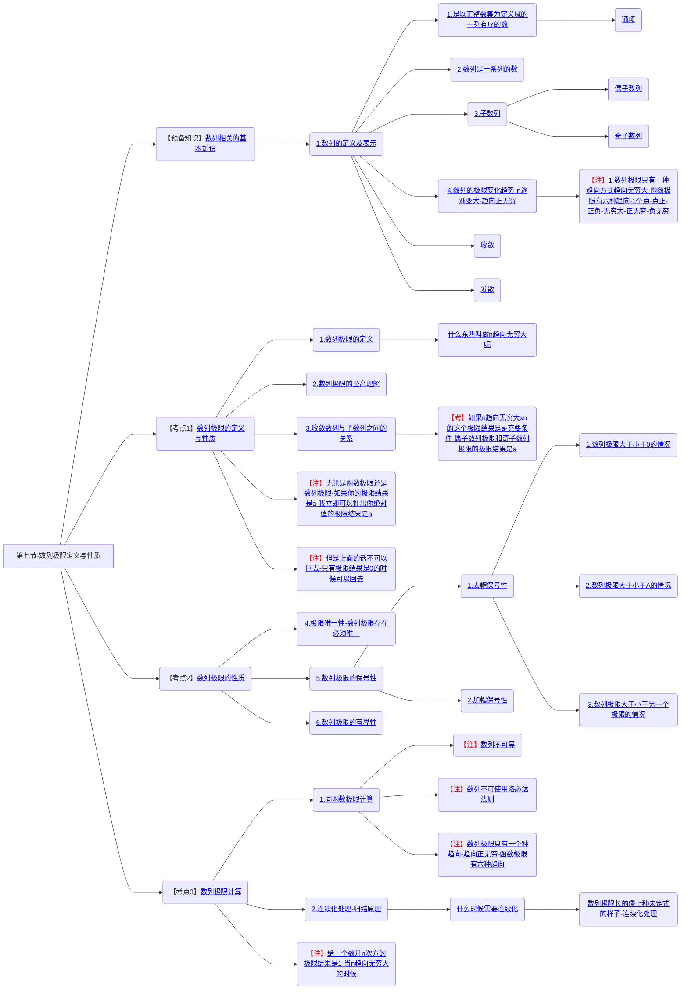
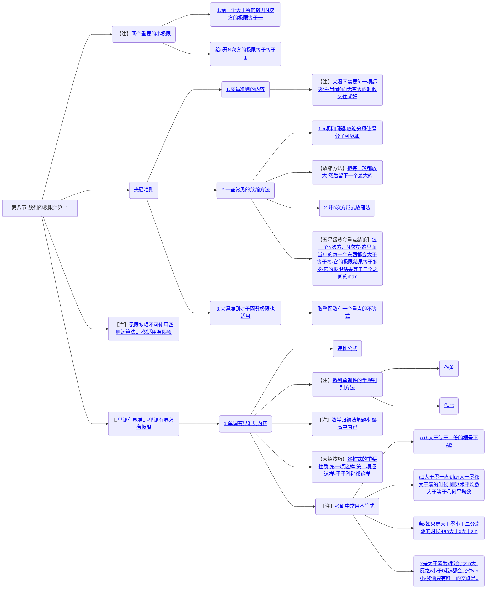

1

## 第七节-数列极限定义与性质

```mermaid
graph LR
第七节-数列极限定义与性质

第七节-数列极限定义与性质--->数列相关的基本知识(【预备知识】<a href="/Users/yuebinghui/Documents/program/github/note/笔记/数学/周洋鑫/基础班/07.数列极限定义与性质.md#数列相关的基本知识">数列相关的基本知识</>)
数列相关的基本知识--->1.数列的定义及表示(<a href="/Users/yuebinghui/Documents/program/github/note/笔记/数学/周洋鑫/基础班/07.数列极限定义与性质.md#1.数列的定义及表示">1.数列的定义及表示</>)
1.数列的定义及表示--->1.是以正整数集为定义域的一列有序的数(<a href="/Users/yuebinghui/Documents/program/github/note/笔记/数学/周洋鑫/基础班/07.数列极限定义与性质.md#1.是以正整数集为定义域的一列有序的数">1.是以正整数集为定义域的一列有序的数</>)
1.是以正整数集为定义域的一列有序的数--->通项(<a href="/Users/yuebinghui/Documents/program/github/note/笔记/数学/周洋鑫/基础班/07.数列极限定义与性质.md#通项">通项</>)

1.数列的定义及表示--->2.数列是一系列的数(<a href="/Users/yuebinghui/Documents/program/github/note/笔记/数学/周洋鑫/基础班/07.数列极限定义与性质.md#2.数列是一系列的数">2.数列是一系列的数</>)

1.数列的定义及表示--->3.子数列(<a href="/Users/yuebinghui/Documents/program/github/note/笔记/数学/周洋鑫/基础班/07.数列极限定义与性质.md#3.子数列">3.子数列</>)
3.子数列--->偶子数列(<a href="/Users/yuebinghui/Documents/program/github/note/笔记/数学/周洋鑫/基础班/07.数列极限定义与性质.md#偶子数列">偶子数列</>)
3.子数列--->奇子数列(<a href="/Users/yuebinghui/Documents/program/github/note/笔记/数学/周洋鑫/基础班/07.数列极限定义与性质.md#奇子数列">奇子数列</>)

1.数列的定义及表示--->4.数列的极限变化趋势-n逐渐变大-趋向正无穷(<a href="/Users/yuebinghui/Documents/program/github/note/笔记/数学/周洋鑫/基础班/07.数列极限定义与性质.md#4.数列的极限变化趋势-n逐渐变大-趋向正无穷">4.数列的极限变化趋势-n逐渐变大-趋向正无穷</>)
4.数列的极限变化趋势-n逐渐变大-趋向正无穷--->1.数列极限只有一种趋向方式趋向无穷大-函数极限有六种趋向-1个点-点正-正负-无穷大-正无穷-负无穷(<span style="color:red">【注】</span><a href="/Users/yuebinghui/Documents/program/github/note/笔记/数学/周洋鑫/基础班/07.数列极限定义与性质.md#1.数列极限只有一种趋向方式趋向无穷大-函数极限有六种趋向-1个点-点正-正负-无穷大-正无穷-负无穷">1.数列极限只有一种趋向方式趋向无穷大-函数极限有六种趋向-1个点-点正-正负-无穷大-正无穷-负无穷</>)
1.数列的定义及表示--->收敛(<a href="/Users/yuebinghui/Documents/program/github/note/笔记/数学/周洋鑫/基础班/07.数列极限定义与性质.md#收敛">收敛</>)
1.数列的定义及表示--->发散(<a href="/Users/yuebinghui/Documents/program/github/note/笔记/数学/周洋鑫/基础班/07.数列极限定义与性质.md#发散">发散</>)


第七节-数列极限定义与性质--->数列极限的定义与性质(【考点1】<a href="/Users/yuebinghui/Documents/program/github/note/笔记/数学/周洋鑫/基础班/07.数列极限定义与性质.md#数列极限的定义与性质">数列极限的定义与性质</>)
数列极限的定义与性质--->1.数列极限的定义(<a href="/Users/yuebinghui/Documents/program/github/note/笔记/数学/周洋鑫/基础班/07.数列极限定义与性质.md#1.数列极限的定义">1.数列极限的定义</>)
1.数列极限的定义--->什么东西叫做n趋向无穷大呢(<a href="/Users/yuebinghui/Documents/program/github/note/笔记/数学/周洋鑫/基础班/07.数列极限定义与性质.md#什么东西叫做n趋向无穷大呢">什么东西叫做n趋向无穷大呢</>)
数列极限的定义与性质--->2.数列极限的至高理解(<a href="/Users/yuebinghui/Documents/program/github/note/笔记/数学/周洋鑫/基础班/07.数列极限定义与性质.md#2.数列极限的至高理解">2.数列极限的至高理解</>)
数列极限的定义与性质--->3.收敛数列与子数列之间的关系(<a href="/Users/yuebinghui/Documents/program/github/note/笔记/数学/周洋鑫/基础班/07.数列极限定义与性质.md#3.收敛数列与子数列之间的关系">3.收敛数列与子数列之间的关系</>)
3.收敛数列与子数列之间的关系--->如果n趋向无穷大xn的这个极限结果是a-充要条件-偶子数列极限和奇子数列极限的极限结果是a(<span style="color:red">【考】</span><a href="/Users/yuebinghui/Documents/program/github/note/笔记/数学/周洋鑫/基础班/07.数列极限定义与性质.md#如果n趋向无穷大xn的这个极限结果是a-充要条件-偶子数列极限和奇子数列极限的极限结果是a">如果n趋向无穷大xn的这个极限结果是a-充要条件-偶子数列极限和奇子数列极限的极限结果是a</>)
数列极限的定义与性质--->无论是函数极限还是数列极限-如果你的极限结果是a-我立即可以推出你绝对值的极限结果是a(<span style="color:red">【注】</span><a href="/Users/yuebinghui/Documents/program/github/note/笔记/数学/周洋鑫/基础班/07.数列极限定义与性质.md#无论是函数极限还是数列极限-如果你的极限结果是a-我立即可以推出你绝对值的极限结果是a">无论是函数极限还是数列极限-如果你的极限结果是a-我立即可以推出你绝对值的极限结果是a</>)
数列极限的定义与性质--->但是上面的话不可以回去-只有极限结果是0的时候可以回去(<span style="color:red">【注】</span><a href="/Users/yuebinghui/Documents/program/github/note/笔记/数学/周洋鑫/基础班/07.数列极限定义与性质.md#但是上面的话不可以回去-只有极限结果是0的时候可以回去">但是上面的话不可以回去-只有极限结果是0的时候可以回去</>)

第七节-数列极限定义与性质--->数列极限的性质(【考点2】<a href="/Users/yuebinghui/Documents/program/github/note/笔记/数学/周洋鑫/基础班/07.数列极限定义与性质.md#数列极限的性质">数列极限的性质</>)
数列极限的性质--->4.极限唯一性-数列极限存在必须唯一(<a href="/Users/yuebinghui/Documents/program/github/note/笔记/数学/周洋鑫/基础班/07.数列极限定义与性质.md#4.极限唯一性-数列极限存在必须唯一">4.极限唯一性-数列极限存在必须唯一</>)
数列极限的性质--->5.数列极限的保号性(<a href="/Users/yuebinghui/Documents/program/github/note/笔记/数学/周洋鑫/基础班/07.数列极限定义与性质.md#5.数列极限的保号性">5.数列极限的保号性</>)
5.数列极限的保号性--->1.去帽保号性(<a href="/Users/yuebinghui/Documents/program/github/note/笔记/数学/周洋鑫/基础班/07.数列极限定义与性质.md#1.去帽保号性">1.去帽保号性</>)
1.去帽保号性--->1.数列极限大于小于0的情况(<a href="/Users/yuebinghui/Documents/program/github/note/笔记/数学/周洋鑫/基础班/07.数列极限定义与性质.md#1.数列极限大于小于0的情况">1.数列极限大于小于0的情况</>)
1.去帽保号性--->2.数列极限大于小于A的情况(<a href="/Users/yuebinghui/Documents/program/github/note/笔记/数学/周洋鑫/基础班/07.数列极限定义与性质.md#2.数列极限大于小于A的情况">2.数列极限大于小于A的情况</>)
1.去帽保号性--->3.数列极限大于小于另一个极限的情况(<a href="/Users/yuebinghui/Documents/program/github/note/笔记/数学/周洋鑫/基础班/07.数列极限定义与性质.md#3.数列极限大于小于另一个极限的情况">3.数列极限大于小于另一个极限的情况</>)
5.数列极限的保号性--->2.加帽保号性(<a href="/Users/yuebinghui/Documents/program/github/note/笔记/数学/周洋鑫/基础班/07.数列极限定义与性质.md#2.加帽保号性">2.加帽保号性</>)
数列极限的性质--->6.数列极限的有界性(<a href="/Users/yuebinghui/Documents/program/github/note/笔记/数学/周洋鑫/基础班/07.数列极限定义与性质.md#6.数列极限的有界性">6.数列极限的有界性</>)

第七节-数列极限定义与性质--->数列极限计算(【考点3】<a href="/Users/yuebinghui/Documents/program/github/note/笔记/数学/周洋鑫/基础班/07.数列极限定义与性质.md#数列极限计算">数列极限计算</>)
数列极限计算--->1.同函数极限计算(<a href="/Users/yuebinghui/Documents/program/github/note/笔记/数学/周洋鑫/基础班/07.数列极限定义与性质.md#1.同函数极限计算">1.同函数极限计算</>)
1.同函数极限计算--->数列不可导(<span style="color:red">【注】</span><a href="/Users/yuebinghui/Documents/program/github/note/笔记/数学/周洋鑫/基础班/07.数列极限定义与性质.md#数列不可导">数列不可导</>)
1.同函数极限计算--->数列不可使用洛必达法则(<span style="color:red">【注】</span><a href="/Users/yuebinghui/Documents/program/github/note/笔记/数学/周洋鑫/基础班/07.数列极限定义与性质.md#数列不可使用洛必达法则">数列不可使用洛必达法则</>)
1.同函数极限计算--->数列极限只有一个种趋向-趋向正无穷-函数极限有六种趋向(<span style="color:red">【注】</span><a href="/Users/yuebinghui/Documents/program/github/note/笔记/数学/周洋鑫/基础班/07.数列极限定义与性质.md#数列极限只有一个种趋向-趋向正无穷-函数极限有六种趋向">数列极限只有一个种趋向-趋向正无穷-函数极限有六种趋向</>)

数列极限计算--->2.连续化处理-归结原理(<a href="/Users/yuebinghui/Documents/program/github/note/笔记/数学/周洋鑫/基础班/07.数列极限定义与性质.md#2.连续化处理-归结原理">2.连续化处理-归结原理</>)
2.连续化处理-归结原理--->什么时候需要连续化(<a href="/Users/yuebinghui/Documents/program/github/note/笔记/数学/周洋鑫/基础班/07.数列极限定义与性质.md#什么时候需要连续化">什么时候需要连续化</>)
什么时候需要连续化--->数列极限长的像七种未定式的样子-连续化处理(<a href="/Users/yuebinghui/Documents/program/github/note/笔记/数学/周洋鑫/基础班/07.数列极限定义与性质.md#数列极限长的像七种未定式的样子-连续化处理">数列极限长的像七种未定式的样子-连续化处理</>)
数列极限计算--->给一个数开n次方的极限结果是1(<span style="color:red">【注】</span><a href="/Users/yuebinghui/Documents/program/github/note/笔记/数学/周洋鑫/基础班/07.数列极限定义与性质.md#给一个数开n次方的极限结果是1">给一个数开n次方的极限结果是1-当n趋向无穷大的时候</>)


```

## 第八节-数列的极限计算_1

```mermaid
graph LR
第八节-数列的极限计算_1

第八节-数列的极限计算_1--->两个重要的小极限(【注】<a href="/Users/yuebinghui/Documents/program/github/note/笔记/数学/周洋鑫/基础班/08.数列的极限计算.md#两个重要的小极限">两个重要的小极限</>)
两个重要的小极限--->1.给一个大于零的数开N次方的极限等于一(<a href="/Users/yuebinghui/Documents/program/github/note/笔记/数学/周洋鑫/基础班/08.数列的极限计算.md#1.给一个大于零的数开N次方的极限等于一">1.给一个大于零的数开N次方的极限等于一</>)
两个重要的小极限--->给n开N次方的极限等于等于1(<a href="/Users/yuebinghui/Documents/program/github/note/笔记/数学/周洋鑫/基础班/08.数列的极限计算.md#给n开N次方的极限等于等于1">给n开N次方的极限等于等于1</>)

第八节-数列的极限计算_1--->夹逼准则(<a href="/Users/yuebinghui/Documents/program/github/note/笔记/数学/周洋鑫/基础班/08.数列的极限计算.md#夹逼准则">夹逼准则</>)
夹逼准则--->1.夹逼准则的内容(<a href="/Users/yuebinghui/Documents/program/github/note/笔记/数学/周洋鑫/基础班/08.数列的极限计算.md#1.夹逼准则的内容">1.夹逼准则的内容</>)
1.夹逼准则的内容--->夹逼不需要每一项都夹住-当n趋向无穷大的时候夹住就好(【注】<a href="/Users/yuebinghui/Documents/program/github/note/笔记/数学/周洋鑫/基础班/08.数列的极限计算.md#夹逼不需要每一项都夹住-当n趋向无穷大的时候夹住就好">夹逼不需要每一项都夹住-当n趋向无穷大的时候夹住就好</>)

第八节-数列的极限计算_1--->无限多项不可使用四则运算法则-仅适用有限项(【注】<a href="/Users/yuebinghui/Documents/program/github/note/笔记/数学/周洋鑫/基础班/08.数列的极限计算.md#无限多项不可使用四则运算法则-仅适用有限项">无限多项不可使用四则运算法则-仅适用有限项</>)

夹逼准则--->2.一些常见的放缩方法(<a href="/Users/yuebinghui/Documents/program/github/note/笔记/数学/周洋鑫/基础班/08.数列的极限计算.md#2.一些常见的放缩方法">2.一些常见的放缩方法</>)
2.一些常见的放缩方法--->1.n项和问题-放缩分母使得分子可以加(<a href="/Users/yuebinghui/Documents/program/github/note/笔记/数学/周洋鑫/基础班/08.数列的极限计算.md#1.n项和问题-放缩分母使得分子可以加">1.n项和问题-放缩分母使得分子可以加</>)
2.一些常见的放缩方法--->把每一项都放大-然后留下一个最大的(【放缩方法】<a href="/Users/yuebinghui/Documents/program/github/note/笔记/数学/周洋鑫/基础班/08.数列的极限计算.md#把每一项都放大-然后留下一个最大的">把每一项都放大-然后留下一个最大的</>)
2.一些常见的放缩方法--->2.开n次方形式放缩法(<a href="/Users/yuebinghui/Documents/program/github/note/笔记/数学/周洋鑫/基础班/08.数列的极限计算.md#2.开n次方形式放缩法">2.开n次方形式放缩法</>)
2.一些常见的放缩方法--->每一个N次方开N次方-这里面当中的每一个东西都会大于等于零-它的极限结果等于多少-它的极限结果等于三个之间的max(【五星级黄金重点结论】<a href="/Users/yuebinghui/Documents/program/github/note/笔记/数学/周洋鑫/基础班/08.数列的极限计算.md#每一个N次方开N次方-这里面当中的每一个东西都会大于等于零-它的极限结果等于多少-它的极限结果等于三个之间的max">每一个N次方开N次方-这里面当中的每一个东西都会大于等于零-它的极限结果等于多少-它的极限结果等于三个之间的max</>)

夹逼准则--->3.夹逼准则对于函数极限也适用(<a href="/Users/yuebinghui/Documents/program/github/note/笔记/数学/周洋鑫/基础班/08.数列的极限计算.md#3.夹逼准则对于函数极限也适用">3.夹逼准则对于函数极限也适用</>)
3.夹逼准则对于函数极限也适用--->取整函数有一个重点的不等式(<a href="/Users/yuebinghui/Documents/program/github/note/笔记/数学/周洋鑫/基础班/08.数列的极限计算.md#取整函数有一个重点的不等式">取整函数有一个重点的不等式</>)

第八节-数列的极限计算_1--->单调有界准则-单调有界必有极限(🌟<a href="/Users/yuebinghui/Documents/program/github/note/笔记/数学/周洋鑫/基础班/08.数列的极限计算.md#单调有界准则-单调有界必有极限">单调有界准则-单调有界必有极限</>)
单调有界准则-单调有界必有极限--->1.单调有界准则内容(<a href="/Users/yuebinghui/Documents/program/github/note/笔记/数学/周洋鑫/基础班/08.数列的极限计算.md#1.单调有界准则内容">1.单调有界准则内容</>)
1.单调有界准则内容--->递推公式(<a href="/Users/yuebinghui/Documents/program/github/note/笔记/数学/周洋鑫/基础班/08.数列的极限计算.md#递推公式">递推公式</>)
1.单调有界准则内容--->数列单调性的常规判别方法(【注】<a href="/Users/yuebinghui/Documents/program/github/note/笔记/数学/周洋鑫/基础班/08.数列的极限计算.md#数列单调性的常规判别方法">数列单调性的常规判别方法</>)
数列单调性的常规判别方法--->作差(<a href="/Users/yuebinghui/Documents/program/github/note/笔记/数学/周洋鑫/基础班/08.数列的极限计算.md#作差">作差</>)
数列单调性的常规判别方法--->作比(<a href="/Users/yuebinghui/Documents/program/github/note/笔记/数学/周洋鑫/基础班/08.数列的极限计算.md#作比">作比</>)
1.单调有界准则内容--->数学归纳法解题步骤-高中内容(【注】<a href="/Users/yuebinghui/Documents/program/github/note/笔记/数学/周洋鑫/基础班/08.数列的极限计算.md#数学归纳法解题步骤-高中内容">数学归纳法解题步骤-高中内容</>)
1.单调有界准则内容--->递推式的重要性质-第一项这样-第二项还这样-子子孙孙都这样(【大招技巧】<a href="/Users/yuebinghui/Documents/program/github/note/笔记/数学/周洋鑫/基础班/08.数列的极限计算.md#递推式的重要性质-第一项这样-第二项还这样-子子孙孙都这样">递推式的重要性质-第一项这样-第二项还这样-子子孙孙都这样</>)
1.单调有界准则内容--->考研中常用不等式(【注】<a href="/Users/yuebinghui/Documents/program/github/note/笔记/数学/周洋鑫/基础班/08.数列的极限计算.md#考研中常用不等式">考研中常用不等式</>)
考研中常用不等式--->a+b大于等于二倍的根号下AB(<a href="/Users/yuebinghui/Documents/program/github/note/笔记/数学/周洋鑫/基础班/08.数列的极限计算.md#a+b大于等于二倍的根号下AB">a+b大于等于二倍的根号下AB</>)
考研中常用不等式--->a1大于零一直到an大于零都大于零的时候-则算术平均数大于等于几何平均数(<a href="/Users/yuebinghui/Documents/program/github/note/笔记/数学/周洋鑫/基础班/08.数列的极限计算.md#a1大于零一直到an大于零都大于零的时候-则算术平均数大于等于几何平均数">a1大于零一直到an大于零都大于零的时候-则算术平均数大于等于几何平均数</>)
考研中常用不等式--->当x如果是大于零小于二分之派的时候-tan大于x大于sin(<a href="/Users/yuebinghui/Documents/program/github/note/笔记/数学/周洋鑫/基础班/08.数列的极限计算.md#当x如果是大于零小于二分之派的时候-tan大于x大于sin">当x如果是大于零小于二分之派的时候-tan大于x大于sin</>)
考研中常用不等式--->x是大于零我x都会比sin大-反之x小于0我x都会比你sin小-我俩只有唯一的交点是0(<a href="/Users/yuebinghui/Documents/program/github/note/笔记/数学/周洋鑫/基础班/08.数列的极限计算.md#x是大于零我x都会比sin大-反之x小于0我x都会比你sin小-我俩只有唯一的交点是0">x是大于零我x都会比sin大-反之x小于0我x都会比你sin小-我俩只有唯一的交点是0</>)


```

