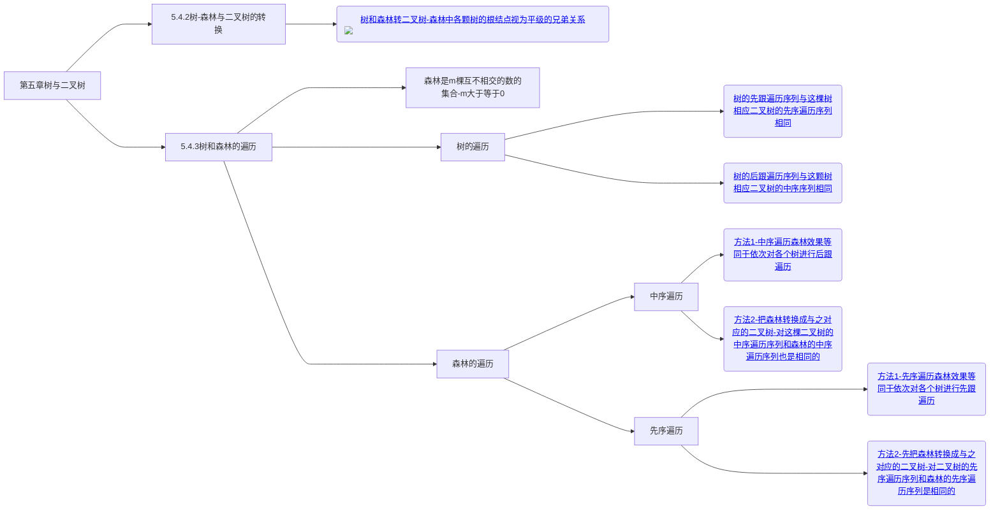

## 树与二叉树

### 前序和后序序列相邻两结点的关系

### 画二叉树递归执行图

给定了一个前序或后序或中序的序列，并且给了这个树的图案，我就可以准确的填入这个树每个空对应的字母，用递归的方式，

前序是第一次访问

中序是第二次访问

后序是第三次访问

# 第五章树与二叉树

```mermaid
graph LR
第五章树与二叉树

第五章树与二叉树--->5.4.2树-森林与二叉树的转换
5.4.2树-森林与二叉树的转换 ---> 树和森林转二叉树-森林中各颗树的根结点视为平级的兄弟关系(<a href="/Users/yuebinghui/Documents/program/github/note/笔记/数据结构/05.第五章树与二叉树/5.4.2树-森林与二叉树的转换.md#树和森林转二叉树-森林中各颗树的根结点视为平级的兄弟关系">树和森林转二叉树-森林中各颗树的根结点视为平级的兄弟关系</><div style="width:500px;"><img src="https://raw.githubusercontent.com/yuebinghui/note/dev/1.0.0/images/image-20241215182100643.png" /></div>)

第五章树与二叉树--->5.4.3树和森林的遍历
5.4.3树和森林的遍历--->森林是m棵互不相交的数的集合-m大于等于0
5.4.3树和森林的遍历--->树的遍历
树的遍历--->树的先跟遍历序列与这棵树相应二叉树的先序遍历序列相同(<a href="/Users/yuebinghui/Documents/program/github/note/笔记/数据结构/05.第五章树与二叉树/5.4.3 树和森林的遍历.md#树的先跟遍历序列与这棵树相应二叉树的先序遍历序列相同">树的先跟遍历序列与这棵树相应二叉树的先序遍历序列相同</>)
树的遍历--->树的后跟遍历序列与这颗树相应二叉树的中序序列相同(<a href="/Users/yuebinghui/Documents/program/github/note/笔记/数据结构/05.第五章树与二叉树/5.4.3 树和森林的遍历.md#树的后跟遍历序列与这颗树相应二叉树的中序序列相同">树的后跟遍历序列与这颗树相应二叉树的中序序列相同</>)

5.4.3树和森林的遍历--->森林的遍历

森林的遍历-->先序遍历
先序遍历--->方法1-先序遍历森林效果等同于依次对各个树进行先跟遍历(<a href="/Users/yuebinghui/Documents/program/github/note/笔记/数据结构/05.第五章树与二叉树/5.4.3 树和森林的遍历.md#方法1-先序遍历森林效果等同于依次对各个树进行先跟遍历">方法1-先序遍历森林效果等同于依次对各个树进行先跟遍历</>)
先序遍历--->方法2-先把森林转换成与之对应的二叉树-对二叉树的先序遍历序列和森林的先序遍历序列是相同的(<a href="/Users/yuebinghui/Documents/program/github/note/笔记/数据结构/05.第五章树与二叉树/5.4.3 树和森林的遍历.md#方法2-先把森林转换成与之对应的二叉树-对二叉树的先序遍历序列和森林的先序遍历序列是相同的">方法2-先把森林转换成与之对应的二叉树-对二叉树的先序遍历序列和森林的先序遍历序列是相同的</>)

森林的遍历-->中序遍历
中序遍历-->方法1-中序遍历森林效果等同于依次对各个树进行后跟遍历(<a href="/Users/yuebinghui/Documents/program/github/note/笔记/数据结构/05.第五章树与二叉树/5.4.3 树和森林的遍历.md#方法1-中序遍历森林效果等同于依次对各个树进行后跟遍历">方法1-中序遍历森林效果等同于依次对各个树进行后跟遍历</>)
中序遍历-->方法2-把森林转换成与之对应的二叉树-对这棵二叉树的中序遍历序列和森林的中序遍历序列也是相同的(<a href="/Users/yuebinghui/Documents/program/github/note/笔记/数据结构/05.第五章树与二叉树/5.4.3 树和森林的遍历.md#方法2-把森林转换成与之对应的二叉树-对这棵二叉树的中序遍历序列和森林的中序遍历序列也是相同的">方法2-把森林转换成与之对应的二叉树-对这棵二叉树的中序遍历序列和森林的中序遍历序列也是相同的</>)
```

11