# #

######   ***时间复杂度，这是最重要的***，🤯   感觉已经掌握了单层循环和双层循环求时间复杂度

###### ***具体见OneNote 数据结构-时间复杂度解题 🤯*** 

# 时间复杂度解题思路 🤯 

## 一层循环🤯  

接下来我们来看一下第一种题型，一层循环，
那么这种题型它的解题思路主要有以下五步

**第一步**是解出<u>循环趟数t</u>及<u>每轮循环i的变化值</u>，

**第二步**是找到t与i之间的关系。

第三步是确定循环停止的条件。

第四步是联立联立第2步和第3步的式子，解出方程

第五步就写结果。

那么，具体的实践步骤呢？我们来看一下这道例题。
这道例题，它首先是i=n×n，

在i不等于一的时候进行一个循环，

执行i÷2这个语句，

那么在i=1的时候结束循环。

那么，按照我们刚刚讲的这个解题思路的话，
首先第一步列出循环趟数t及每轮循环i的变化值。
首先来看这个T，它从这个第零趟循环，第一趟循环，第二趟循环，第三趟循环点点点。

然后这个每轮循环i它的值。从n方。就是循环，然后没开始的时候第零轮循环是i的值是n方。
这个第一轮循环的时候。i的值就是这个n方除以二，然后在第二轮循环的时候就是n方除以二，然后再除以二，
第三轮循环的时候就是n方除以四，再除以二就是八分之n方。

那么，第二步就是找到t与i之间的关系。
那么，我们很明显就可以看到这个t和i之间的关系，
就是i=2的t次方分之n方。

然后第三步就是确定循环的停止条件，
我们刚刚说了这个循环，它停止的时候是在i=1的时候停止，
所以i=1就是我们这里所说的这个。
循环停止条件

那么第四步就是联立上面两个式子
就是联立这两个刚刚列出来的这两个式子。

然后解方程，那么这里我们再写一下吧。
这个二的t次方挪过来以后就是n的平方=2的t次方。
然后我们就可以解出t=log以二为底n方，
然后把这个二拿到前面就是t=2倍的log以二为底n的对数。

我们都知道，在时算时间复杂度的时候，这个系数它可以省略，
所以最后我们写结果的时候就把这个系数省略掉了。
所以它的时间复杂度就是log以二为底n的对数。

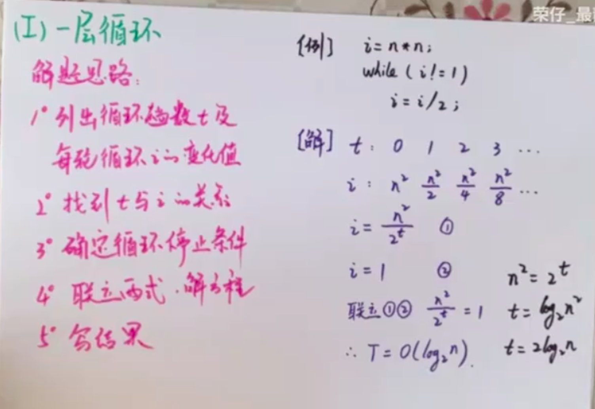

1.从17题的做题可以看出，只要列出循环趟数t的一部分（比如前6趟）
2.然后列出i是如何变化的，找出i和t之间的关系
3.就是要列出i和t之间的表达式

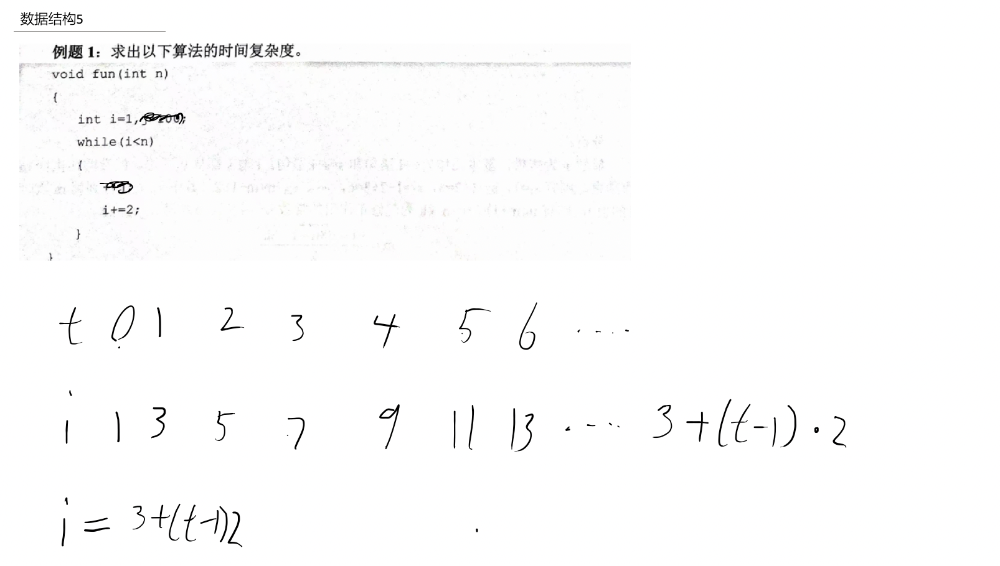

4.然后找到循环停止的条件，循环停止的条件是 i和 问题规模n的关系

然后通过上面第三步的式子把t循环执行次数和问题规模联立起来就好了

##### 例

为了加深对这种解题思路的印象，接下来我们再来看一道例题。这道例题是二零一九年。四零八数据结构中的一道有关于时间复杂度计算的一道题。

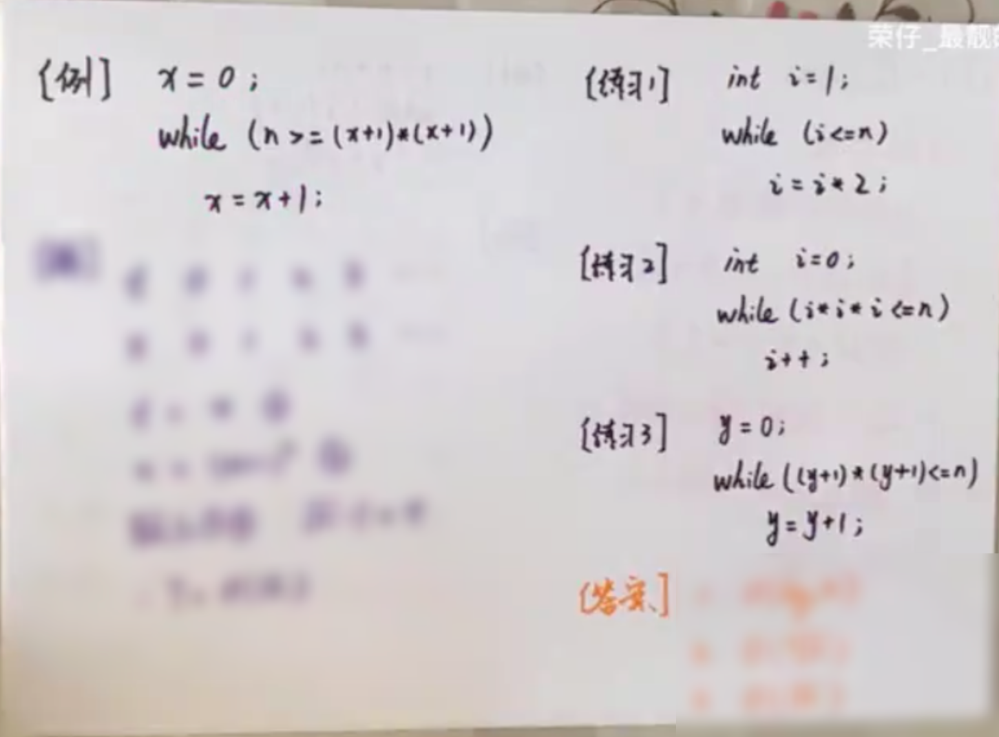

那么，这道题首先是x初始为零，
然后呃，在n大于等于x+1的平方的时候
我们执行x=x+1这条语句。

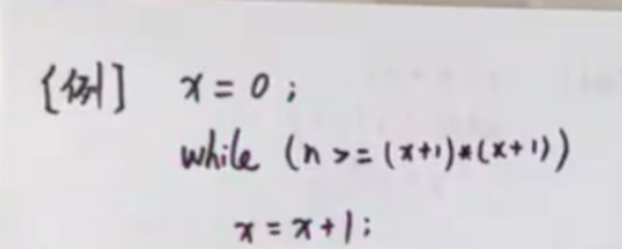

按照还是按照刚刚的那个解题思路呃，
首先呢，列出循环趟数t以及每轮循环x然后它之间的变化值那么
刚刚那道题它是i，
然后这道题是x，但是它们的本质都是一样的。

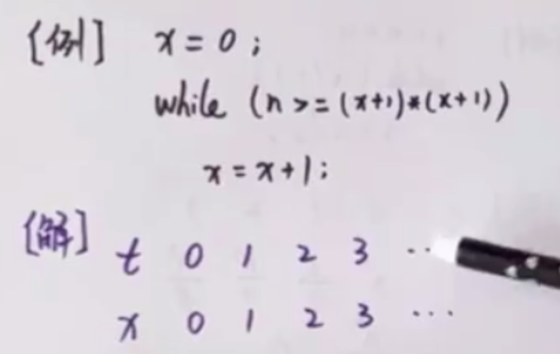

首先来看就是这个T是从呃第零次循环，第一次循环，第二次循环一直往后，

然后x呢是在。第零次循环的时候是初始值是零，
第一次循环就是就只有这一条语句改变x的值。
那么，第一次循环的时候x是一，
第二次循环的时候x是二，
然后x每次循环每次加一。

好，然后根据这两个这个表格呢呃，
我们很显然能够看出来这个。呃t和x之间的关系就是t=x。

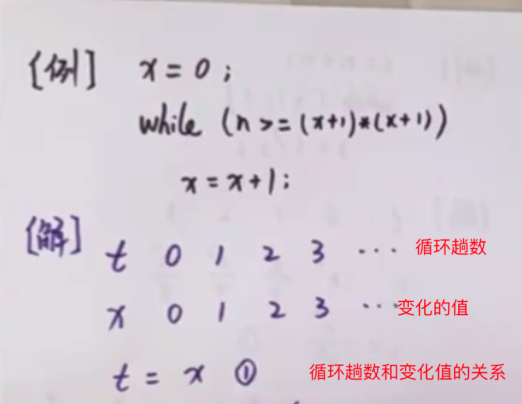

那么，第三步就是确定这个循环，它的停止条件我们可以看到这个，while这条语句。在什么时候呃停止循环呢？
是在x+1的平方比n大的时候，
然后这是就是它的上限嘛？
然后呃。就列出来这条语句，

然后联立刚刚我们呃列出来的这样一条语句的话呢，
我们就可以解出来。根号n- 1=t。
呃，那么我们很显然就是把这个。常数给它剔除掉，最后就可以写出。这个程序它的时间复杂度就是根号n。

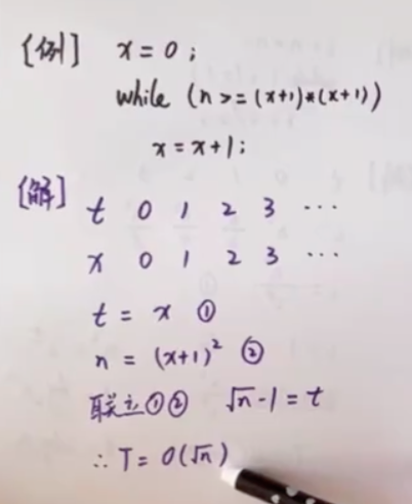

好为了使呃，

就是继续加深我们刚刚提到的这个解题思路的印象呢呃，
给大家留了。三个练习题，然后下面是这个答案，就是用刚刚讲的。这个解题思路很快就可以秒杀这种题。

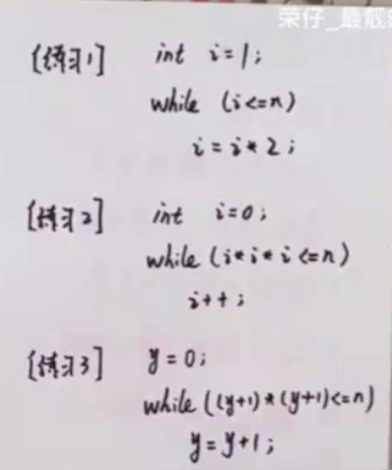

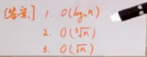

## 两层循环🤡 

下面呢，我们来看第二种题型，两层循环，那么关于这种题型，
它的解题思路主要分为以下三步三步。

第一步是列出外层循环中i的变化值。

第二步是列出内层语句中的执行次数。

第三步是求和，并且写出结果。

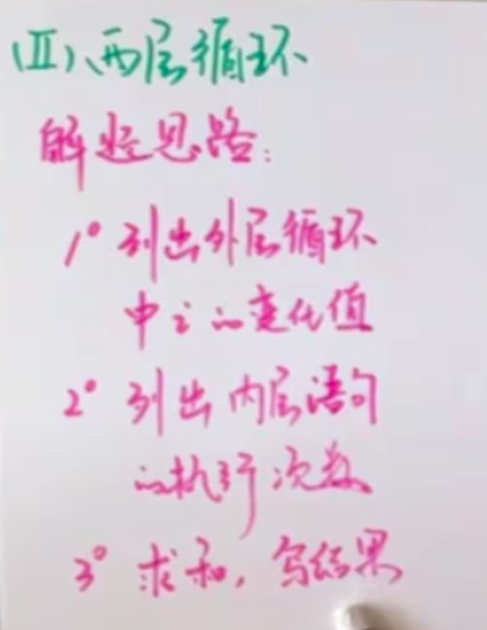

1.<u>这里列出i的变化值，要总结成与n的关系式</u>，比如是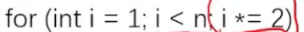，那么与n的关系是log2n，如果是一个普通的for循环，就是每次自增1的话，就是n（好像是把单层循环的那一堆操作，融合成了这一步）
内层语句的执行次数就是注意看是否和外层的变量有关
3.求和就是把外层执行多少轮（就是n的表达式，就是执行次数和问题规模的关系)然后看内层每轮执行多少次，相加就好

具体的操作思路呢，
我们用一道例题来看。首先，初始化m为0 i和j。呃，然后这执行两次这个循环，
然后每次循环它的最内层语句是m加加。
按照我们刚刚讲的这个解题思路的话呢？

首先列出外层循环中i的变化值。嗯，我们可以看到i，然后在每次循环的时候i加加，加一，然后它在等于n的时候停止这个外层循环，
所以我们i呢，就从一二三一直写到n。

呃，那么第二步列出内层语句中，然后它的这个内层语句，它的执行次数呃，
我们可以看到内层语句就是这一条语句。

那么就是在i=1，然后j=1的时候，这个j是等于二，就是执行两次内存语句。它是执行两次的。
然后在这个i等于呃二的时候，这个内层语句呢，就是执行的是这个四次。
然后在i=3的时候，内层语句执行六次，
那么按照这个规律。
i=1的时候两次
i=2的时候四次
i=3的时候是六次，
那么i=n的时候就是2n次。
二四六，然后一直加到2n，就是内层语句它的执行总次数，

这是一个等差数列的一个求和就是二分之然后项数是n首项是二，尾项是2n，
然后就是求出来这个值是n倍的n+1。
如果问m加加，它的这个执行次数就是
n倍的n+1，

如果问的是内层语句，它的时间复杂度的话就是on方。

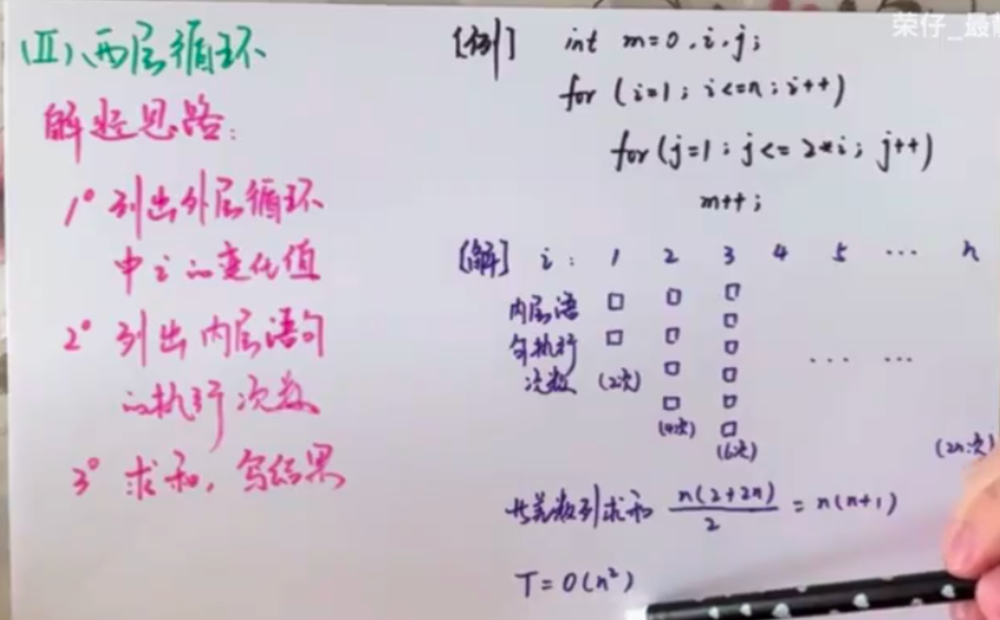

（就是看内层循环一共执行了多少次，像上面这个就是执行了2 4 8 16 ... 2n的次数，所以等差数列得出的次数就是时间复杂度）

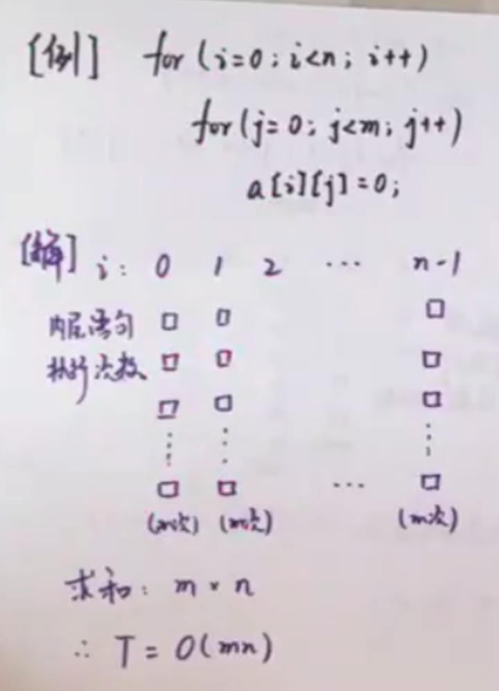

（就是看内层循环一共执行了多少次，像上面这个就是外层执行了n-1趟里面那个循环每次执行m的次数，就执行了n-1个m，就是n-1 乘 m就是时间复杂度）

好，接下来我们再来看一道例题，那么这道题也是一道双层循环的题呃，
我们还按按照刚刚的那个解题思路。
然后呃，按照三步曲呃，把这道题解一下，

那么第一步是列出外层循环i的变化值，那么根据这个程序，我们可以看到i初始为零，然后i每次加一每轮循环都加一。一直到什么时候结束呀？
是在i=n- 1的时候结束n- 1就是i的一个上限。

所以的话，我们列出外层循环，它的i的变化值就是从零一二一直变到n- 1。
那么，第二步就是列出内存循环语句，然后它的执行次数，

内存循环语句就是内存这一条for语句。然后我们看这个呃J从零，然后每次加一，一直到呃这个m- 1。然后零到m- 1，
然后每轮循环，这值变化多少次呀？变化m次。
所以的话呢，就是i等于一零的时候，然后这个呃内存循环语句执行m次一的时候也是m次n- 1的时候也是m次。

那么这个时候呢，我们就可以把这个东西它可以抽象成一个二维平面，
它的高是m。宽呢是n。
因为零到n减一
一共有n个值。所以我们把它求和就是相乘长乘宽，然后m×n
最后就可以得出这个。这个这个呃程序，
然后它的时间复杂度就是o mn。

呃和上一种题型一样，这里呢，给大家列出来两个练习题，

然后下面这是答案，也是用刚刚。讲的这个方法可以很快的。解决这样的一类问题。

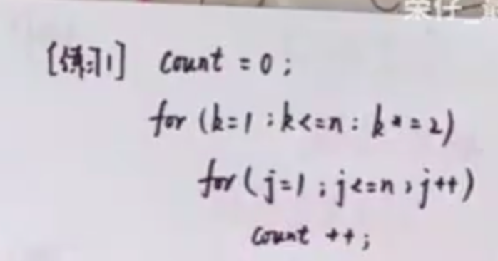

（就是看内层循环一共执行了多少次，像上面这个就是外层执行了$log^n_2$趟里面那个循环每次执行n的次数，就执行了$log^n_2$个n，就是$log^n_2$ 乘 n就是时间复杂度）

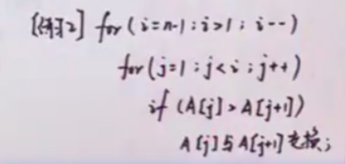

（就是看内层循环一共执行了多少次，像上面这个就是执行了0 1 2 3 ... n-2 的次数，所以等差数列得出的次数就是时间复杂度n方）

## 多层循环

https://www.bilibili.com/video/BV13d4y1K74p/?spm_id_from=333.337.search-card.all.click&vd_source=eb024751d9a3caae0e64c8745e74f9db

### 方法1：计算三维体积（没学，有必要再理解吧）

呃，接下来呢？我们来看这个时间复杂度计算的最后一种题型，多层循环。关于多层循环呢，我为大家提供了两种解题思路。呃，第一种解题思路呢，就是把它抽象为计算一个三维物体的体积。然后第二种呃解题思路呢，就是列式，

然后求和呃，我们通过这样一道例题来把这两道。呃，这个解题思路呃，实践一下。呃，首先来看这个方法，一方法，一是抽象为计算三维物体的体积，然后我们可以把这个三层循环呢？呃抽象为一个这样一个呃锥体，然后进呃计算这个锥体的体积为什么抽象成这个锥体而不抽象成？呃，一个呃，立方体呢？

就是呃，那种正方体的，然后立方体。因为它这个i从零变到n是i加加，然后j是从零变到j加加的时候，这个j每轮循环它的j值是依赖于这个i值的。然后那当i值小的时候，这个呃j，然后它的这个循环的次数就小当。i然后达到n的时候，这个j的循环次数就多，所以然后它的边是从小，然后逐渐递增的。那么同理，然后这个k的循环，

每轮循环的循环次数呢？也是依赖于这个j值，所以也是从小到大，所以我们就会可以把它抽象成一个这个。呃，锥体的体积，然后通过锥体的这个体积计算公式三分之一底面积乘以高，我们就可可以很轻易的得出，然后它的这个。呃，程序它的这个时间复杂度是on的三次方。呃，

### 方法2：列式求和（这个也复杂，先不学了）

接下来呢？介绍第二种方法就是列式求和。对于这样一个三层循环的。

呃，程序它的列式求和呢，我们可以写三个求和符号，然后呃，第一步是先对这个最内层的这个求和符号进行求和。呃，它实质上就是k从零变化到j- 1呃k从零变化到。j- 1，然后k加加每每轮加一，所以呃，就是一个看看这个从呃k从零到j减一一共变化了多少个数，其实这个求和的符号意思是？所以就是呃j-1-0，然后再加一，所以的话就是k从零到j-1，

一共变化了有这个数。那么，第二层循呃，这第二层这个循环的话，然后就是呃进行这个第二个求和符号的计算。第二个修改符号就是求JJ从零，然后变到i是通过j。呃，每一轮循环加一，然后进行实现，所以的话呢，也是这个求和符号，求和符号是对j进行求，然后这个j呢是从零。一直到i，

然后呃每循环一次，这里的值加一。所以的话呢，就相当于是一个呃等差数列求和等差数列求和，这也是从零变化到。i然后就是零+1+2+3，然后一直加到i。所以的话呢呃，这个。我们的求和公式就是二分之，然后这个项数项数从零到i是i加一个数，然后首项是零，尾项是i，所以就是二分之i。贝塔i+1呃，

最后呢，就是对i进行求和i的话，就是从零到n结束，然后每轮循环i的值加上一。我们把这个二分之一提到前面，然后求和就是变成对i方和i分别进行求和，然后i方和i分别进行求和，我们有基本的那个呃数列求和公式。对对方进行求和的话，就是六分之。这个n，然后n加一乘以二n加一呃对i进行求和的时候是二分之n，然后n加一。最后能把它计算，然后取那个最高阶的，

最后就是它的时间复杂度就是整个。程序的时间复杂度就是on的三次方。好，以上就是关于时间复杂度三种题型的解题思路呃，谢谢大家。

