## 【掌握】Linux基础

### 学习目标

掌握Linux核心命令，为大模型私有化部署奠定基础

### Linux的目录结构

* Linux和Windows, Mac一样, 都是文件系统, 采用文件 和 文件夹的形式来管理数据. 

- 只不过在Linux 操作系统中, 是没有盘符概念的,  任何文件(文件夹)都是从根目录开始进行拆分的

- 且Linux中采用的是目录树结构, Windows中采用的是森系结构, 如下图:

  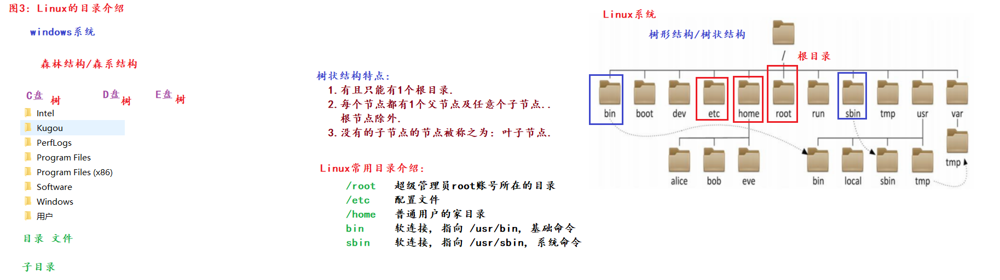

- Linux中常用的目录结构:
  - /etc :  配置文件存放的目录, 相当于Windows中的设置面板
  - /home: 用户的家目录,相当于Windows中的用户目录
  - /opt: 应用程序存放的目录,相当于Windows中的 software目录
  - /bin: 终端指令集存放的目录
  - /sbin: 超级管理员用户使用的指令集,包括用户的创建删除等指令
  - /root: 超级管理员的家目录,  每个Linux系统默认有且只有一个超管用户,拥有该操作系统的一切权限,也是最高权限.

    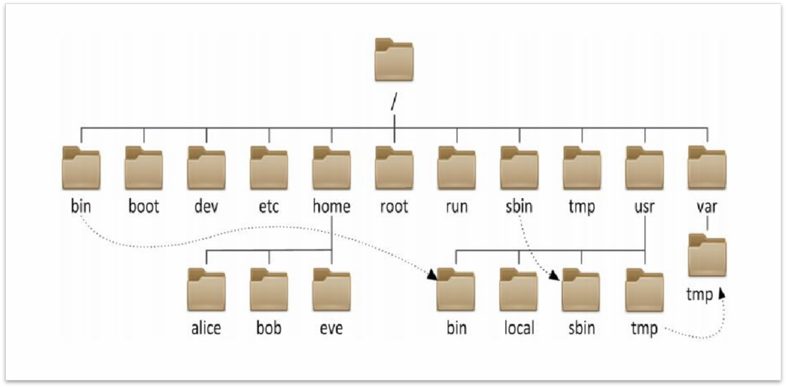

### Linux的常用命令

Linux指令的构成:

```
linux指令 = 命令(做什么) + 选项(怎么做) + 参数(对谁做)

- command : 命令名, 相应功能的英文单词或单词的缩写
- [-options] : 选项, 可用来对命令进行控制, 也可以省略
- parameter  : 传给命令的参数, 可以是 零个、一个 或者 多个
```

#### Linux文件与目录管理

* ls命令

  > ls命令: 展示linux系统中指定位置的目录信息
  >
  > ```shell
  > -a  查看所有文件,包括隐藏文件
  > -l  展示文件的详细信息,包括权限,归属,文件大小,创建修改时间,文件名称
  > -h  人性化展示文件大小,赋予最恰当的单位
  > ```

  > ls 指令的三个选项可以随意自由组合,且选项的顺序可以随意调整
  >
  > ```shell
  > ls -lh  展示文件详细信息列表,并且合理展示单位
  > ls -al  展示所有文件详细信息列表,包括隐藏文件
  > ls -alh  展示所有文件详细信息列表,包括隐藏文件,并且合理展示单位
  > ```

  > ls 可以获取任意指定路径的文件信息
  >
  > ~~~shel
  > ls  参数  路径信息
  > ls /  查看根目录的文件
  > ls aaa 查看当前目录下的aaa目录中的文件内容
  > ~~~
  >
  > ls -l 完全等价于 ll  可以快速查看文件的详细信息
  >
  > 【拓展：】ll  也可以配合选项-h -a使用

* **Linux中的路径:**

  >什么是文件路径?
  >
  >​	路径就是我们从根目录,盘符或者指定位置,查找到目标文件所经历的目录层级.
  >
  >​	现实路径的描述方式:  
  >
  >​		1.中国 北京市  昌平区  回龙观东大街  xxx校区  x号楼 x单元....
  >​		2.从当前位置触发,向前行驶五公里,左转向前行驶4公里,掉头......
  >
  >计算机中路径的描述方式
  >
  >1. 绝对路径: 从根目录或者盘符出发,直到查找到目标文件所经历的目录层级
  >2. 相对路径: 从当前目录出发,直到查找到目标文件所经历的目录层级

 * Linux中的路径和Windows中的路径有什么区别?

   > 绝对路径中, Linux 是从根目录出发进行查找, Windows是从盘符出发进行查找

  * Linux中路径的书写方式

    **hello.py**绝对路径: `/root/apple/hello.py`

    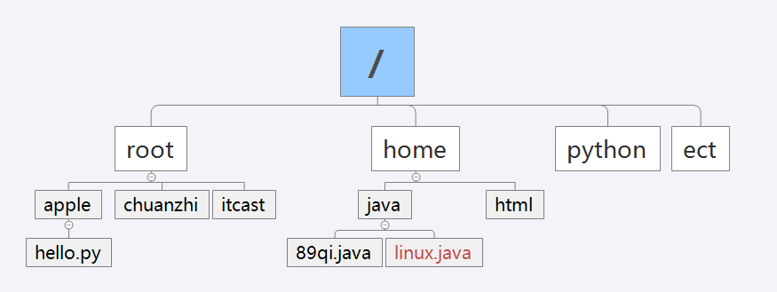

    从apple目录出发,到linux.java的相对路径: `../../home/java/linux.java`

    ~~~shel
    ./  代表当前目录
    ../ 代表上一级目录
    ~~~

* cd命令

  > cd命令,是为了切换工作目录,或者说活动目录的
  >
  > 例如:ls后不加任何参数,则默认输出当前目录的文件信息, cd命令就切换的是当前目录
  >
  > cd  路径信息  可以切换到指定目录中
  >
  > cd ../  返回上一级目录
  >
  > cd -  返回上一次操作的工作目录
  >
  > cd /  进入根目录
  >
  > cd  ~ 返回家目录,  波浪线可以省略
  >
  > **注意: cd指令中 同样可以使用相对路径,也可以使用绝对路径**

* pwd命令

  >pwd命令获取的就是当前所在的工作目录的绝对路径
  >
  >
  >
  >**注意: pwd获取的是目录路径,不是文件路径**  (==目录就等于文件夹==)
  >
  >

* mkdir命令

  >mkdir命令是创建空目录的命令,我们可以在指定路径下创建一个空目录
  >
  >~~~shel
  >mkdir 文件路径    在指定路径下创建目录
  >mkdir  ./aaa
  >
  >mkdir -p 文件路径   在指定路径下创建一个空目录,同时创建其父目录
  >mkdir -p ./111/222/333
  >~~~


* touch命令

  > touch 可以创建一个新的文件,文件的扩展名随意,甚至可以是不存在的扩展名
  >
  > touch 可以一次性创建多个文件,但是文件路径必须正确
  >
  > ~~~shell
  > touch 1.txt 2.txt 3.txt 
  > ~~~
  >
  > touch创建的文件如果存在不报错,但是没有新文件产生

* rm命令

  > rm 是删除文件的指令,可以删除文件或文件夹
  >
  > ~~~shel
  > -r 递归删除,删除文件夹时使用
  > -f 强制删除,不进行问询
  > ~~~
  >
  > rm 可以删除任意文件,路径可以是相对路径,也可以是绝对路径
  >
  > ```shell
  > # 删除文件
  > rm /root/1.txt
  > # 删除文件夹
  > rm -r /root/aaa
  > # 删除文件夹并不进行提示
  > rm -rf /root/aaa
  > ```
  >
  > rm可以一次性删除多个文件
  >
  > ~~~shell
  > # rm后跟随多个路径
  > rm 1.txt 2.txt 3.txt
  > # rm后跟随路径通配符
  > rm ./aaa/*
  > ~~~
  >
  > 在正常开发中如果使用的是root权限,不建议使用-f  如果必须使用,需要极其慎重,因为这种删除方式无法找回

#### Linux查看文件内容

* cat指令

  > 用于查看linux中的**小型**文本文件
  >
  > 因为他会一次性将所有的文件内容加载到终端中,终端的数据展示数量有限,大文件显示不全,且过于消耗内存
  >
  > ~~~shel
  > cat 文件名称
  > ~~~
  >

* more指令

  > 用于查看linux中的**中型**文本文件
  >
  > 使用more进行文件的查看可以按页显示,手动翻页或回滚,更加灵活,但同样消耗内存
  >
  > ~~~shel
  > more 文件名称
  > - enter 向下一行
  > - space 向下一页
  > - b 向上一页
  > - q 退出查看
  > ~~~

#### Linux文件基本属性

* chmod命令

  > chmod主要是进行文件权限管理的,可以给文件增加修改删除权限
  >
  > 
  >
  > 语法 chmod [-R] 权限 文件或者文件夹
  >
  > 选项：-R，对文件夹内的全部内容应用同样的操作

* 数值型权限管理

  >权限可以用3位数字来代表，第一位数字表示用户权限，第二位表示用户组权限，第三位表示其它用户权限。
  >数字的细节如下：r记为4，w记为2，x记为1，可以有：
  >0：无任何权限，	即 ---
  >1：仅有x权限，	即 --x
  >2：仅有w权限	即 -w-
  >3：有w和x权限	即 -wx
  >4：仅有r权限	即 r--
  >5：有r和x权限	即 r-x
  >6：有r和w权限	即 rw-
  >7：有全部权限	即 rwx
  >
  >~~~shell
  ># 用户拥有读写执行权限(rwx 7), 用户组拥有读写权限(rw 6), 其他用户拥有读的权限(r 4)
  >chmod 764 1.txt
  ># 如果需要所有用户具有可读可写可执行权限
  >chmod 777 1.t.xt
  >
  ># 注意: 在开发中尽量不要出现777的权限会让别人觉得你很low 侮辱你的职业
  >~~~

  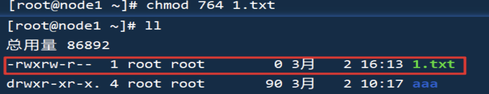

* 字母型权限管理

  >r : 读权限
  >
  >w : 写权限
  >
  >x : 执行权限
  >
  >
  >
  >u : 拥有者
  >
  >g : 用户组
  >
  >o : 其他用户
  >
  >a : 所有用户
  >
  >~~~shell
  ># 格式: chmod - + 权限
  ># 给自己减少可执行权限,给用户组增加写入权限
  >chmod u-x,g+w abc
  ># 给所有用户减少读的权限
  >chmod a-r abc
  >
  ># 格式: chmod = 权限
  ># 给自己设置属主权限为只读,此时原有权限全部消失,只保留新赋予的权限内容
  >chmod u=r abc 
  ># 给所有用户最高权限
  >chmod a=rwx abc
  >
  ># 格式: 混用
  ># 给用户读写执行权限, 给用户组读写权限, 给其他用户只读权限
  >chmod u=rwx,g-x,o-wx abc
  > 
  ># 如果我们需要修改当前目录及其目录中子文件的权限,需要使用递归方式完成操作  条件-R选项即可
  >chmod -R u=rwx,g=rw,o=r aaa
  >~~~

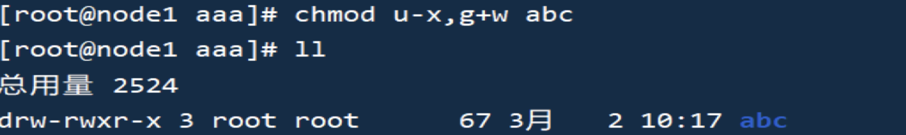

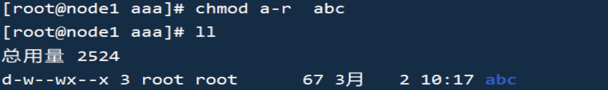

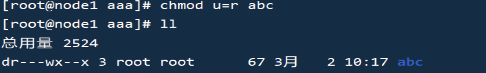

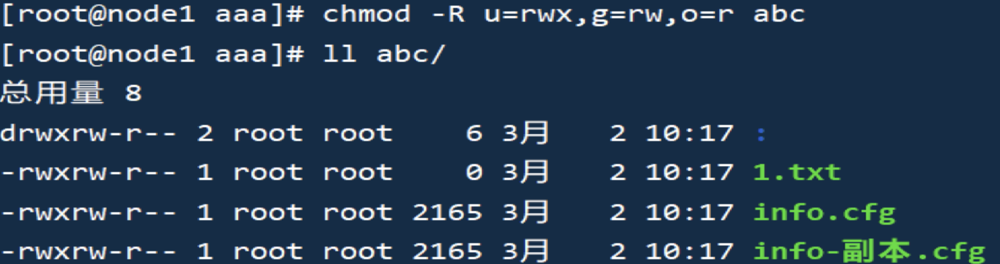

#### Linux文件打包和压缩文件

* tar命令

  >**tar命令是进行打包,解包, 压缩和解压的命令**
  >
  >打包: 将多个文件归档为一个文件,文件大小不会减小.
  >
  >解包(拆包):将一个包文件拆分为多个实体文件.
  >
  >压缩:将文件按照一定的算法减小体积,但是文件的内容和信息不发生改变
  >
  >解压:将一个压缩文件还原到正常状态.
  >
  >参数:
  >
  >- c : 打包选项
  >- x : 解包选项
  >- z : 压缩或者解压选项
  >- v : 展示过程信息
  >- f : 指定文件名称
  >
  >注意: c 和x 参数不能同时出现在终端命令中
  >
  >打包
  >
  >~~~shell
  ># tar -cvf 包的名称  要打包的文件列表
  >tar -cvf 1_3.tar 1.txt 2.txt 3.txt
  ># 将1.txt 2.txt 3.txt 打包到 aaa目录下
  >tar -cvf aaa/1_3.tar 1.txt 2.txt 3.txt
  >~~~
  >
  >解包
  >
  >~~~shell
  ># 将原有的.txt文件全部删除
  >rm -f *.txt
  ># 将1_3.tar 解压到当前压缩包所在位置
  >tar -xvf 1_3.tar
  ># 将个文件解压bbb目录下
  ># 此时需要使用选项C(大写)指定解包路径
  >tar -xvf 1_3.tar -C bbb
  >~~~
  >
  >压缩
  >
  >~~~
  >tar -zcvf 1_3.tar 1.txt 2.txt 3.txt
  >~~~
  >
  >解压缩
  >
  >~~~
  >tar -zxvf 1_3.tar -C bbb
  >~~~
  >
  >在开发中,我们一般使用的最多的是解压.解压指令可以记忆为长兄为父(zxvf)
  >
  >注意:
  >
  >1. 压缩时,如果源文件太小,可能体积会增大  例如  被压缩文件只有20B 可能压缩完成后大小是50B
  >2. 压缩和解压时一般使用.tar.gz结尾,方便程序员交流
  >3. 使用上述指令压缩后,文件为gzip压缩格式.

#### 系统管理命令

* ps命令

  > 查看linux系统中的进程信息
  >
  > ```shell
  > ps  查看当前活跃进程
  > ps -ef 查看当前所有进程
  > ```
  >
  > 在查看进程时,pid这一列中存储的是进程编号,也就是这个进程的唯一标识.
  > 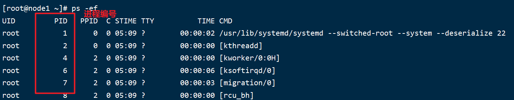

* kill命令

  > 如果我们想结束linux中的软件或服务也可以通过操作进程来解决
  >
  > ```shell
  > kill -9 进程编号
  > ```
  >
  > 注意:
  >
  > kill -9 可以快速杀死进程,但是不安全,因为我们的服务再运行过程中,可能会需要保存或者将某些任务执行完再关闭,所以轻易不用,一般都是用于杀死闲置进程,或者不响应的进程.

* ifconfig命令

  > ifconfig主要用于查看服务器的网络信息, 当前阶段最重要的信息就是ip地址
  >
  > 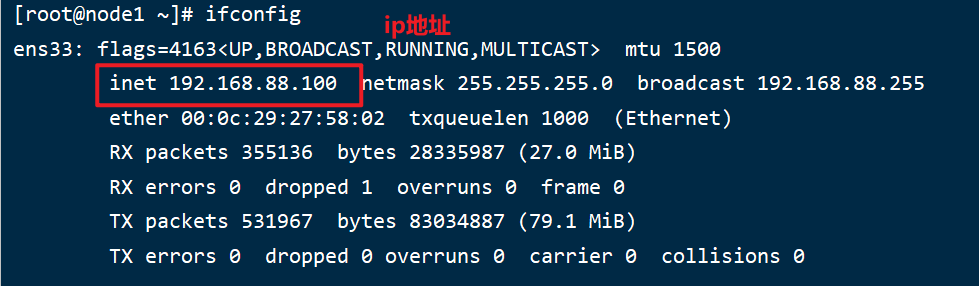
  >
  > **扩展:**
  >
  > 在windows中如果需要查看网卡信息,需要使用`ipconfig`进行查看

* free命令

  >可以使用free查看内存使用情况
  >
  >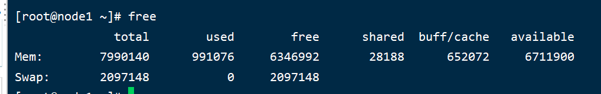
  >
  >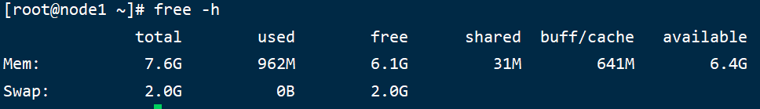
  >
  >

* df命令

  >可以使用df命令查看磁盘的使用情况
  >
  >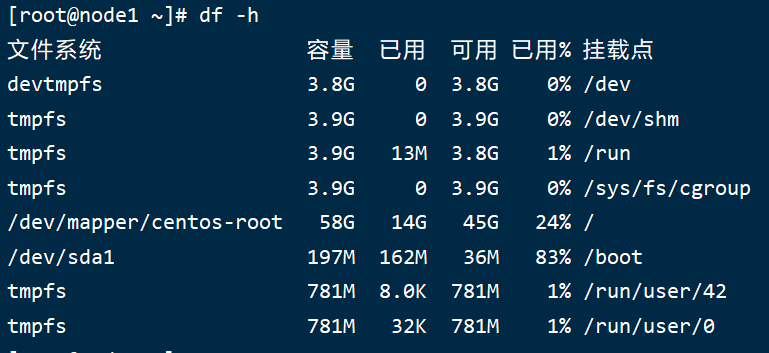

* clear命令

  >clear命令,可以清除终端窗口的信息,让光标移动到终端的最上方
  >
  >快速清屏也可以使用快捷键 ctrl + L 

### 小结

Q1：Linux文件与目录管理命令有哪些？

* ls、pwd、mkdir、touch、cd、rm

Q2：如何查看Linux中文件内容？区别是什么？

* cat：主要用于显示整个文件内容，适合查看小文件
* more：用于分页显示文件内容，适合查看大文件。

Q3：如何查看Linux系统进程命令？
* ps：是 Linux 中用于查看当前系统进程状态的工具。它可以显示正在运行的进程信息，如进程 ID（PID）、CPU 和内存使用情况、运行状态等。

### 练习

#### cd命令

~~~sql
1：切换到你的主目录。
	
2：切换到根目录 (/)。
    
3：切换到上一级目录。
      
4：切换到名为 Documents 的目录，假设它在你的主目录下。
	
5：如果你在任意目录下，直接切换到 /var/log 目录。
	
~~~

#### mkdir命令

~~~sql
1：基础创建：在你的主目录下创建一个名为 NewFolder 的新目录。

2：创建多级目录：在同一命令中创建多级目录结构，例如 ~/NewFolder/SubFolder1/SubFolder2。

3：创建多个同级目录：在你的主目录下同时创建 FolderA, FolderB, 和 FolderC。

4：在特定目录下创建：假设你当前不在主目录下，但在 /var/www 下创建一个名为 MyProject 的目录。

~~~

#### touch命令

~~~
1：基本使用：在当前目录下创建一个名为 newfile.txt 的新文件。

2：创建多个文件：在同一命令中创建多个文件，如 file1.txt, file2.txt, 和 file3.txt。

3：更新文件时间戳：假设你有一个文件 oldfile.txt，使用 touch 更新其访问和修改时间戳。

4：使用绝对路径创建文件：在 /var/log 目录下创建一个名为 log.txt 的文件。

~~~

#### rm命令

~~~sql
1：基本删除：删除当前目录下的一个名为 example.txt 的文件。

2：删除多个文件：删除当前目录下的多个文件，例如 file1.txt, file2.txt, 和 file3.txt。

3：递归删除目录：删除一个名为 mydir 的目录及其内容。

4：强制删除：使用 -f 选项强制删除一个名为 lockedfile.txt 的文件。

~~~
